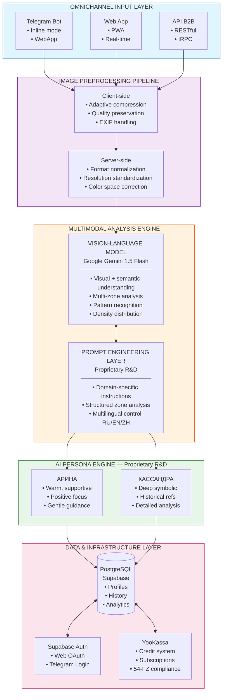
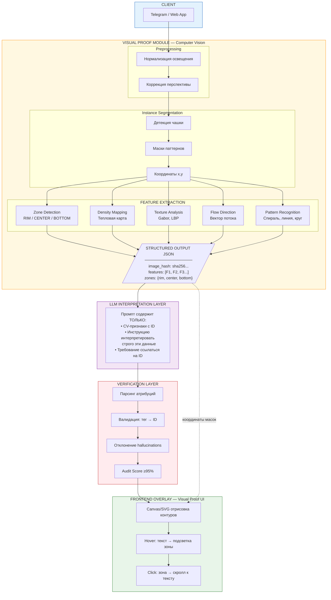
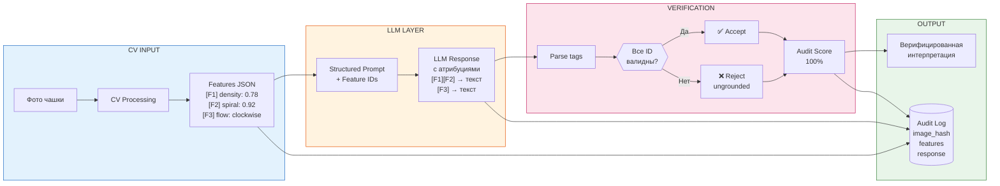
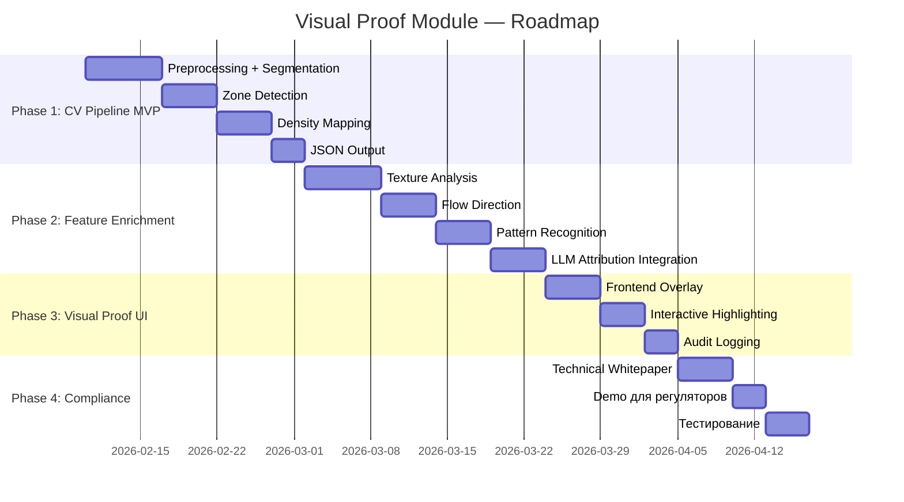

## 10. ТЕХНОЛОГИЧЕСКОЕ ОПИСАНИЕ ДЛЯ БИЗНЕС-ПЛАНА (Пункт 8)

> **Готовый текст для отправки в Astana Hub / AFSA**

---

### 8. ТЕХНОЛОГИЧЕСКОЕ ОПИСАНИЕ

---

#### 8.1. ТЕКУЩАЯ АРХИТЕКТУРА: Интеллектуальная мультимодальная платформа

**Обзор платформы:**
Symancy — AI-платформа нового поколения для визуального анализа и персонализированной интерпретации образов на основе искусства тассеографии (анализ кофейной гущи). Система объединяет передовые технологии Computer Vision, обработки естественного языка (NLP), мультиязычной генерации и персонализированного AI-ассистирования в единой омниканальной платформе.

---

##### 8.1.1. Архитектурные компоненты платформы



---

##### 8.1.2. Ключевые технологические компоненты

**A. Модуль предобработки изображений (Image Preprocessing Pipeline)**

Собственный многоуровневый пайплайн оптимизации изображений:

| Этап | Технология | R&D компонент |
|------|-----------|---------------|
| Клиентская адаптивная компрессия | browser-image-compression | Алгоритм сохранения критических деталей при уменьшении размера |
| Серверная нормализация | Sharp (Node.js) | Стандартизация входных данных для консистентного анализа |
| Валидация контента | Custom filters | Автоматическое определение пригодности изображения |
| Метаданные и хеширование | SHA-256 | Обеспечение трассируемости и аудита |

**B. Мультимодальный аналитический движок (Multimodal Analysis Engine)**

Интеграция со state-of-the-art Vision-Language моделью с собственным слоем управления:

- **Vision API**: Google Gemini 1.5 Flash — мультимодальная модель с глубоким пониманием визуального контекста
- **Prompt Engineering Layer**: Собственная библиотека специализированных промптов (R&D):
  - **Зонирование**: Инструкции для структурированного анализа по семантическим зонам (RIM / CENTER / BOTTOM)
  - **Паттерн-детекция**: Специализированные директивы для распознавания традиционных символов
  - **Контекстуальная привязка**: Техники связывания визуальных элементов с интерпретацией
  - **Мультиязычность**: Контроль генерации на 3 языках (RU / EN / ZH)

**C. Система AI-персонажей (Persona Engine) — уникальная разработка**

Проприетарная система персонализированных AI-ассистентов:

| Персона | Стилистика | Применение |
|---------|-----------|------------|
| **Арина** | Тёплая, поддерживающая | Акцент на позитивных аспектах, эмпатичные формулировки |
| **Кассандра** | Аналитическая, глубокая | Детальный разбор, исторические и культурные референсы |

Каждая персона — результат исследований в области стилистической настройки LLM через prompt engineering.

**D. Омниканальная платформа (Omnichannel Delivery)**

| Канал | Технология | Возможности |
|-------|-----------|-------------|
| **Telegram Bot** | grammY + pg-boss | Inline-режим, контекстные follow-up, WebApp интеграция, proactive messaging |
| **Web Application** | React 19 + Vite | PWA, адаптивный дизайн, real-time через Supabase Realtime |
| **API** | RESTful + tRPC | Типобезопасный интерфейс для B2B партнёров |

---

##### 8.1.3. Интеллектуальные алгоритмы (R&D компонент)

**Prompt Engineering как область исследований:**

Symancy разработала методологию domain-specific prompt engineering для задач визуального анализа. Ключевые инновации:

1. **Структурированное зонирование изображения**
   - Промпты инструктируют модель разделять анализ по семантическим зонам чашки
   - Каждая зона имеет собственную интерпретационную рамку

2. **Паттерн-классификация**
   - Таксономия визуальных паттернов тассеографии (спирали, линии, скопления, разрывы)
   - Связь паттернов с интерпретационным словарём

3. **Consistency Control**
   - Техники для повышения воспроизводимости результатов
   - Температурные настройки и seed-параметры

**Пример структурированного промпта (упрощённый):**
```
Проанализируй изображение кофейной гущи. Раздели анализ на зоны:

1. КРАЙ ЧАШКИ (RIM) — ближайшее будущее, внешние события
   • Опиши видимые паттерны
   • Укажи плотность распределения
   • Интерпретируй символику

2. ЦЕНТР (CENTER) — текущая ситуация
   [аналогичная структура]

3. ДНО (BOTTOM) — глубинные процессы
   [аналогичная структура]

Формат ответа: структурированный JSON с полями zone, patterns, density, interpretation.
```

---

##### 8.1.4. Технологические преимущества

| Аспект | Реализация | Бизнес-ценность |
|--------|-----------|-----------------|
| **Мультимодальность** | Vision + Language в едином пайплайне | Глубокое понимание визуального контекста |
| **Персонализация** | AI-персоны с уникальными стилями | Дифференциация от конкурентов |
| **Масштабируемость** | Serverless + managed services | Автоматическое масштабирование |
| **Мультиязычность** | 3 языка (RU/EN/ZH) | Выход на глобальный рынок |
| **Омниканальность** | Telegram + Web + API | Максимальный охват пользователей |
| **Compliance** | 54-ФЗ фискализация | Готовность к работе в РФ/СНГ |

---

##### 8.1.5. Соответствие критериям DeepTech (текущее состояние)

| Критерий | Текущая реализация | Статус |
|----------|-------------------|--------|
| Собственные алгоритмы | Prompt Engineering Library, Persona Engine | ✅ Есть |
| Domain expertise | Методология анализа тассеографии | ✅ Есть |
| Технологический барьер | Интеграция компонентов требует экспертизы | ✅ Есть |
| Масштабируемость | Cloud-native архитектура | ✅ Есть |
| **Explainable AI** | Implicit (внутри Vision API) | ⚠️ Требует усиления |
| **Визуальная верификация** | Отсутствует | ⚠️ Требует разработки |

---

##### 8.1.6. Области развития (переход к версии 2.0)

Текущая архитектура функциональна и масштабируема. Для полного соответствия требованиям AFSA по Explainable AI планируется развитие:

| Область | Текущее | Целевое (v2.0) |
|---------|---------|----------------|
| Feature Extraction | Implicit (в Vision API) | Explicit CV Pipeline с JSON output |
| Трассируемость | На уровне логов | Attribution mechanism паттерн→текст |
| Визуализация | Текст + фото отдельно | Interactive overlay с подсветкой зон |
| Воспроизводимость | Probabilistic | Deterministic CV + constrained LLM |

**Важно:** Данные улучшения — естественная эволюция платформы, а не переделка. Текущая архитектура является прочным фундаментом для внедрения Visual Proof Module.

---

#### 8.2. Целевая архитектура: Visual Proof Module (Вариант 2)

**Ключевая инновация:**
Разработка собственного модуля Computer Vision (Visual Proof Module), который анализирует изображение **ДО** передачи в LLM и формирует структурированный набор верифицируемых признаков. Каждый текстовый инсайт становится **математически привязан** к конкретным визуальным данным.

---

##### 8.2.1. Архитектура системы



---

##### 8.2.2. Детализация модулей

**A. Preprocessing Module**
- **Нормализация освещения**: Адаптивная гистограммная эквализация (CLAHE)
- **Коррекция перспективы**: Автоматическое выравнивание по контуру чашки
- **Стандартизация размера**: Приведение к единому разрешению для консистентности
- **Технологии**: OpenCV (Python) / Sharp (Node.js)

**B. Instance Segmentation Module**
- **Детекция чашки**: Выделение области интереса (ROI) с отсечением фона
- **Сегментация паттернов**: Выделение отдельных визуальных элементов (пятна, линии, скопления)
- **Выход**: Маски сегментации в формате полигонов (массив координат [x,y])
- **Технологии**: OpenCV contour detection, возможно Segment Anything Model (SAM) для точности

**C. Zone Detection Module**
- **Алгоритмическое разделение чашки на семантические зоны**:
  - **RIM (край)**: Внешнее кольцо — символизирует ближайшее будущее
  - **CENTER (центр)**: Центральная область — текущая ситуация
  - **BOTTOM (дно)**: Нижняя зона — глубинные процессы, прошлое
- **Выход**: Координаты границ зон для наложения на изображение
- **Технологии**: Геометрические алгоритмы на основе detected cup contour

**D. Density Mapping Module**
- **Построение тепловой карты**: Визуализация плотности распределения кофейного осадка
- **Метрики**: Normalized density value (0.0–1.0) для каждой зоны
- **Выход**: Матрица плотности + визуализация для отладки
- **Технологии**: OpenCV kernel density estimation, Gaussian blur analysis

**E. Texture Analysis Module**
- **Gabor-фильтры**: Анализ направленных текстур и повторяющихся паттернов
- **LBP (Local Binary Patterns)**: Извлечение текстурных дескрипторов
- **Метрики**: Контрастность, зернистость, однородность
- **Выход**: Feature vector с числовыми характеристиками текстуры
- **Технологии**: scikit-image, OpenCV

**F. Flow Direction Module**
- **Анализ направления «течения» гущи**: Определение доминирующего вектора
- **Методы**: Optical flow analysis на статичном изображении, gradient orientation
- **Выход**: Угол направления (0°–360°), сила/уверенность (0.0–1.0)
- **Технологии**: OpenCV calcOpticalFlowFarneback, собственные алгоритмы

**G. Pattern Recognition Module**
- **Классификация геометрических форм**: спираль, линия, круг, скопление, разрыв
- **Confidence score**: Уверенность в детекции каждого паттерна
- **Выход**: Список detected patterns с координатами и confidence
- **Технологии**: Contour analysis, shape matching, возможно классификатор на собственном датасете

---

##### 8.2.3. Механизм Explainable AI (Visual Proof)



**Принцип работы:**

1. **Структурированный ввод для LLM**: LLM получает НЕ изображение, а JSON с извлечёнными признаками, где каждый признак имеет уникальный идентификатор (F1, F2, F3...).

2. **Принудительная атрибуция**: Промпт инструктирует LLM ссылаться на ID признаков при каждом утверждении.

3. **Верификация выхода**: Система парсит ответ LLM и проверяет:
   - Все ли упомянутые ID существуют в исходном JSON
   - Нет ли утверждений без привязки к признакам (потенциальные галлюцинации)

4. **Audit Score**: Процент верифицированных утверждений (target: >95%)

**Пример взаимодействия:**

```
CV OUTPUT (JSON):
{
  "features": [
    { "id": "F1", "type": "density", "zone": "rim", "value": 0.78, "bbox": [120,45,280,95] },
    { "id": "F2", "type": "pattern", "name": "spiral", "confidence": 0.92, "center": [200,300] },
    { "id": "F3", "type": "flow", "direction": "clockwise", "angle": 87, "strength": 0.6 }
  ]
}

LLM PROMPT:
"Интерпретируй следующие CV-детектированные признаки. Для каждого утверждения
укажи ID признака в квадратных скобках.

Признаки:
[F1] Высокая плотность в зоне RIM (0.78)
[F2] Спиральный паттерн в центре (confidence: 0.92)
[F3] Направление потока по часовой стрелке (strength: 0.6)

Интерпретируй ТОЛЬКО эти данные."

LLM RESPONSE:
"[F1][F2] Концентрация энергии на краю чашки, формирующаяся в спираль, указывает
на приближающиеся возможности, требующие внимания. [F3] Движение по часовой
стрелке символизирует позитивную динамику в текущем направлении."

VERIFICATION:
✓ [F1][F2] — валидные ID, соответствуют признакам
✓ [F3] — валидный ID
Audit Score: 100% (все утверждения верифицированы)
```

---

##### 8.2.4. Frontend Overlay (Visual Proof UI)

**Визуализация связи CV ↔ Текст:**

Клиентское приложение получает от сервера:
1. Оригинальное изображение
2. Массив координат (маски, bbox) для каждого детектированного признака
3. Текстовую интерпретацию с атрибуциями

**Интерактивные элементы:**
- **Overlay контуров**: Canvas/SVG отрисовывает векторные контуры поверх фото
- **Hover-эффект**: При наведении на фрагмент текста — подсвечивается соответствующая зона на фото
- **Клик-навигация**: Клик на зону фото — скроллит к соответствующему тексту
- **Цветовая кодировка**: Разные цвета для разных типов признаков

**Важно:**
Контуры **не генерируются** нейросетью (Image-to-Image), а **отрисовываются** на основе точных координат, полученных от CV-модуля. Это гарантирует детерминированность и воспроизводимость.

---

##### 8.2.5. Технический стек целевой архитектуры

| Компонент | Технология | Обоснование |
|-----------|-----------|-------------|
| CV Pipeline | Python + OpenCV + FastAPI | Полноценные CV-возможности, GPU-ускорение |
| Segmentation | OpenCV / SAM (опционально) | Баланс точности и скорости |
| Feature Extraction | scikit-image + numpy | Промышленный стандарт для текстурного анализа |
| LLM Integration | Google Gemini API / OpenAI | Внешний API с нашим контролем входа |
| Verification Layer | Python + regex/parser | Валидация атрибуций |
| Frontend Overlay | Canvas API / SVG + React | Кроссплатформенная отрисовка |
| Audit Logging | PostgreSQL (Supabase) | Хранение полной трассы для аудита |

---

##### 8.2.6. Соответствие требованиям регуляторов

**Для AFSA (МФЦА) — Explainable AI:**

| Требование | Реализация |
|------------|------------|
| Прозрачность алгоритма | Каждый шаг CV-пайплайна документирован и верифицируем |
| Отсутствие «чёрного ящика» | LLM получает только структурированные данные, не изображение |
| Трассируемость | Audit log: image_hash → CV features → prompt → LLM response |
| Воспроизводимость | Детерминированный CV-пайплайн даёт идентичные features для одного фото |
| Минимизация Model Bias | LLM ограничен интерпретацией только предоставленных признаков |
| Model Misuse Prevention | CV-модуль фильтрует данные и задаёт жёсткий контекст |

**Для Astana Hub — DeepTech / R&D:**

| Критерий | Подтверждение |
|----------|---------------|
| Собственные алгоритмы | Custom CV pipeline для специфической задачи (тассеография) |
| R&D компонент | Исследование и разработка domain-specific feature extraction |
| Уникальность | Нет готовых решений для анализа кофейной гущи — собственная разработка |
| Демонстрируемость | Визуальное доказательство работы каждого модуля |
| Интеллектуальная собственность | Алгоритмы, обученные модели, датасет — база для патентования |

---

##### 8.2.7. Дорожная карта реализации



**Фаза 1: CV Pipeline MVP (2–3 недели)**
- [ ] Preprocessing + Cup Segmentation
- [ ] Zone Detection
- [ ] Basic Density Mapping
- [ ] Structured JSON output

**Фаза 2: Feature Enrichment (2–3 недели)**
- [ ] Texture Analysis
- [ ] Flow Direction
- [ ] Pattern Recognition
- [ ] LLM integration с атрибуцией

**Фаза 3: Visual Proof UI (1–2 недели)**
- [ ] Frontend Overlay implementation
- [ ] Interactive highlighting
- [ ] Audit logging

**Фаза 4: Compliance & Documentation (1–2 недели)**
- [ ] Technical whitepaper
- [ ] Demo для регуляторов
- [ ] Тестирование воспроизводимости

---

##### 8.2.8. Заключение

Развитие архитектуры до Visual Proof Module усиливает позиции Symancy как DeepTech-платформы с собственным слоем Computer Vision. Это обеспечивает:

1. **Полное соответствие требованиям AFSA** по Explainable AI
2. **Усиление квалификации как DeepTech** для Astana Hub
3. **Расширение базы интеллектуальной собственности** (патенты, ИС)
4. **Конкурентное преимущество** — уникальная технология визуальной верификации

---

#### 8.3. РЕЗЮМЕ ДЛЯ РЕГУЛЯТОРОВ

##### Для Astana Hub (DeepTech qualification)

**Symancy — DeepTech платформа, потому что:**

✅ **Собственные алгоритмы и R&D:**
- Проприетарная система Prompt Engineering для domain-specific анализа
- Уникальная Persona Engine с AI-персонажами
- Методология структурированного зонирования изображений
- Разрабатываемый Visual Proof Module (CV Pipeline)

✅ **Технологический барьер входа:**
- Интеграция Vision-Language моделей с domain expertise
- Мультиязычная генерация (RU/EN/ZH) с контролем стиля
- Омниканальная архитектура (Telegram + Web + API)

✅ **Интеллектуальная собственность:**
- Библиотека специализированных промптов
- Методология анализа тассеографии
- Планируемые патенты на Visual Proof технологию

✅ **Соответствие приоритетным направлениям:**
- Artificial Intelligence / Machine Learning
- Computer Vision
- Natural Language Processing

---

##### Для AFSA (Explainable AI compliance)

**Текущее состояние:**
Платформа использует структурированный подход к анализу с зонированием изображений и связыванием визуальных паттернов с интерпретацией через систему промптов.

**Планируемое усиление (Visual Proof Module):**

| Требование AFSA | Реализация |
|-----------------|------------|
| **Прозрачность** | Explicit CV feature extraction с JSON output |
| **Трассируемость** | Audit log: image_hash → features → prompt → response |
| **Объяснимость** | Каждое утверждение привязано к конкретному CV-признаку |
| **Воспроизводимость** | Детерминированный CV даёт идентичные features |
| **Визуальная верификация** | Frontend overlay с интерактивной подсветкой зон |
| **Model Bias mitigation** | LLM ограничен интерпретацией только CV-detected данных |
| **Model Misuse prevention** | CV-модуль фильтрует и контекстуализирует вход |

**Ключевое преимущество:**
Symancy — не «чёрный ящик». Система демонстрирует явную цепочку: **визуальный паттерн → CV-признак → интерпретация**, что обеспечивает полную прозрачность для регулятора.

---

##### Сравнительная таблица архитектур

| Характеристика | v1.0 (текущая) | v2.0 (с Visual Proof) |
|----------------|----------------|----------------------|
| Prompt Engineering | ✅ Есть | ✅ Усилен |
| AI Personas | ✅ Есть | ✅ Есть |
| Омниканальность | ✅ Есть | ✅ Есть |
| **CV Pipeline** | ⚠️ Implicit | ✅ Explicit |
| **Attribution** | ⚠️ Implicit | ✅ Explicit |
| **Visual Overlay** | ❌ Нет | ✅ Есть |
| **Audit Trail** | ⚠️ Базовый | ✅ Полный |
| **AFSA Compliance** | ⚠️ Частично | ✅ Полностью |
| **DeepTech level** | ✅ Базовый | ✅✅ Усиленный |

---

**Контактная информация для технических вопросов:**
[Добавить контакты технического директора / CTO]

---
