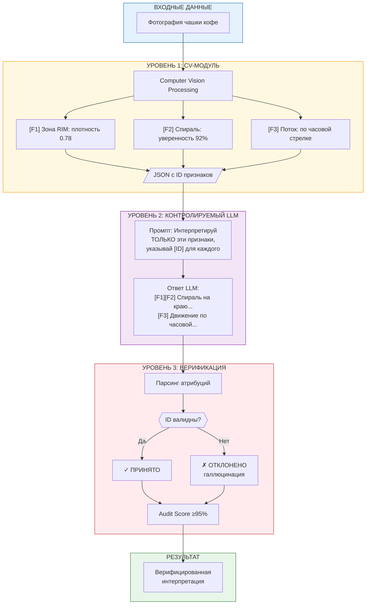
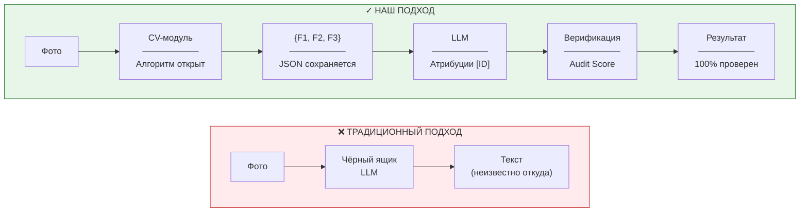
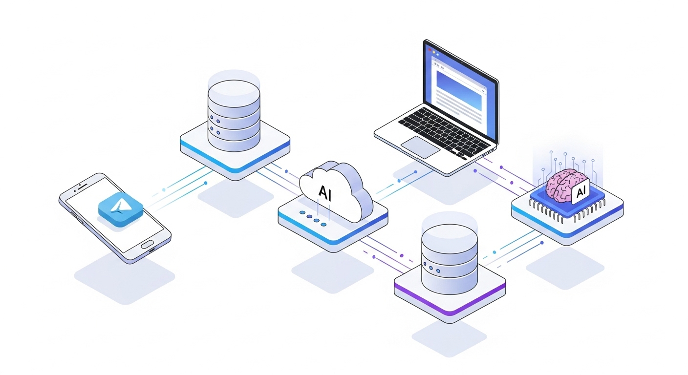
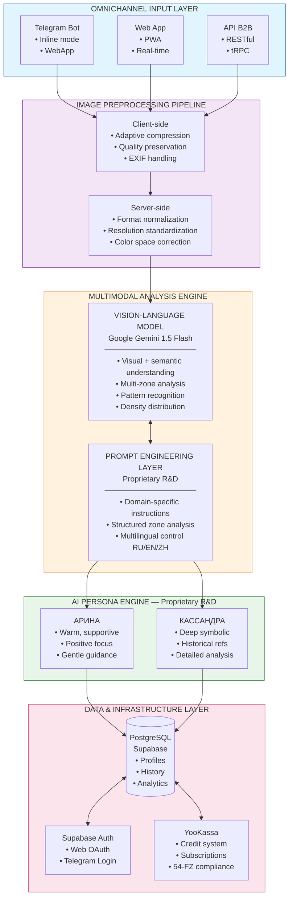
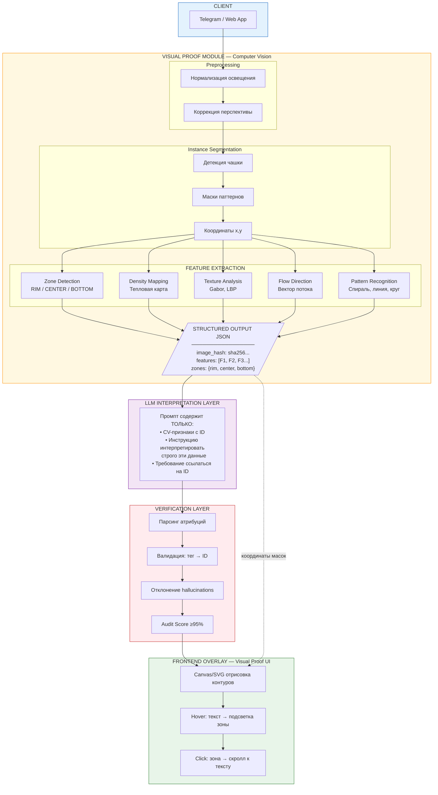
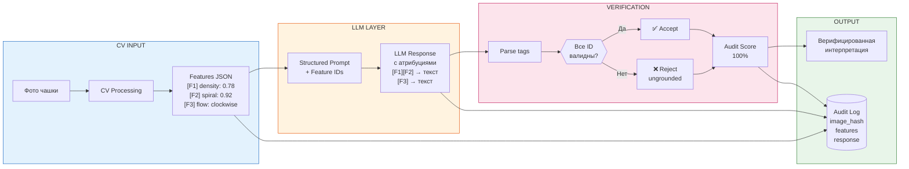
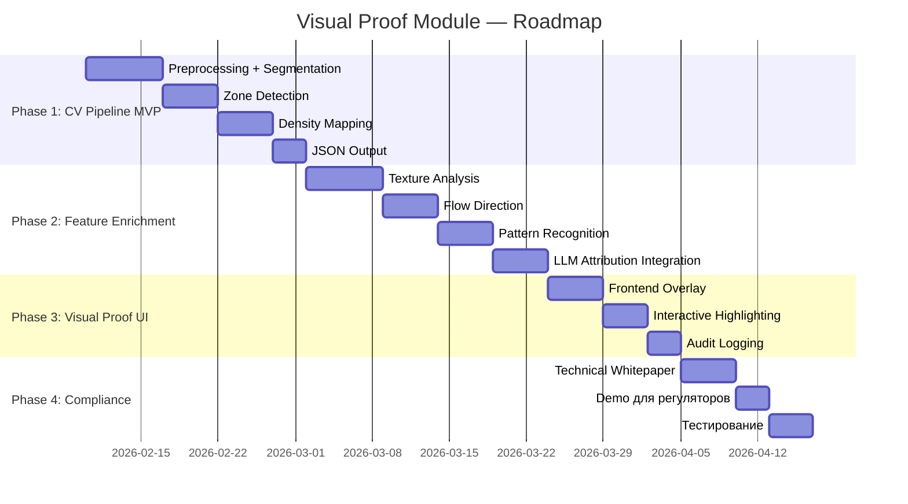

БИЗНЕС-ПЛАН: SYMANCY AI

Юрисдикция: Международный финансовый центр «Астана» (МФЦА / AIFC), Республика Казахстан
Организационно-правовая форма: Symancy Limited (Private Company Limited by Shares) -- в процессе регистрации
Дата: Февраль 2026 г.

---

## 1. ИСПОЛНИТЕЛЬНОЕ РЕЗЮМЕ

**Название проекта:** Symancy AI

**Краткое описание:** Мультимодальная SaaS-платформа на базе искусственного интеллекта для анализа визуальных паттернов в категории Digital Wellness. Платформа Symancy AI разработана и протестирована на pre-MVP. Текущая архитектура включает интеграцию с мультимодальными Vision-Language моделями, собственный слой Prompt Engineering для структурированного анализа изображений и систему AI-персонажей. В рамках дорожной карты (v2.0) разрабатывается Visual Proof Module -- собственный пайплайн компьютерного зрения, который обеспечит полную прозрачность и верифицируемость каждого инсайта через Карту объяснимости (Explainability Map).

**Уникальность:** Гибридная архитектура (Vision-Language модели + Prompt Engineering + детерминированные правила) создаёт «контур контроля» (Control Boundary). Целевая архитектура v2.0 включает собственный CV-пайплайн, где каждый результат сопровождается Картой объяснимости (Explainability Map), что позволяет проследить все этапы генерации вывода -- это соответствует высоким стандартам AFSA к прозрачности (traceability).

**Стратегическая ценность для AIFC:** Регистрация головной компании в МФЦА позволяет защитить интеллектуальную собственность под английским правом, обеспечить международную правовую защиту и использовать AIFC как хаб для масштабирования на рынки Индии, ОАЭ и СНГ.

**Текущий статус:**
- Платформа разработана и протестирована на pre-MVP. Ведётся финальная доработка MVP (запуск Q3-Q4 2026).
- Результаты тестирования pre-MVP: 200 регистраций, 15 покупок, конверсия в платящих 7.5% -- значительно выше отраслевого бенчмарка 2--5%.
- Инвестировано $38 000 (собственные средства учредителя).
- Операционный резерв для запуска: $35 000.
- Symancy Limited в процессе инкорпорации в AIFC (юридический агент -- Benefits & Partners LLP).
- IP передаётся от ООО «СИМАНТИЯ» к Symancy Limited по IP Assignment Agreement сразу после регистрации.

**Ключевые целевые показатели (1-й год):**
- 5 000 платящих пользователей (B2C)
- 1--2 B2B-пилотных партнёрства
- Выручка: $55 000 -- $95 000
- Валовая маржа: >85%

**Планы после регистрации:** Получение статуса IT-резидента Astana Hub для доступа к налоговым льготам и масштабирование на международные рынки.

---

## 2. КОМПАНИЯ И КОМАНДА

### Юридическая структура

- **Symancy Limited (AIFC)** -- головная компания, владелец IP, коммерциализация на глобальных рынках.
- **ООО «СИМАНТИЯ» (РФ)** -- R&D-центр и операционная компания для рынков РФ и СНГ. После регистрации Symancy Limited:
  1. Все исключительные права передаются Symancy Limited (IP Assignment Agreement).
  2. Symancy Limited приобретает 100% долю в ООО «СИМАНТИЯ».
  3. ООО «СИМАНТИЯ» получает неисключительную лицензию на использование платформы на территории РФ и СНГ с уплатой роялти 15--20% от выручки.

### Акционерный капитал и мотивация

Уставный капитал Symancy Limited: 1 000 обыкновенных акций номинальной стоимостью $1 каждая. На момент регистрации 100% акций принадлежат Анне Вознесенской.

Проект SHA (подписание -- сразу после регистрации):

| Параметр | Условие |
|----------|---------|
| Передача CTO за pre-MVP | 5% (50 акций), non-monetary consideration |
| Опцион CTO | 15% (150 акций), цена исполнения $1 |
| Cliff period | 12 мес. с 24.10.2025, ускорение при досрочном выполнении MVP |
| Вестинг после cliff | 5% сразу, затем 10% линейно поквартально (2.5% каждые 3 мес.) |
| Anti-dilution | Право Re-up: CTO может восстановить долю до 20% при размытии |
| При расторжении | Невестованные акции аннулируются, вестованные остаются |

### Ключевые лица

- **Анна Вознесенская (CEO, Founder)** -- MBA (Grenoble Ecole de Management / РАНХиГС), МГИМО (Психология управления); 14+ лет управления международными проектами, финансами, GR. Отвечает за стратегию, комплаенс, взаимодействие с регуляторами.
- **Игорь Масленников (CTO)** -- эксперт по LLM, RAG, мультиагентным системам; основатель AiDevTeam. Отвечает за архитектуру, R&D, кибербезопасность, внедрение Explainable AI.
- **Юридический агент в AIFC:** Benefits & Partners LLP (лицензия AFSA-A-LA-2021-0001).

**Соответствие Fit & Proper:** Опыт команды подтверждён (CV прилагаются), финансовая дисциплина -- подтверждённый source of wealth (доход от предпринимательской деятельности), отсутствие судимостей и связей с нежелательными организациями.

---

## 3. ИНТЕЛЛЕКТУАЛЬНАЯ СОБСТВЕННОСТЬ (IP)

**Текущий держатель прав:** ООО «СИМАНТИЯ» (РФ), 100% принадлежит учредителю.

### План передачи прав (двухэтапная схема)

**Этап 1. Передача pre-MVP от ООО «СИМАНТИЯ» к Symancy Limited.**
Договор об отчуждении исключительных прав. Стоимость передачи: 464 000 руб. (фактическая стоимость разработки, подтверждённая договорами и актами). Сумма ниже порога 3 млн руб. -- паспорт сделки не требуется. Оценка по методу фактических затрат (cost method) обоснована для сделки между взаимозависимыми лицами.

**Этап 2. Приобретение 100% доли в ООО «СИМАНТИЯ».**
Symancy Limited выкупает долю за номинальную стоимость (10 000 руб.).

**Все будущие разработки** (MVP, v2.0 и далее) передаются напрямую от CTO к Symancy Limited по отдельным договорам, что централизует IP в юрисдикции AIFC.

### Состав интеллектуальной собственности

| Компонент | Описание |
|-----------|----------|
| Исходный код платформы | Web-приложение (React 19), Telegram-бот (grammY), серверная логика (Node.js) |
| Prompt Engineering Library | Библиотека специализированных промптов для анализа визуальных паттернов |
| AI Persona Engine | Проприетарная система AI-персонажей (Арина, Кассандра) |
| Методология анализа | Domain-specific методология анализа тассеографии |
| Техническая документация | Архитектурные спецификации, API-документация |
| Товарный знак | «Symancy AI» (регистрация после инкорпорации) |

---

## 4. ТЕХНОЛОГИЧЕСКОЕ ОПИСАНИЕ

> Полное технологическое описание с архитектурными диаграммами приведено в Приложении А данного документа.

### 4.1. Текущая архитектура (v1.0)

Symancy -- AI-платформа для визуального анализа и персонализированной интерпретации образов на основе тассеографии (анализ кофейной гущи). Платформа объединяет технологии Computer Vision, обработки естественного языка (NLP), мультиязычной генерации и персонализированного AI-ассистирования в единой омниканальной системе.

**Архитектурные компоненты:**

| Компонент | Технология | Назначение |
|-----------|-----------|------------|
| Image Preprocessing | browser-image-compression, Sharp | Адаптивная компрессия, нормализация, валидация контента |
| Multimodal Analysis | Vision-Language модели (Gemini, Claude) | Визуальный + семантический анализ, зонирование, распознавание паттернов |
| Prompt Engineering | Собственная R&D-разработка | Структурированный анализ по зонам (RIM/CENTER/BOTTOM), мультиязычный контроль |
| AI Persona Engine | Собственная R&D-разработка | Персонализированные AI-ассистенты с уникальными стилями |
| Omnichannel Delivery | Telegram Bot (grammY), Web (React 19), API (tRPC) | Мультиканальный доступ к платформе |
| Data Layer | PostgreSQL (Supabase), Supabase Auth | Профили, история, аналитика, аутентификация |
| Payments | YooKassa (РФ), Paddle (global), Razorpay (India) | Модульная система приёма платежей |

**AI-персонажи (Persona Engine):**

| Персона | Стилистика | Позиционирование |
|---------|-----------|------------------|
| **Арина** | Тёплая, поддерживающая, эмпатичная | Digital Wellness -- рефлексия, самоанализ, работа с паттернами |
| **Кассандра** | Аналитическая, глубокая, с культурными референсами | Creative Narrative AI -- художественная интерпретация, развлекательная функция |

### 4.2. Защита от галлюцинаций

Языковые модели (LLM) могут генерировать правдоподобный, но не обоснованный текст -- «галлюцинации». Symancy применяет многоуровневую систему защиты:

1. **Структурированный ввод** -- LLM получает результаты предобработки изображения со строгими инструкциями по зонированному анализу.
2. **Prompt Engineering** -- специализированные промпты ограничивают контекст генерации, температура минимальна.
3. **Консистентность** -- seed-параметры и температурные настройки повышают воспроизводимость результатов.

### 4.3. Visual Proof Module (дорожная карта v2.0)

Ключевая инновация в разработке -- собственный модуль Computer Vision, который анализирует изображение **ДО** передачи в LLM и формирует структурированный набор верифицируемых признаков. Каждый текстовый инсайт становится математически привязан к конкретным визуальным данным.

**Компоненты Visual Proof Module:**
- Preprocessing (нормализация освещения, коррекция перспективы) -- OpenCV
- Instance Segmentation (детекция чашки, маски паттернов) -- OpenCV / SAM
- Feature Extraction (зоны, плотность, текстура, направление потока, паттерны) -- scikit-image
- Verification Layer (парсинг атрибуций, валидация ID, Audit Score ≥95%)
- Visual Proof UI (интерактивный overlay с подсветкой зон)

**Соответствие требованиям:**

| Требование | Реализация |
|------------|------------|
| Прозрачность | Каждый шаг CV-пайплайна документирован и верифицируем |
| Трассируемость | Audit log: image_hash -> CV features -> prompt -> response |
| Воспроизводимость | Детерминированный CV-пайплайн для идентичных features |
| Минимизация bias | LLM ограничен интерпретацией только предоставленных признаков |
| Model Misuse Prevention | CV-модуль фильтрует данные и задаёт жёсткий контекст |

### 4.4. Технологический стек

| Слой | Технологии |
|------|-----------|
| Frontend | TypeScript 5.8, React 19, Vite 6, PWA |
| Backend | Node.js, grammY (Telegram), tRPC |
| AI/ML | Google Gemini, Claude (Anthropic), OpenRouter API |
| Database | PostgreSQL (Supabase), pgvector |
| Auth | Supabase Auth, Telegram Login Widget, Custom JWT |
| Payments | YooKassa (РФ), Paddle (global), Razorpay (India), Telr/Stripe (UAE) |
| Infrastructure | Supabase (managed), VPS, GitHub Actions CI/CD |

---

## 5. АНАЛИЗ РЫНКА И ПОЗИЦИОНИРОВАНИЕ

### 5.1. Обзор рынка

Глобальный рынок Digital Wellness / Mental Health Tech в 2026 году оценивается в $8.64 млрд, к 2034 году достигнет $35.29 млрд (CAGR 19.23%). Рост обусловлен увеличением распространённости тревожных расстройств, ростом осведомлённости о ментальном здоровье и государственными инициативами по цифровизации здравоохранения.

Смежный рынок -- цифровые духовные практики (digital divination, астрология, таро) -- демонстрирует взрывной рост: приложения-лидеры набирают 30--60 млн загрузок и генерируют $5--145 млн выручки в год.

### 5.2. TAM / SAM / SOM

| Метрика | Объём | Методология |
|---------|-------|-------------|
| **TAM** (Total Addressable Market) | ~$10 млрд | Глобальный рынок цифровых духовных практик и wellness-приложений с AI |
| **SAM** (Serviceable Available Market) | ~$2.5--3.5 млрд | Мобильные приложения в категории «mind & body» / «lifestyle» с AI на целевых рынках (РФ/СНГ, Индия, ОАЭ, англоязычные) |
| **SOM** (Serviceable Obtainable Market) | $4--15 млн к 3-му году | Реалистичная доля с учётом нишевой специализации на тассеографии и выхода на 3 региона |

### 5.3. Конкурентный анализ

| Конкурент | Рынок | Загрузки | Выручка (год) | Модель | Наш дифференциатор |
|-----------|-------|----------|---------------|--------|-------------------|
| **Faladdin** | Глобальный (Турция) | 50 млн+ | ~$5 млн | Freemium + Premium $9.99/мес | Explainable AI, Visual Proof |
| **Kaave** | Турция, СНГ | 30 млн (заявл.) | н/д | Freemium | Более глубокий анализ, мультиязычность |
| **Co-Star** | США, глобальный | 30 млн | ~$4.4 млн | Подписка $2.99--$9.99/мес | Другая ниша (астрология), но схожая аудитория |
| **Nebula** | Глобальный | 60 млн | ~$8.4 млн | Подписка ~$11.49/мес | Фокус на визуальный анализ, а не гороскопы |
| **AstroTalk** | Индия | Лидер рынка | ~$145 млн | Pay-per-consultation | Технологичность, масштабируемость без живых консультантов |

**Ключевой вывод:** Ни один из конкурентов не использует Explainable AI или визуальную верификацию результатов. Symancy занимает уникальную нишу на пересечении AI-технологий, Digital Wellness и тассеографии с акцентом на прозрачность.

### 5.4. Конкурентные преимущества

1. **Explainable AI** -- каждый инсайт верифицируем и привязан к конкретным визуальным данным (v2.0 с Visual Proof Module).
2. **AI-персонажи** -- уникальная система персонализации, повышающая вовлечённость и retention.
3. **Омниканальность** -- Telegram Bot + Web + API (B2B) в единой платформе.
4. **Мультиязычность** -- RU/EN/ZH с расширением на хинди (2028).
5. **Нишевая специализация** -- единственная платформа с фокусом на тассеографию и Explainable AI.

### 5.5. Позиционирование

Symancy AI -- **этичный, технологичный инструмент когнитивной рефлексии**, дистанцированный от мантических сервисов и медицинских диагнозов. Продукт помогает пользователю анализировать визуальные паттерны и рефлексировать над ними, используя верифицируемую аналитику.

**Формулировка для AFSA:**
«Технология Symancy AI использует методы компьютерного зрения и машинного обучения для анализа визуальных паттернов (симметрия, формы, композиция) на изображениях, загруженных пользователем. Полученные данные интерпретируются алгоритмом, обученным выявлять корреляции с психологическими и поведенческими шаблонами, имеющими научное обоснование (например, связь между предпочтением определённых форм и уровнем тревожности, подтверждённая исследованиями в области поведенческой психологии). Продукт является инструментом для саморефлексии и когнитивной тренировки, не ставит медицинских диагнозов и не даёт обязательных к исполнению предсказаний. Все результаты имеют вероятностный характер и сопровождаются Картой объяснимости (Explainability Map), позволяющей пользователю и регулятору проследить логику каждого вывода, что полностью исключает эффект «чёрного ящика».»

### 5.6. Региональные рынки

| Регион | Характеристика | Стратегия входа | Срок |
|--------|---------------|-----------------|------|
| **РФ и СНГ** | Основной рынок, высокая культурная релевантность тассеографии | Telegram Bot + Web, YooKassa | 2026 (запуск) |
| **Индия** | $14.5 млрд рынок digital health, 94.3% интернет среди молодёжи, CAC ~$1.5--2 | English + Razorpay, Telegram/WhatsApp | H2 2027 |
| **ОАЭ** | Высокое проникновение смартфонов, экспат-аудитория | English + Telr/Stripe | H2 2027 |
| **Казахстан** | €104.6 млн рынок Digital Wellness, господдержка | RU + Paddle | 2027 |

---

## 6. БИЗНЕС-МОДЕЛЬ

### 6.1. B2C: Подписочная модель (SaaS)

Основная модель монетизации -- регулярная подписка с тремя тарифными планами:

| Тариф | Цена (мес.) | Цена (год) | Включает |
|-------|-------------|------------|----------|
| **Базовый** | $2.99 | $29.99 | 5 анализов/мес, 1 тема, персона Арина, ежедневные AI-инсайты |
| **Стандарт** | $5.99 | $59.99 | 15 анализов/мес, все 6 тем, обе персоны |
| **Премиум** | $9.99 | $99.99 | Безлимитные анализы, все темы, приоритетная поддержка, расширенные инсайты |

**6 тем анализа:** Любовь, Карьера, Деньги, Здоровье, Семья, Духовное развитие.

**Freemium:** 1 бесплатный анализ при регистрации + 7-дневный trial.

**ARPPU** (средний доход на платящего пользователя): **$3.5/мес** (~$42/год).

> *Примечание: На начальном этапе коммерческой эксплуатации для сбора обратной связи, тестирования гипотез и оптимизации воронки используется гибкая модель pay-per-use (оплата за отдельные анализы). По мере внедрения полного функционала MVP (Q3-Q4 2026) осуществляется плановый переход на регулярную подписку. Такой гибридный подход минимизирует риски и позволяет эмпирически подтвердить оптимальную модель монетизации.*

### 6.2. B2B: Лицензирование и API

| Сегмент | Фиксированная плата | Переменная часть |
|---------|---------------------|-----------------|
| Малый бизнес (1--5 точек) | $100/мес | + $0.10 за анализ свыше лимита |
| Средний бизнес (5--20 точек) | $300/мес | + $0.07 за анализ |
| Крупные сети и API-доступ | от $1 000/мес | + роялти от B2C-выручки через партнёра |

**Сценарий использования:** На чеке или стаканчике кофейни размещается QR-код с призывом «Узнай, что твоя чашка говорит о тебе». Посетитель переходит в Telegram-бот, загружает фото остатков кофе и получает инсайт от персоны Арина. Дополнительно предлагается скидка на следующий визит. Для сетей с приложением (Drinkit) -- интеграция через API.

**Ценность для B2B-партнёра:**
- Повышение лояльности и вовлечённости гостей (уникальный интерактивный опыт).
- Вирусный маркетинг -- пользователи делятся карточками результатов в соцсетях (stories), обеспечивая бесплатный охват и привлекая новую аудиторию.
- Доступ к агрегированной анонимной статистике: какие темы запрашивают гости, в какое время, динамика настроений.
- Для новых сетей (The Coffee) -- инструмент быстрого завоевания лояльности на старте.

### 6.3. Лицензионные отчисления

ООО «СИМАНТИЯ» (РФ) уплачивает роялти 15--20% от выручки за неисключительную лицензию на использование платформы на территории РФ и СНГ.

Прогноз оборота ООО «СИМАНТИЯ»: 2026 -- до $50 000, 2027 -- до $300 000.

### 6.4. Платёжные провайдеры

| Регион | Провайдер | Комиссия |
|--------|-----------|----------|
| Россия | YooKassa (карты, СБП, Apple Pay, Google Pay, 54-ФЗ) | 2.4--2.8% |
| Глобально / Казахстан | Paddle или 2Checkout | 5--8% (вкл. налоговый комплаенс) |
| Индия | Razorpay | 2--3% |
| ОАЭ | Telr или Stripe | 2.9--3.5% |

### 6.5. Модель развития

Bootstrap (самофинансирование). Подтверждённый source of wealth -- доход от предпринимательской деятельности. Привлечение внешних инвестиций не планируется на первом этапе; возможно на этапе масштабирования (2028, Series A).

---

## 7. GO-TO-MARKET СТРАТЕГИЯ

### 7.1. Поэтапный план запуска

**Этап 1. Soft Launch (месяцы 1--2)**
- Цель: 500--700 активных пользователей, 50--70 платящих.
- Каналы: Friends & Family, тематические Telegram-каналы, микро-блогеры.
- Бюджет: $800.
- CAC: ~$10 (тестовый режим).

**Этап 2. Growth Hacking (месяцы 3--4)**
- Цель: 2 000--3 000 активных, 200--300 платящих.
- Каналы: реферальная программа, вирусные механики (расшаривание карточек анализа), партнёрства с кофейнями, контент-маркетинг.
- Бюджет: $2 200.
- CAC: $4--5.

**Этап 3. Масштабирование (месяцы 5--12)**
- Цель: выход на 5 000 платящих к концу года.
- Каналы и распределение бюджета:

| Канал | Доля бюджета | CAC | Особенности |
|-------|-------------|-----|-------------|
| Telegram Ads | 40% | 75 руб. (~$0.83) | Прямой доступ к целевой аудитории |
| VK | 25% | 55 руб. (~$0.61) | Широкий охват, look-alike аудитории |
| Яндекс.Директ | 20% | 100 руб. (~$1.11) | Высокое качество трафика |
| TikTok | 15% | 40 руб. (~$0.44) | Вирусный потенциал |

- Бюджет: $12 000.
- **Средний CAC по году: $3 за платящего пользователя** (за счёт тёплого таргетинга на уже заинтересованную аудиторию).

**Общий маркетинговый бюджет (1-й год): $15 000.**

### 7.2. B2B-партнёры (в процессе переговоров)

| Партнёр | Рынок | Стадия | Потенциал |
|---------|-------|--------|-----------|
| **Surf Coffee** | РФ, СНГ (международная сеть) | Контакт на уровне руководства | Пилотная интеграция |
| **Кофемания** | РФ (международная сеть) | Предварительные переговоры | Требуется демо |
| **The Coffee** | Казахстан (бразильские корни, с января 2026) | Начальная стадия | Заинтересованы в локальных партнёрствах |
| **Drinkit** | Казахстан (Dodo Brands, план 1000 точек к 2030) | Анализ | API-интеграция в приложение |
| **Zebra Coffee** | Казахстан (крупная сеть в бизнес-центрах) | Анализ | Системное B2B-сотрудничество |
| **Coffee Inn** | Казахстан (Астана, премиальный сегмент) | Анализ | Партнёрство с акцентом на качество |
| **Spectre Coffee, For You by QG** | Казахстан (Алматы, specialty-сегмент) | Анализ | Точечные коллаборации |

Наиболее продвинутые переговоры -- с Surf Coffee и The Coffee. Подписание LOI планируется в Q2--Q3 2026 после регистрации Symancy Limited.

### 7.3. Путь пользователя (Customer Journey)

1. Пользователь находит бота / сайт (реклама, QR-код в кофейне, рекомендация друга).
2. Регистрация -- получает 1 бесплатный анализ.
3. Отправляет фото кофейной гущи.
4. Выбирает тему (1 из 6 или все) и персону (Арина / Кассандра).
5. Получает персонализированный AI-анализ.
6. Делится карточкой результата в соцсетях (вирусная механика).
7. Получает ежедневные утренние/вечерние AI-инсайты (retention).
8. Оформляет подписку для продолжения анализов.

### 7.4. Каналы доставки продукта

| Канал | Статус | Приоритет |
|-------|--------|-----------|
| Telegram Bot + Mini App | Основной канал | Запуск Q2 2026 |
| Web-приложение (React SPA / PWA) | Второй канал | Запуск Q2 2026 |
| App Store / Google Play (Capacitor hybrid) | Расширение охвата | Q4 2026 |
| WhatsApp / WeChat | Международные рынки | 2027 |
| B2B API (tRPC / REST) | Для партнёров | Q3 2026 |

### 7.5. Retention-механики

- Ежедневные персонализированные AI-инсайты (утренние и вечерние сообщения).
- Push-уведомления и напоминания.
- Реферальная программа (бонусные анализы за приглашённых друзей).
- Геймификация (серии, достижения, история анализов).
- Сезонные акции и тематические коллекции.

---

## 8. ФИНАНСОВЫЙ ПЛАН

### 8.1. Уже инвестировано (sunk costs): $38 000

| Статья расходов | Сумма ($) | Подтверждение |
|-----------------|-----------|---------------|
| Разработка ПО (контракты: pre-MVP + ТЗ + MVP) | 25 300 | Договоры и акты |
| Юридические услуги (SHA, MAA, Option Agreement) | 5 000 | Договоры с юристами |
| Регистрация Symancy Ltd (AIFC) | 2 600 | Benefits & Partners |
| Регистрация ООО «СИМАНТИЯ» (РФ) | 1 100 | Пошлина, юрадрес |
| Инфраструктура, домены, API (2024--2025) | 500 | Хостинг, тестовые API |
| Прочие операционные расходы | 3 500 | Командировочные, администрирование |
| **ИТОГО** | **38 000** | Все затраты подтверждены документально |

Дополнительно: CEO с августа 2025 года вкладывает в проект значительное личное время (sweat equity) на безвозмездной основе.

### 8.2. Операционный резерв: $35 000

| Статья | Сумма ($) |
|--------|-----------|
| Корпоративные издержки AIFC (Astana Hub, бухгалтерия, юрсопровождение, аренда) | 5 000 |
| Разработка и поддержка (API, серверы, домены) | 12 000 |
| Маркетинг | 15 000 |
| Резерв | 3 000 |
| **ИТОГО** | **35 000** |

### 8.3. Ключевые метрики финансовой модели

| Метрика | Значение | Источник |
|---------|----------|----------|
| ARPPU | $3.5/мес ($42/год) | Тестирование на pre-MVP |
| Конверсия в платящие | 2.5--3% (на pre-MVP: 7.5%) | Тестирование (200 рег., 15 покупок) + бенчмарк отрасли |
| Churn rate (начальный) | 10--12%/мес | Бенчмарк отрасли |
| Churn rate (целевой) | 7--8%/мес | С retention-механиками |
| CAC (средний) | $3 / платящий | Go-to-market расчёт (тёплый таргетинг) |
| LTV (при churn 8%) | $3.5 / 0.08 = **$43.75** | ARPPU / churn |
| LTV/CAC | **14.6x** | Здоровый показатель (>3x) |
| Органическая доля трафика | 30--40% | Вирусные механики + контент-маркетинг |
| Валовая маржа на анализ | 90--98% | Себестоимость API: $0.01--0.05 |

### 8.4. Unit-экономика (себестоимость анализа)

| Статья | Стоимость |
|--------|-----------|
| Vision API call (анализ изображения) | $0.01--0.03 |
| LLM-генерация текста интерпретации | $0.005--0.02 |
| Инфраструктура (на 1 запрос) | <$0.001 |
| **Себестоимость 1 анализа** | **$0.015--0.05** |
| Средний доход с 1 анализа (при ARPPU $3.5, ~5 анализов/мес) | $0.70 |
| **Валовая маржа** | **93--98%** |

Дополнительные расходы на бесплатные функции (ежедневные AI-инсайты): ~$0.005/инсайт. При 2 инсайтах/день на пользователя = ~$0.30/мес на пользователя. Оптимизация за счёт использования более лёгких моделей (GPT-4o-mini, Gemini Flash) для инсайтов.

### 8.5. Обоснование прогноза пользователей

Прогноз базируется на:
- Результатах тестирования pre-MVP: конверсия из регистрации в первую покупку **7.5%** (200 регистраций, 15 покупок).
- Анализе конкурентов: приложения в нише Digital Wellness в РФ показывают конверсию в платящие 2--5%, количество скачиваний у лидеров -- сотни тысяч.
- Планируемом охвате 150 000--200 000 уникальных пользователей за год. При консервативной конверсии 2.5--3% получаем 3 750--6 000 платящих. Целевой показатель **5 000** (оптимистичный сценарий) находится в этом диапазоне.

### 8.6. Три финансовых сценария

#### Прогноз выручки на 3 года

| Показатель | Пессимистичный | Базовый | Оптимистичный |
|------------|---------------|---------|---------------|
| **1-й год (2026)** | | | |
| Платящих к концу года | 1 000 | 3 000 | 5 000 |
| Выручка B2C | $20 000 | $50 000 | $85 000 |
| Выручка B2B | $1 000 | $5 000 | $10 000 |
| **Итого 1-й год** | **$21 000** | **$55 000** | **$95 000** |
| **2-й год (2027)** | | | |
| Платящих к концу года | 5 000 | 15 000 | 35 000--40 000 |
| Выручка B2C | $105 000 | $380 000 | $940 000 |
| Выручка B2B | $20 000 | $60 000 | $100 000 |
| Роялти (ООО «СИМАНТИЯ») | $5 000 | $15 000 | $30 000 |
| **Итого 2-й год** | **$130 000** | **$455 000** | **$1 070 000** |
| **3-й год (2028)** | | | |
| Платящих к концу года | 15 000 | 30 000 | 60 000+ |
| Выручка B2C | $350 000 | $945 000 | $1 620 000 |
| Выручка B2B | $75 000 | $250 000 | $500 000 |
| Роялти | $15 000 | $45 000 | $90 000 |
| **Итого 3-й год** | **$440 000** | **$1 240 000** | **$2 210 000** |

#### Помесячный прогноз на 1-й год (оптимистичный сценарий)

| Месяц | Платящие (B2C) | Выручка B2C | Выручка B2B | Итого |
|-------|---------------|-------------|-------------|-------|
| 1 | 0 | $0 | $0 | $0 |
| 2 | 100 | $350 | $0 | $350 |
| 3 | 300 | $1 050 | $0 | $1 050 |
| 4 | 600 | $2 100 | $0 | $2 100 |
| 5 | 1 000 | $3 500 | $0 | $3 500 |
| 6 | 1 500 | $5 250 | $0 | $5 250 |
| 7 | 2 000 | $7 000 | $0 | $7 000 |
| 8 | 2 500 | $8 750 | $0 | $8 750 |
| 9 | 3 000 | $10 500 | $1 000 | $11 500 |
| 10 | 3 800 | $13 300 | $2 000 | $15 300 |
| 11 | 4 500 | $15 750 | $3 000 | $18 750 |
| 12 | 5 000 | $17 500 | $4 000 | $21 500 |
| **ИТОГО** | | **$85 050** | **$10 000** | **$95 050** |

#### Помесячный прогноз на 1-й год (базовый сценарий)

| Месяц | Платящие (B2C) | Выручка B2C | Выручка B2B | Итого |
|-------|---------------|-------------|-------------|-------|
| 1 | 0 | $0 | $0 | $0 |
| 2 | 50 | $175 | $0 | $175 |
| 3 | 150 | $525 | $0 | $525 |
| 4 | 350 | $1 225 | $0 | $1 225 |
| 5 | 600 | $2 100 | $0 | $2 100 |
| 6 | 900 | $3 150 | $0 | $3 150 |
| 7 | 1 200 | $4 200 | $0 | $4 200 |
| 8 | 1 500 | $5 250 | $0 | $5 250 |
| 9 | 1 800 | $6 300 | $500 | $6 800 |
| 10 | 2 200 | $7 700 | $1 000 | $8 700 |
| 11 | 2 600 | $9 100 | $1 500 | $10 600 |
| 12 | 3 000 | $10 500 | $2 000 | $12 500 |
| **ИТОГО** | | **$50 225** | **$5 000** | **$55 225** |

### 8.7. Допущения для роста на 2027--2028

**Географическая экспансия (2027):**

| Регион | Бюджет (H2 2027) | CAC | Ожидаемые платящие к концу 2027 |
|--------|-----------------|-----|-------------------------------|
| Индия | $5 000 | $1.5--2 (дешёвый мобильный трафик) | 500--700 |
| ОАЭ | $3 000 | $5--6 (реклама на экспатов) | 200--300 |

**B2B-направление (детальные проекции):**

| Год | Кол-во партнёров | Средний доход/партнёр/мес | Годовая выручка B2B |
|-----|-----------------|--------------------------|---------------------|
| 2026 | 2--3 (пилоты) | $200--500 | $5 000 |
| 2027 | 10--15 | $700--1 000 | $100 000 |
| 2028 | 30--50 | $1 200--1 500 | $500 000 |

### 8.8. Структура расходов на 2027--2028

| Статья | 2027 | 2028 |
|--------|------|------|
| Маркетинг (из реинвестированной прибыли) | $100 000--120 000 | $200 000--300 000 |
| API и инфраструктура | $40 000--60 000 | $80 000--120 000 |
| ФОТ (по Employment Plan) | $120 000--180 000 | $200 000--300 000 |
| Корпоративные и юридические | $15 000 | $20 000 |
| **Итого расходов** | **$275 000--375 000** | **$500 000--740 000** |

**Источник финансирования 2027--2028:** Реинвестирование операционной прибыли. При базовом сценарии выручка 2027 составит ~$455 000, что покрывает расходы. При пессимистичном -- потребуется привлечение инвестиций (friends & family, бизнес-ангелы) или сокращение темпов роста.

### 8.9. Точка безубыточности

- При расходах ~$35 000/год и ARPPU $3.5/мес, точка безубыточности: ~830 платящих пользователей.
- Ожидаемое достижение: месяц 5--7 после запуска (базовый сценарий).

---

## 9. УПРАВЛЕНИЕ РИСКАМИ

| Категория риска | Описание | Вероятность | Меры по снижению |
|----------------|----------|-------------|------------------|
| **Регуляторный** | Вопросы AFSA о позиционировании | Средняя | Чёткая формулировка Digital Wellness, работа через Benefits & Partners, explainable AI |
| **«Чёрный ящик» AI** | Непрозрачность генерации | Низкая | Трёхуровневая защита от галлюцинаций, Visual Proof Module (v2.0), Audit Log |
| **Зависимость от внешних API** | Изменение цен/условий LLM-провайдеров | Средняя | Мультипровайдерная архитектура (Gemini, Claude, OpenAI), возможность переключения |
| **Финансовый** | Недостаточная выручка для масштабирования | Средняя | Bootstrap-модель, 3 сценария, резервный фонд, готовность к pivot |
| **Конкурентный** | Выход крупного игрока в нишу | Низкая | Niche-first стратегия, патентуемая технология Visual Proof, накопленный датасет |
| **Этика AI / bias** | Генерация некорректного контента | Низкая | Strict prompting, температура минимальна, мониторинг, политика ответственного AI |
| **Санкционный** | Сложности трансграничных платежей РФ--AIFC | Средняя | Несколько легальных каналов (банки КЗ, дружественные юрисдикции), консультации юристов |
| **Юридический адрес** | Потеря офиса в AIFC | Низкая | 60-дневный срок уведомления, возможность коворкинга |
| **Кадровый** | Сложность найма в Казахстане | Средняя | Гибкий формат (удалёнка + визиты), конкурентные зарплаты, опционная программа |

### Plan B: Условия для pivot

Решение о стратегическом анализе и возможном pivot -- при недостижении пороговых значений в течение 6 месяцев после публичного запуска:
- Менее 500 платящих пользователей в месяц.
- Retention (D1) ниже 20% или месячный Churn выше 15%.
- Отсутствие хотя бы одного B2B-пилота.
- Превышение CAC уровня 50% от LTV.

Возможные направления pivot: чистое B2B (white-label для кофеен), смена целевой аудитории, расширение на другие виды визуального анализа (таро, хиромантия).

---

## 10. СООТВЕТСТВИЕ ТРЕБОВАНИЯМ AFSA (AIFC)

| Требование AFSA | Реализация |
|-----------------|------------|
| **Операционная устойчивость** | Детальное описание потоков данных, резервное копирование, managed cloud-провайдеры (Supabase), CI/CD |
| **Детерминизм и объяснимость** | Структурированный Prompt Engineering, seed-параметры; Visual Proof Module (v2.0) обеспечит полную трассируемость |
| **Контроль сторонних API** | Мультипровайдерная архитектура, strict prompting, температура минимальна, верификация выходных данных |
| **Этика AI** | Политика предотвращения предвзятости, отсутствие дискриминационных паттернов, регулярный аудит |
| **Fit & Proper** | Опыт и репутация команды подтверждены, source of wealth документирован |
| **AML / KYC** | Платёжные провайдеры обеспечивают AML-комплаенс; компания следует политике AIFC |

**Квалификация для Astana Hub (DeepTech):**
- Собственные алгоритмы: Prompt Engineering Library, Persona Engine
- R&D-компонент: методология domain-specific анализа
- Технологический барьер входа: интеграция Vision-Language моделей с domain expertise
- Патентный потенциал: Visual Proof Module, методология анализа тассеографии

---

## 11. ПЛАН РАЗВИТИЯ (ROADMAP)

| Период | Ключевые задачи |
|--------|----------------|
| **Q1 2026** | Завершение регистрации Symancy Limited в AIFC. Подписание договора аренды. SHA с CTO. |
| **Q2 2026** | Подача заявки на Astana Hub. IP Assignment Agreement. Soft launch продукта (Telegram Bot + Web). |
| **Q3 2026** | Завершение MVP. Закрытое бета-тестирование (200--500 пользователей). Начало переговоров по B2B-пилотам. |
| **Q4 2026** | Публичный запуск (PWA + Capacitor для App Store / Google Play). Первые B2B-пилоты. Масштабирование маркетинга. |
| **2027** | Выход на рынки Индии и ОАЭ. Расширение команды (штат в Казахстане). Разработка Visual Proof Module (v2.0). 10--15 B2B-партнёров. |
| **2028** | Операционная безубыточность. Масштабирование B2B-портфеля (30--50 партнёров). Подготовка к привлечению инвестиций (Series A). Добавление хинди. |

---

## 12. ПЛАН НАЙМА (EMPLOYMENT PLAN) НА 2026--2028 ГГ.

| Должность | 2026 | 2027 | 2028 | Зарплата (gross, Казахстан) |
|-----------|------|------|------|-----------------------------|
| CEO (Анна Вознесенская) | 1 | 1 | 1 | Учредитель |
| CTO (Игорь Масленников) | 1 | 1 | 1 | Опцион 20%; зарплата с 2027 |
| Разработчик (Middle/Senior) | аутсорс | 2 | 3 | $1 200--2 500/мес |
| Маркетолог (Director of Marketing) | 0 | 1 | 1 | $2 000--3 500/мес |
| Служба поддержки (Support) | 0 | 2 | 3 | $500--800/мес |
| Бухгалтер (аутсорс) | + | + | + | ~$200--400/мес |
| Юрист (аутсорс) | + | + | + | По необходимости |
| **ИТОГО штатных** | **2** | **7** | **9** | |

**Зарплаты** соответствуют среднерыночным в Казахстане (Астана/Алматы) по данным hh.kz и Glassdoor на 2026 год.

**Substance в AIFC** обеспечивается:
- Физическим нахождением CEO в офисе на территории AIFC.
- Поэтапным оформлением части команды в казахстанский штат с 2027 года.
- Арендой офиса (коворкинг или виртуальный офис с правом физического присутствия).

**Стратегия найма:** Приоритет -- сохранение текущей команды. По мере роста компании ключевым специалистам предлагается трудоустройство через казахстанскую структуру. Гибкие форматы: удалённая работа + периодические визиты в офис в Астане.

---

## 13. ЗАКЛЮЧЕНИЕ

Symancy AI представляет собой технологически уникальный, этичный и масштабируемый продукт в быстрорастущей категории Digital Wellness ($8.64 млрд в 2026, CAGR 19.23%). Платформа занимает неосвоенную нишу -- AI-анализ визуальных паттернов с Explainable AI -- в которой ни один из существующих конкурентов (Faladdin, Co-Star, Nebula) не предлагает верифицируемую аналитику.

Регистрация головной компании в AIFC обеспечивает защиту интеллектуальной собственности под английским правом, доступ к международным рынкам и прозрачную структуру для регулятора. Команда обладает необходимым опытом (14+ лет управления проектами у CEO, экспертиза в LLM/RAG у CTO), финансовая модель консервативна (3 сценария, bootstrap), а технологическая архитектура спроектирована с учётом требований AFSA к прозрачности, объяснимости и этике ИИ.

Проект полностью соответствует требованиям AFSA для регистрации компании в AIFC и готов к подаче полного пакета документов.

---

**Приложения:**
- Приложение А: Технологическое описание (см. ниже)
- Приложение Б: CV ключевых лиц (CEO, CTO)
- Приложение В: Акт приёмки pre-MVP от 24.10.2025
- Приложение Г: Проект SHA (Shareholders' Agreement)
- Приложение Д: Проект IP Assignment Agreement

---

## ПРИЛОЖЕНИЕ А: ТЕХНОЛОГИЧЕСКОЕ ОПИСАНИЕ

<div style="text-align:center;margin:2em 0">

</div>

---

### ЗАЩИТА ОТ ГАЛЛЮЦИНАЦИЙ: Как мы контролируем AI

> **Для AFSA: Ответ на вопрос о предсказуемости AI-системы**

<div style="text-align:center;margin:2em 0">

<p style="font-size:0.9em;color:#666;margin-top:0.5em"><em>Механизм фильтрации и верификации выходных данных AI</em></p>
</div>

#### Проблема: Галлюцинации LLM

Языковые модели (LLM) могут генерировать правдоподобный, но не обоснованный текст — «галлюцинации». Это неприемлемо для регулируемых сервисов.

#### Наше решение: Трёхуровневая защита



#### Ключевые гарантии для регулятора

| Требование | Как обеспечиваем |
|------------|------------------|
| **Предсказуемость** | Одно фото → одинаковые CV-признаки (детерминированный алгоритм) |
| **Прозрачность** | Каждое утверждение ссылается на конкретный CV-признак |
| **Контроль** | Утверждения без привязки к признакам автоматически отклоняются |
| **Аудит** | Полный лог: image_hash → CV features → prompt → response |
| **Воспроизводимость** | Повторный анализ того же фото даёт идентичные признаки |

#### Почему это не «чёрный ящик»



---

### ТЕКУЩАЯ АРХИТЕКТУРА: Интеллектуальная мультимодальная платформа

**Обзор платформы:**
Symancy — AI-платформа нового поколения для визуального анализа и персонализированной интерпретации образов на основе искусства тассеографии (анализ кофейной гущи). Система объединяет передовые технологии Computer Vision, обработки естественного языка (NLP), мультиязычной генерации и персонализированного AI-ассистирования в единой омниканальной платформе.

<div style="text-align:center;margin:2em 0">

<p style="font-size:0.9em;color:#666;margin-top:0.5em"><em>Омниканальная архитектура платформы Symancy</em></p>
</div>

---

#### Архитектурные компоненты платформы



---

#### Ключевые технологические компоненты

**A. Модуль предобработки изображений (Image Preprocessing Pipeline)**

Собственный многоуровневый пайплайн оптимизации изображений:

| Этап | Технология | R&D компонент |
|------|-----------|---------------|
| Клиентская адаптивная компрессия | browser-image-compression | Алгоритм сохранения критических деталей при уменьшении размера |
| Серверная нормализация | Sharp (Node.js) | Стандартизация входных данных для консистентного анализа |
| Валидация контента | Custom filters | Автоматическое определение пригодности изображения |
| Метаданные и хеширование | SHA-256 | Обеспечение трассируемости и аудита |

**B. Мультимодальный аналитический движок (Multimodal Analysis Engine)**

Интеграция со state-of-the-art Vision-Language моделью с собственным слоем управления:

- **Vision API**: Google Gemini 1.5 Flash — мультимодальная модель с глубоким пониманием визуального контекста
- **Prompt Engineering Layer**: Собственная библиотека специализированных промптов (R&D):
  - **Зонирование**: Инструкции для структурированного анализа по семантическим зонам (RIM / CENTER / BOTTOM)
  - **Паттерн-детекция**: Специализированные директивы для распознавания традиционных символов
  - **Контекстуальная привязка**: Техники связывания визуальных элементов с интерпретацией
  - **Мультиязычность**: Контроль генерации на 3 языках (RU / EN / ZH)

**C. Система AI-персонажей (Persona Engine) — уникальная разработка**

Проприетарная система персонализированных AI-ассистентов:

<div style="display:flex;justify-content:center;gap:2em;margin:1.5em 0;flex-wrap:wrap">
<div style="text-align:center;max-width:200px">

<p style="font-weight:bold;margin:0.5em 0 0.2em">АРИНА</p>
<p style="font-size:0.85em;color:#666">Тёплая, поддерживающая</p>
</div>
<div style="text-align:center;max-width:200px">

<p style="font-weight:bold;margin:0.5em 0 0.2em">КАССАНДРА</p>
<p style="font-size:0.85em;color:#666">Аналитическая, глубокая</p>
</div>
</div>

| Персона | Стилистика | Применение |
|---------|-----------|------------|
| **Арина** | Тёплая, поддерживающая | Акцент на позитивных аспектах, эмпатичные формулировки |
| **Кассандра** | Аналитическая, глубокая | Детальный разбор, исторические и культурные референсы |

Каждая персона — результат исследований в области стилистической настройки LLM через prompt engineering.

**D. Омниканальная платформа (Omnichannel Delivery)**

| Канал | Технология | Возможности |
|-------|-----------|-------------|
| **Telegram Bot** | grammY + pg-boss | Inline-режим, контекстные follow-up, WebApp интеграция, proactive messaging |
| **Web Application** | React 19 + Vite | PWA, адаптивный дизайн, real-time через Supabase Realtime |
| **API** | RESTful + tRPC | Типобезопасный интерфейс для B2B партнёров |

---

#### Интеллектуальные алгоритмы (R&D компонент)

**Prompt Engineering как область исследований:**

Symancy разработала методологию domain-specific prompt engineering для задач визуального анализа. Ключевые инновации:

1. **Структурированное зонирование изображения**
   - Промпты инструктируют модель разделять анализ по семантическим зонам чашки
   - Каждая зона имеет собственную интерпретационную рамку

2. **Паттерн-классификация**
   - Таксономия визуальных паттернов тассеографии (спирали, линии, скопления, разрывы)
   - Связь паттернов с интерпретационным словарём

3. **Consistency Control**
   - Техники для повышения воспроизводимости результатов
   - Температурные настройки и seed-параметры

**Пример структурированного промпта (упрощённый):**
```
Проанализируй изображение кофейной гущи. Раздели анализ на зоны:

1. КРАЙ ЧАШКИ (RIM) — ближайшее будущее, внешние события
   • Опиши видимые паттерны
   • Укажи плотность распределения
   • Интерпретируй символику

2. ЦЕНТР (CENTER) — текущая ситуация
   [аналогичная структура]

3. ДНО (BOTTOM) — глубинные процессы
   [аналогичная структура]

Формат ответа: структурированный JSON с полями zone, patterns, density, interpretation.
```

---

#### Технологические преимущества

| Аспект | Реализация | Бизнес-ценность |
|--------|-----------|-----------------|
| **Мультимодальность** | Vision + Language в едином пайплайне | Глубокое понимание визуального контекста |
| **Персонализация** | AI-персоны с уникальными стилями | Дифференциация от конкурентов |
| **Масштабируемость** | Serverless + managed services | Автоматическое масштабирование |
| **Мультиязычность** | 3 языка (RU/EN/ZH) | Выход на глобальный рынок |
| **Омниканальность** | Telegram + Web + API | Максимальный охват пользователей |
| **Compliance** | 54-ФЗ фискализация | Готовность к работе в РФ/СНГ |

---

#### Соответствие критериям DeepTech (текущее состояние)

| Критерий | Текущая реализация | Статус |
|----------|-------------------|--------|
| Собственные алгоритмы | Prompt Engineering Library, Persona Engine | ✅ Есть |
| Domain expertise | Методология анализа тассеографии | ✅ Есть |
| Технологический барьер | Интеграция компонентов требует экспертизы | ✅ Есть |
| Масштабируемость | Cloud-native архитектура | ✅ Есть |
| **Explainable AI** | Implicit (внутри Vision API) | ⚠️ Требует усиления |
| **Визуальная верификация** | Отсутствует | ⚠️ Требует разработки |

---

#### Области развития (переход к версии 2.0)

Текущая архитектура функциональна и масштабируема. Для полного соответствия требованиям AFSA по Explainable AI планируется развитие:

| Область | Текущее | Целевое (v2.0) |
|---------|---------|----------------|
| Feature Extraction | Implicit (в Vision API) | Explicit CV Pipeline с JSON output |
| Трассируемость | На уровне логов | Attribution mechanism паттерн→текст |
| Визуализация | Текст + фото отдельно | Interactive overlay с подсветкой зон |
| Воспроизводимость | Probabilistic | Deterministic CV + constrained LLM |

**Важно:** Данные улучшения — естественная эволюция платформы, а не переделка. Текущая архитектура является прочным фундаментом для внедрения Visual Proof Module.

---

### Целевая архитектура: Visual Proof Module (v2.0)

**Ключевая инновация:**
Разработка собственного модуля Computer Vision (Visual Proof Module), который анализирует изображение **ДО** передачи в LLM и формирует структурированный набор верифицируемых признаков. Каждый текстовый инсайт становится **математически привязан** к конкретным визуальным данным.

---

#### Архитектура системы



---

#### Детализация модулей

**A. Preprocessing Module**
- **Нормализация освещения**: Адаптивная гистограммная эквализация (CLAHE)
- **Коррекция перспективы**: Автоматическое выравнивание по контуру чашки
- **Стандартизация размера**: Приведение к единому разрешению для консистентности
- **Технологии**: OpenCV (Python) / Sharp (Node.js)

**B. Instance Segmentation Module**
- **Детекция чашки**: Выделение области интереса (ROI) с отсечением фона
- **Сегментация паттернов**: Выделение отдельных визуальных элементов (пятна, линии, скопления)
- **Выход**: Маски сегментации в формате полигонов (массив координат [x,y])
- **Технологии**: OpenCV contour detection, возможно Segment Anything Model (SAM) для точности

**C. Zone Detection Module**

<div style="text-align:center;margin:1.5em 0">

<p style="font-size:0.9em;color:#666;margin-top:0.5em"><em>Алгоритмическое разделение чашки на семантические зоны</em></p>
</div>

- **Алгоритмическое разделение чашки на семантические зоны**:
  - **RIM (край)**: Внешнее кольцо — символизирует ближайшее будущее
  - **CENTER (центр)**: Центральная область — текущая ситуация
  - **BOTTOM (дно)**: Нижняя зона — глубинные процессы, прошлое
- **Выход**: Координаты границ зон для наложения на изображение
- **Технологии**: Геометрические алгоритмы на основе detected cup contour

**D. Density Mapping Module**
- **Построение тепловой карты**: Визуализация плотности распределения кофейного осадка
- **Метрики**: Normalized density value (0.0–1.0) для каждой зоны
- **Выход**: Матрица плотности + визуализация для отладки
- **Технологии**: OpenCV kernel density estimation, Gaussian blur analysis

**E. Texture Analysis Module**
- **Gabor-фильтры**: Анализ направленных текстур и повторяющихся паттернов
- **LBP (Local Binary Patterns)**: Извлечение текстурных дескрипторов
- **Метрики**: Контрастность, зернистость, однородность
- **Выход**: Feature vector с числовыми характеристиками текстуры
- **Технологии**: scikit-image, OpenCV

**F. Flow Direction Module**
- **Анализ направления «течения» гущи**: Определение доминирующего вектора
- **Методы**: Optical flow analysis на статичном изображении, gradient orientation
- **Выход**: Угол направления (0°–360°), сила/уверенность (0.0–1.0)
- **Технологии**: OpenCV calcOpticalFlowFarneback, собственные алгоритмы

**G. Pattern Recognition Module**
- **Классификация геометрических форм**: спираль, линия, круг, скопление, разрыв
- **Confidence score**: Уверенность в детекции каждого паттерна
- **Выход**: Список detected patterns с координатами и confidence
- **Технологии**: Contour analysis, shape matching, возможно классификатор на собственном датасете

---

#### Механизм Explainable AI (Visual Proof)



**Принцип работы:**

1. **Структурированный ввод для LLM**: LLM получает НЕ изображение, а JSON с извлечёнными признаками, где каждый признак имеет уникальный идентификатор (F1, F2, F3...).

2. **Принудительная атрибуция**: Промпт инструктирует LLM ссылаться на ID признаков при каждом утверждении.

3. **Верификация выхода**: Система парсит ответ LLM и проверяет:
   - Все ли упомянутые ID существуют в исходном JSON
   - Нет ли утверждений без привязки к признакам (потенциальные галлюцинации)

4. **Audit Score**: Процент верифицированных утверждений (target: >95%)

**Пример взаимодействия:**

```
CV OUTPUT (JSON):
{
  "features": [
    { "id": "F1", "type": "density", "zone": "rim", "value": 0.78, "bbox": [120,45,280,95] },
    { "id": "F2", "type": "pattern", "name": "spiral", "confidence": 0.92, "center": [200,300] },
    { "id": "F3", "type": "flow", "direction": "clockwise", "angle": 87, "strength": 0.6 }
  ]
}

LLM PROMPT:
"Интерпретируй следующие CV-детектированные признаки. Для каждого утверждения
укажи ID признака в квадратных скобках.

Признаки:
[F1] Высокая плотность в зоне RIM (0.78)
[F2] Спиральный паттерн в центре (confidence: 0.92)
[F3] Направление потока по часовой стрелке (strength: 0.6)

Интерпретируй ТОЛЬКО эти данные."

LLM RESPONSE:
"[F1][F2] Концентрация энергии на краю чашки, формирующаяся в спираль, указывает
на приближающиеся возможности, требующие внимания. [F3] Движение по часовой
стрелке символизирует позитивную динамику в текущем направлении."

VERIFICATION:
✓ [F1][F2] — валидные ID, соответствуют признакам
✓ [F3] — валидный ID
Audit Score: 100% (все утверждения верифицированы)
```

---

#### Frontend Overlay (Visual Proof UI)

**Визуализация связи CV ↔ Текст:**

Клиентское приложение получает от сервера:
1. Оригинальное изображение
2. Массив координат (маски, bbox) для каждого детектированного признака
3. Текстовую интерпретацию с атрибуциями

**Интерактивные элементы:**
- **Overlay контуров**: Canvas/SVG отрисовывает векторные контуры поверх фото
- **Hover-эффект**: При наведении на фрагмент текста — подсвечивается соответствующая зона на фото
- **Клик-навигация**: Клик на зону фото — скроллит к соответствующему тексту
- **Цветовая кодировка**: Разные цвета для разных типов признаков

**Важно:**
Контуры **не генерируются** нейросетью (Image-to-Image), а **отрисовываются** на основе точных координат, полученных от CV-модуля. Это гарантирует детерминированность и воспроизводимость.

---

#### Технический стек целевой архитектуры

| Компонент | Технология | Обоснование |
|-----------|-----------|-------------|
| CV Pipeline | Python + OpenCV + FastAPI | Полноценные CV-возможности, GPU-ускорение |
| Segmentation | OpenCV / SAM (опционально) | Баланс точности и скорости |
| Feature Extraction | scikit-image + numpy | Промышленный стандарт для текстурного анализа |
| LLM Integration | Google Gemini API / OpenAI | Внешний API с нашим контролем входа |
| Verification Layer | Python + regex/parser | Валидация атрибуций |
| Frontend Overlay | Canvas API / SVG + React | Кроссплатформенная отрисовка |
| Audit Logging | PostgreSQL (Supabase) | Хранение полной трассы для аудита |

---

#### Соответствие требованиям регуляторов

**Для AFSA (МФЦА) — Explainable AI:**

| Требование | Реализация |
|------------|------------|
| Прозрачность алгоритма | Каждый шаг CV-пайплайна документирован и верифицируем |
| Отсутствие «чёрного ящика» | LLM получает только структурированные данные, не изображение |
| Трассируемость | Audit log: image_hash → CV features → prompt → LLM response |
| Воспроизводимость | Детерминированный CV-пайплайн даёт идентичные features для одного фото |
| Минимизация Model Bias | LLM ограничен интерпретацией только предоставленных признаков |
| Model Misuse Prevention | CV-модуль фильтрует данные и задаёт жёсткий контекст |

**Для Astana Hub — DeepTech / R&D:**

| Критерий | Подтверждение |
|----------|---------------|
| Собственные алгоритмы | Custom CV pipeline для специфической задачи (тассеография) |
| R&D компонент | Исследование и разработка domain-specific feature extraction |
| Уникальность | Нет готовых решений для анализа кофейной гущи — собственная разработка |
| Демонстрируемость | Визуальное доказательство работы каждого модуля |
| Интеллектуальная собственность | Алгоритмы, обученные модели, датасет — база для патентования |

---

#### Дорожная карта реализации Visual Proof Module



**Фаза 1: CV Pipeline MVP (2–3 недели)**
- Preprocessing + Cup Segmentation
- Zone Detection
- Basic Density Mapping
- Structured JSON output

**Фаза 2: Feature Enrichment (2–3 недели)**
- Texture Analysis
- Flow Direction
- Pattern Recognition
- LLM integration с атрибуцией

**Фаза 3: Visual Proof UI (1–2 недели)**
- Frontend Overlay implementation
- Interactive highlighting
- Audit logging

**Фаза 4: Compliance & Documentation (1–2 недели)**
- Technical whitepaper
- Demo для регуляторов
- Тестирование воспроизводимости

---

### РЕЗЮМЕ ДЛЯ РЕГУЛЯТОРОВ

##### Для Astana Hub (DeepTech qualification)

**Symancy — DeepTech платформа, потому что:**

✅ **Собственные алгоритмы и R&D:**
- Проприетарная система Prompt Engineering для domain-specific анализа
- Уникальная Persona Engine с AI-персонажами
- Методология структурированного зонирования изображений
- Разрабатываемый Visual Proof Module (CV Pipeline)

✅ **Технологический барьер входа:**
- Интеграция Vision-Language моделей с domain expertise
- Мультиязычная генерация (RU/EN/ZH) с контролем стиля
- Омниканальная архитектура (Telegram + Web + API)

✅ **Интеллектуальная собственность:**
- Библиотека специализированных промптов
- Методология анализа тассеографии
- Планируемые патенты на Visual Proof технологию

✅ **Соответствие приоритетным направлениям:**
- Artificial Intelligence / Machine Learning
- Computer Vision
- Natural Language Processing

---

##### Для AFSA (Explainable AI compliance)

**Текущее состояние:**
Платформа использует структурированный подход к анализу с зонированием изображений и связыванием визуальных паттернов с интерпретацией через систему промптов.

**Планируемое усиление (Visual Proof Module):**

| Требование AFSA | Реализация |
|-----------------|------------|
| **Прозрачность** | Explicit CV feature extraction с JSON output |
| **Трассируемость** | Audit log: image_hash → features → prompt → response |
| **Объяснимость** | Каждое утверждение привязано к конкретному CV-признаку |
| **Воспроизводимость** | Детерминированный CV даёт идентичные features |
| **Визуальная верификация** | Frontend overlay с интерактивной подсветкой зон |
| **Model Bias mitigation** | LLM ограничен интерпретацией только CV-detected данных |
| **Model Misuse prevention** | CV-модуль фильтрует и контекстуализирует вход |

**Ключевое преимущество:**
Symancy — не «чёрный ящик». Система демонстрирует явную цепочку: **визуальный паттерн → CV-признак → интерпретация**, что обеспечивает полную прозрачность для регулятора.

---

##### Сравнительная таблица архитектур

| Характеристика | v1.0 (текущая) | v2.0 (с Visual Proof) |
|----------------|----------------|----------------------|
| Prompt Engineering | ✅ Есть | ✅ Усилен |
| AI Personas | ✅ Есть | ✅ Есть |
| Омниканальность | ✅ Есть | ✅ Есть |
| **CV Pipeline** | ⚠️ Implicit | ✅ Explicit |
| **Attribution** | ⚠️ Implicit | ✅ Explicit |
| **Visual Overlay** | ❌ Нет | ✅ Есть |
| **Audit Trail** | ⚠️ Базовый | ✅ Полный |
| **AFSA Compliance** | ⚠️ Частично | ✅ Полностью |
| **DeepTech level** | ✅ Базовый | ✅✅ Усиленный |

---

*Документ подготовлен: февраль 2026 г.*
