<div style="text-align:center;padding:3em 2em 2em;page-break-after:always">

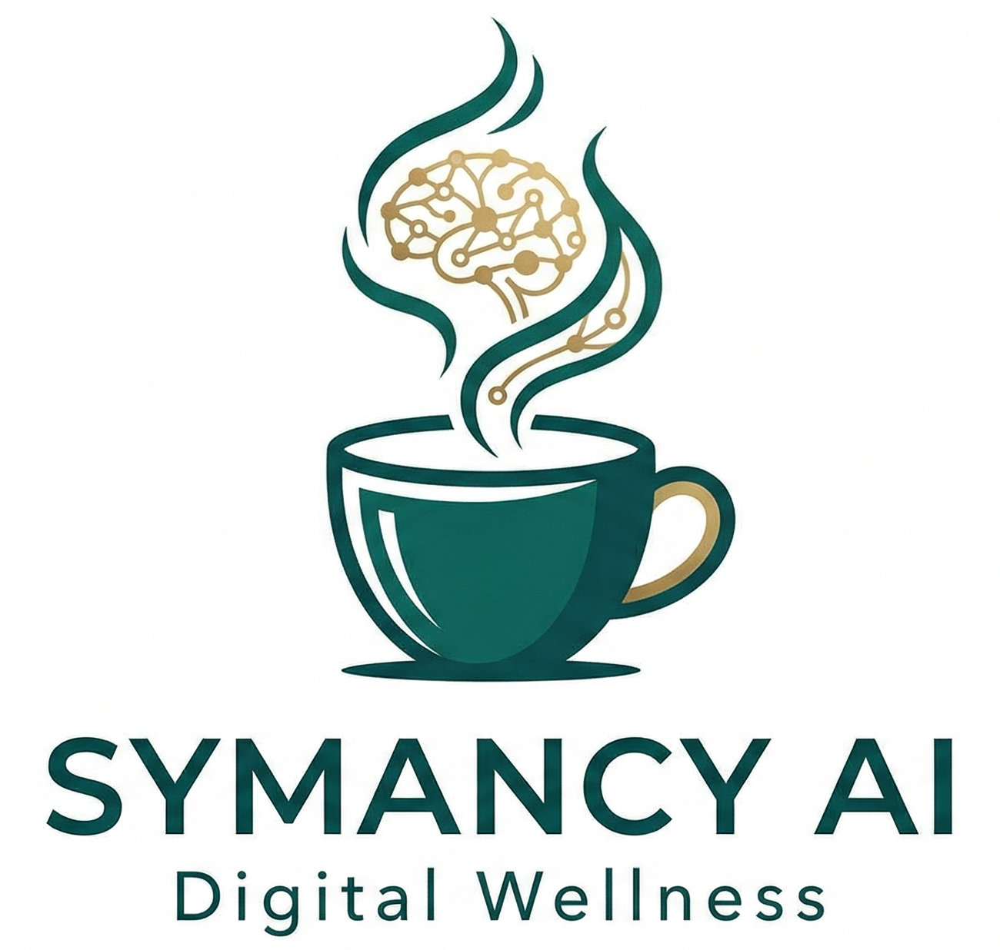

<h1 style="font-size:2.2em;margin:0 0 0.3em;letter-spacing:0.02em">BUSINESS PLAN</h1>
<h2 style="font-size:1.4em;font-weight:normal;color:#555;margin:0 0 2.5em">SYMANCY AI</h2>


<table style="margin:0 auto;border:none;border-collapse:collapse;text-align:left;font-size:0.95em">
<tr><td style="padding:0.3em 1em 0.3em 0;font-weight:bold;border:none;color:#333">Jurisdiction</td><td style="padding:0.3em 0;border:none">Astana International Financial Centre (AIFC), Republic of Kazakhstan</td></tr>
<tr><td style="padding:0.3em 1em 0.3em 0;font-weight:bold;border:none;color:#333">Legal Form</td><td style="padding:0.3em 0;border:none">Symancy Limited (Private Company Limited by Shares) — incorporation in progress</td></tr>
<tr><td style="padding:0.3em 1em 0.3em 0;font-weight:bold;border:none;color:#333">Date</td><td style="padding:0.3em 0;border:none">February 2026</td></tr>
</table>

<p style="margin:2.5em 0 0;padding:0.6em 1.5em;display:inline-block;border:2px solid #c0392b;border-radius:4px;color:#c0392b;font-weight:bold;font-size:0.9em;letter-spacing:0.1em">CONFIDENTIAL</p>

</div>

---

## Table of Contents

1. [Executive Summary](#1-executive-summary)
2. [Company and Team](#2-company-and-team)
3. [Intellectual Property (IP)](#3-intellectual-property-ip)
4. [Technology Description](#4-technology-description)
5. [Market Analysis and Positioning](#5-market-analysis-and-positioning)
6. [Business Model](#6-business-model)
7. [Go-to-Market Strategy](#7-go-to-market-strategy)
8. [Financial Plan](#8-financial-plan)
9. [Risk Management](#9-risk-management)
10. [AFSA (AIFC) Compliance](#10-afsa-aifc-compliance)
11. [Development Plan (Roadmap)](#11-development-plan-roadmap)
12. [Employment Plan for 2026--2028](#12-employment-plan-for-2026-2028)
13. [Conclusion](#13-conclusion)
14. [Appendix A: Technology Description](#appendix-a-technology-description)

---

## 1. EXECUTIVE SUMMARY

**Project Name:** Symancy AI

**Brief Description:** A multimodal SaaS platform powered by artificial intelligence for visual pattern analysis in the Digital Wellness category. The Symancy AI platform has been developed and tested at the pre-MVP stage. The current architecture includes integration with multimodal Vision-Language models, a proprietary Prompt Engineering layer for structured image analysis, and an AI persona system. As part of the roadmap (v2.0), the Visual Proof Module is being developed -- a proprietary computer vision pipeline that will ensure full transparency and verifiability of every insight through an Explainability Map.

**Uniqueness:** The hybrid architecture (Vision-Language models + Prompt Engineering + deterministic rules) creates a "Control Boundary." The target v2.0 architecture includes a proprietary CV pipeline where each result is accompanied by an Explainability Map, allowing all stages of output generation to be traced -- this meets AFSA's high standards for traceability.

**Strategic Value for AIFC:** Registering the parent company in AIFC enables intellectual property protection under English law, ensures international legal protection, and leverages AIFC as a hub for scaling into India, UAE, and CIS markets.

**Current Status:**
- The platform has been developed and tested at the pre-MVP stage. Final MVP development is underway (launch Q3-Q4 2026).
- Pre-MVP testing results: 200 registrations, 15 purchases, conversion to paying users 7.5% -- significantly above the industry benchmark of 2--5%.
- $38,000 invested (founder's personal funds).
- Operating reserve for launch: $35,000.
- Symancy Limited is in the process of incorporation in AIFC (legal agent -- Benefits & Partners LLP).
- IP is to be transferred from LLC "SIMANTIA" (ООО «СИМАНТИЯ») to Symancy Limited via an IP Assignment Agreement immediately upon registration.

**Key Target Metrics (Year 1):**
- 5,000 paying users (B2C)
- 1--2 B2B pilot partnerships
- Revenue: $55,000 -- $95,000
- Gross margin: >85%

**Post-Registration Plans:** Obtaining IT resident status at Astana Hub for access to tax benefits and scaling to international markets.

---

## 2. COMPANY AND TEAM

### Legal Structure

- **Symancy Limited (AIFC)** -- parent company, IP holder, commercialization in global markets.
- **LLC "SIMANTIA" (ООО «СИМАНТИЯ», Russia)** -- R&D center and operating company for Russia and CIS markets. Upon registration of Symancy Limited:
  1. All exclusive rights are transferred to Symancy Limited (IP Assignment Agreement).
  2. Symancy Limited acquires a 100% stake in LLC "SIMANTIA" (ООО «СИМАНТИЯ»).
  3. LLC "SIMANTIA" (ООО «СИМАНТИЯ») receives a non-exclusive license to use the platform in Russia and CIS territories, paying royalties of 15--20% of revenue.

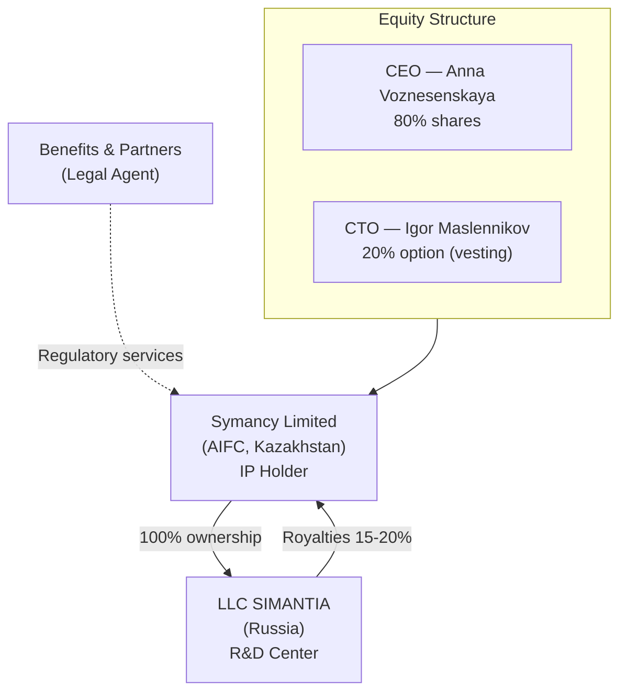
```mermaid
flowchart TB
    SYM["Symancy Limited<br/>(AIFC, Kazakhstan)<br/>IP Holder"]
    LLC["LLC SIMANTIA<br/>(Russia)<br/>R&D Center"]

    SYM -->|"100% ownership"| LLC
    LLC -->|"Royalties 15-20%"| SYM

    subgraph Equity["Equity Structure"]
        CEO["CEO — Anna Voznesenskaya<br/>80% shares"]
        CTO["CTO — Igor Maslennikov<br/>20% option (vesting)"]
    end

    Equity --> SYM
    BP["Benefits & Partners<br/>(Legal Agent)"] -.->|"Regulatory services"| SYM
```

### Share Capital and Incentive Structure

Authorized share capital of Symancy Limited: 1,000 ordinary shares with a par value of $1 each. At the time of registration, 100% of shares are held by Anna Voznesenskaya.

Draft SHA (signing -- immediately upon registration):

| Parameter | Condition |
|-----------|-----------|
| CTO transfer for pre-MVP | 5% (50 shares), non-monetary consideration |
| CTO option | 15% (150 shares), exercise price $1 |
| Cliff period | 12 months from 24.10.2025, acceleration upon early MVP completion |
| Post-cliff vesting | 5% immediately, then 10% linear quarterly (2.5% every 3 months) |
| Anti-dilution | Re-up right: CTO may restore stake to 20% upon dilution |
| Upon termination | Unvested shares are cancelled, vested shares are retained |

### Key Personnel

- **Anna Voznesenskaya (CEO, Founder)** -- MBA (Grenoble Ecole de Management / RANEPA), MGIMO (Management Psychology); 14+ years of international project management, finance, and GR experience. Responsible for strategy, compliance, and regulatory engagement.
- **Igor Maslennikov (CTO)** -- LLM, RAG, and multi-agent systems expert; founder of AiDevTeam. Responsible for architecture, R&D, cybersecurity, and Explainable AI implementation.
- **Legal Agent in AIFC:** Benefits & Partners LLP (license AFSA-A-LA-2021-0001).

**Fit & Proper Compliance:** The team's experience is documented (CVs attached), financial discipline is confirmed -- verified source of wealth (income from entrepreneurial activity), no criminal record, and no affiliations with undesirable organizations.

---

## 3. INTELLECTUAL PROPERTY (IP)

**Current Rights Holder:** LLC "SIMANTIA" (ООО «СИМАНТИЯ», Russia), 100% owned by the founder.

### Rights Transfer Plan (Two-Stage Scheme)

**Stage 1. Transfer of pre-MVP from LLC "SIMANTIA" (ООО «СИМАНТИЯ») to Symancy Limited.**
Agreement on the alienation of exclusive rights. Transfer value: 464,000 RUB (actual development cost, confirmed by contracts and acceptance certificates). The amount is below the 3 million RUB threshold -- a transaction passport is not required. Valuation using the cost method is justified for a transaction between related parties.

**Stage 2. Acquisition of a 100% stake in LLC "SIMANTIA" (ООО «СИМАНТИЯ»).**
Symancy Limited acquires the stake at nominal value (10,000 RUB).

**All future developments** (MVP, v2.0, and beyond) are transferred directly from the CTO to Symancy Limited under separate agreements, centralizing IP in the AIFC jurisdiction.

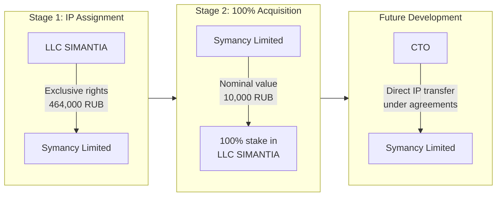
```mermaid
flowchart LR
    subgraph S1["Stage 1: IP Assignment"]
        LLC1["LLC SIMANTIA"] -->|"Exclusive rights<br/>464,000 RUB"| SYM1["Symancy Limited"]
    end
    subgraph S2["Stage 2: 100% Acquisition"]
        SYM2["Symancy Limited"] -->|"Nominal value<br/>10,000 RUB"| LLC2["100% stake in<br/>LLC SIMANTIA"]
    end
    subgraph S3["Future Development"]
        CTO["CTO"] -->|"Direct IP transfer<br/>under agreements"| SYM3["Symancy Limited"]
    end

    S1 --> S2 --> S3
```

### Intellectual Property Composition

| Component | Description |
|-----------|-------------|
| Platform Source Code | Web application (React 19), Telegram bot (grammY), server logic (Node.js) |
| Prompt Engineering Library | Library of specialized prompts for visual pattern analysis |
| AI Persona Engine | Proprietary AI persona system (Arina, Cassandra) |
| Analysis Methodology | Domain-specific tasseography analysis methodology |
| Technical Documentation | Architectural specifications, API documentation |
| Trademark | "Symancy AI" (registration upon incorporation) |

---

## 4. TECHNOLOGY DESCRIPTION

> A complete technology description with architectural diagrams is provided in Appendix A of this document.

### 4.1. Current Architecture (v1.0)

Symancy is an AI platform for visual analysis and personalized interpretation of imagery based on tasseography (coffee grounds reading). The platform integrates Computer Vision, Natural Language Processing (NLP), multilingual generation, and personalized AI assistance technologies in a unified omnichannel system.

**Architectural Components:**

| Component | Technology | Purpose |
|-----------|-----------|---------|
| Image Preprocessing | browser-image-compression, Sharp | Adaptive compression, normalization, content validation |
| Multimodal Analysis | Vision-Language models (Gemini, Claude) | Visual + semantic analysis, zoning, pattern recognition |
| Prompt Engineering | Proprietary R&D development | Structured analysis by zones (RIM/CENTER/BOTTOM), multilingual control |
| AI Persona Engine | Proprietary R&D development | Personalized AI assistants with unique styles |
| Omnichannel Delivery | Telegram Bot (grammY), Web (React 19), API (tRPC) | Multi-channel platform access |
| Data Layer | PostgreSQL (Supabase), Supabase Auth | Profiles, history, analytics, authentication |
| Payments | YooKassa (Russia), Paddle (global), Razorpay (India) | Modular payment processing system |

<div style="text-align:center;margin:2em 0">
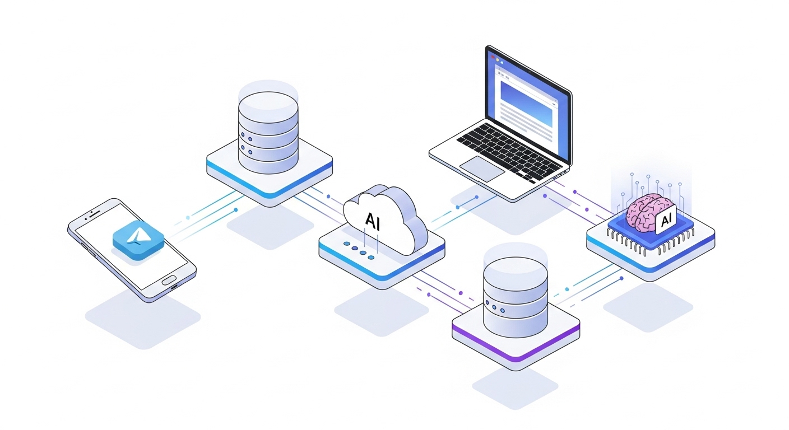
<p style="font-size:0.9em;color:#666;margin-top:0.5em"><em>Omnichannel Platform Architecture</em></p>
</div>

<div style="display:flex;justify-content:center;gap:2em;flex-wrap:wrap;margin:2em 0">
<div style="text-align:center">
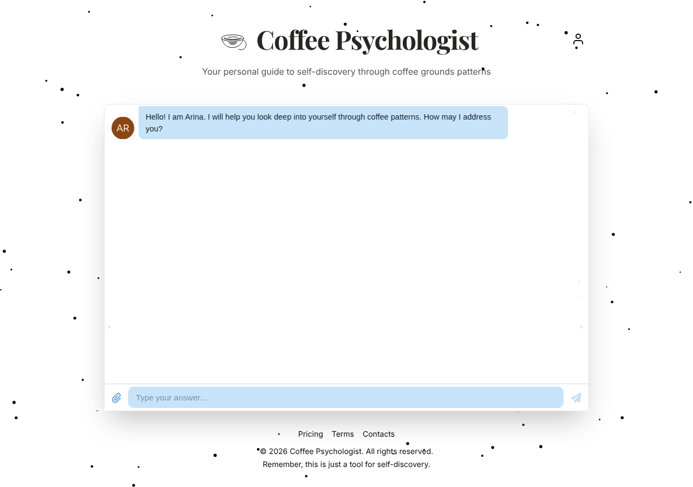
<p style="font-size:0.9em;color:#666;margin-top:0.5em"><em>Web Application — Desktop</em></p>
</div>
<div style="text-align:center">
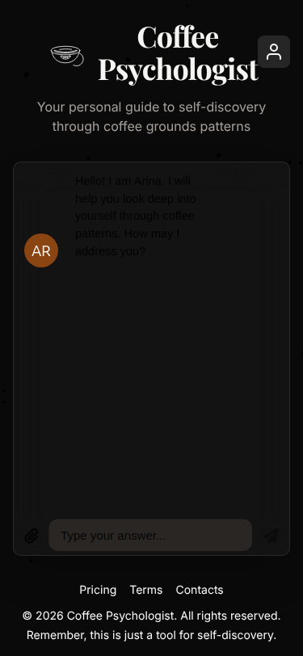
<p style="font-size:0.9em;color:#666;margin-top:0.5em"><em>Mobile — Dark Theme</em></p>
</div>
</div>

**AI Personas (Persona Engine):**

| Persona | Style | Positioning |
|---------|-------|-------------|
| **Arina** | Warm, supportive, empathetic | Digital Wellness -- reflection, self-analysis, working with patterns |
| **Cassandra** | Analytical, profound, with cultural references | Creative Narrative AI -- artistic interpretation, entertainment function |

<div style="display:flex;justify-content:center;gap:2em;flex-wrap:wrap;margin:2em 0">
<div style="text-align:center">

<p style="font-size:0.9em;color:#666;margin-top:0.5em"><em>Arina — Digital Wellness</em></p>
</div>
<div style="text-align:center">

<p style="font-size:0.9em;color:#666;margin-top:0.5em"><em>Cassandra — Creative Narrative AI</em></p>
</div>
</div>

### 4.2. Hallucination Protection

Language models (LLMs) can generate plausible but ungrounded text -- "hallucinations." Symancy employs a multi-layered protection system:

<div style="text-align:center;margin:2em 0">

<p style="font-size:0.9em;color:#666;margin-top:0.5em"><em>AI Output Filtering and Verification Mechanism</em></p>
</div>

1. **Structured Input** -- The LLM receives image preprocessing results with strict instructions for zone-based analysis.
2. **Prompt Engineering** -- Specialized prompts constrain the generation context; temperature is minimized.
3. **Consistency** -- Seed parameters and temperature settings improve result reproducibility.

### 4.3. Visual Proof Module (v2.0 Roadmap)

The key innovation under development is a proprietary Computer Vision module that analyzes the image **BEFORE** passing it to the LLM and generates a structured set of verifiable features. Each textual insight becomes mathematically linked to specific visual data.

**Visual Proof Module Components:**
- Preprocessing (lighting normalization, perspective correction) -- OpenCV
- Instance Segmentation (cup detection, pattern masks) -- OpenCV / SAM
- Feature Extraction (zones, density, texture, flow direction, patterns) -- scikit-image
- Verification Layer (attribution parsing, ID validation, Audit Score ≥95%)
- Visual Proof UI (interactive overlay with zone highlighting)

<div style="text-align:center;margin:2em 0">

<p style="font-size:0.9em;color:#666;margin-top:0.5em"><em>Computer Vision Zone Detection: RIM / CENTER / BOTTOM</em></p>
</div>

**Compliance Alignment:**

| Requirement | Implementation |
|-------------|----------------|
| Transparency | Each step of the CV pipeline is documented and verifiable |
| Traceability | Audit log: image_hash -> CV features -> prompt -> response |
| Reproducibility | Deterministic CV pipeline for identical features |
| Bias Minimization | LLM is restricted to interpreting only the provided features |
| Model Misuse Prevention | CV module filters data and sets a strict context |

### 4.4. Technology Stack

| Layer | Technologies |
|-------|-------------|
| Frontend | TypeScript 5.8, React 19, Vite 6, PWA |
| Backend | Node.js, grammY (Telegram), tRPC |
| AI/ML | Google Gemini, Claude (Anthropic), OpenRouter API |
| Database | PostgreSQL (Supabase), pgvector |
| Auth | Supabase Auth, Telegram Login Widget, Custom JWT |
| Payments | YooKassa (Russia), Paddle (global), Razorpay (India), Telr/Stripe (UAE) |
| Infrastructure | Supabase (managed), VPS, GitHub Actions CI/CD |

---

## 5. MARKET ANALYSIS AND POSITIONING

### 5.1. Market Overview

The global Digital Wellness / Mental Health Tech market is valued at $8.64 billion in 2026 and is projected to reach $35.29 billion by 2034 (CAGR 19.23%). Growth is driven by increasing prevalence of anxiety disorders, rising mental health awareness, and government healthcare digitization initiatives.

The adjacent market -- digital spiritual practices (digital divination, astrology, tarot) -- demonstrates explosive growth: leading apps accumulate 30--60 million downloads and generate $5--145 million in annual revenue.

### 5.2. TAM / SAM / SOM

| Metric | Volume | Methodology |
|--------|--------|-------------|
| **TAM** (Total Addressable Market) | ~$10 billion | Global market for digital spiritual practices and AI wellness apps |
| **SAM** (Serviceable Available Market) | ~$2.5--3.5 billion | Mobile apps in "mind & body" / "lifestyle" category with AI in target markets (Russia/CIS, India, UAE, English-speaking) |
| **SOM** (Serviceable Obtainable Market) | $4--15 million by Year 3 | Realistic share considering niche specialization in tasseography and entry into 3 regions |

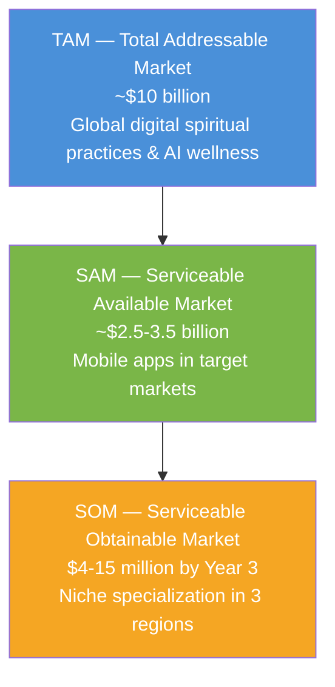
```mermaid
flowchart TB
    TAM["TAM — Total Addressable Market<br/>~$10 billion<br/>Global digital spiritual practices & AI wellness"]
    SAM["SAM — Serviceable Available Market<br/>~$2.5-3.5 billion<br/>Mobile apps in target markets"]
    SOM["SOM — Serviceable Obtainable Market<br/>$4-15 million by Year 3<br/>Niche specialization in 3 regions"]

    TAM --> SAM --> SOM

    style TAM fill:#4a90d9,color:#fff
    style SAM fill:#7ab648,color:#fff
    style SOM fill:#f5a623,color:#fff
```

### 5.3. Competitive Analysis

| Competitor | Market | Downloads | Revenue (annual) | Model | Our Differentiator |
|------------|--------|-----------|------------------|-------|--------------------|
| **Faladdin** | Global (Turkey) | 50M+ | ~$5M | Freemium + Premium $9.99/mo | Explainable AI, Visual Proof |
| **Kaave** | Turkey, CIS | 30M (claimed) | N/A | Freemium | Deeper analysis, multilingual |
| **Co-Star** | USA, global | 30M | ~$4.4M | Subscription $2.99--$9.99/mo | Different niche (astrology), but similar audience |
| **Nebula** | Global | 60M | ~$8.4M | Subscription ~$11.49/mo | Focus on visual analysis, not horoscopes |
| **AstroTalk** | India | Market leader | ~$145M | Pay-per-consultation | Technology-driven, scalable without live consultants |

**Key Conclusion:** None of the competitors use Explainable AI or visual verification of results. Symancy occupies a unique niche at the intersection of AI technology, Digital Wellness, and tasseography with an emphasis on transparency.

### 5.4. Competitive Advantages

1. **Explainable AI** -- each insight is verifiable and linked to specific visual data (v2.0 with Visual Proof Module).
2. **AI Personas** -- a unique personalization system that increases engagement and retention.
3. **Omnichannel** -- Telegram Bot + Web + API (B2B) in a unified platform.
4. **Multilingual** -- RU/EN/ZH with expansion to Hindi (2028).
5. **Niche Specialization** -- the only platform focused on tasseography and Explainable AI.

### 5.5. Positioning

Symancy AI is an **ethical, technology-driven cognitive reflection tool**, distanced from divination services and medical diagnostics. The product helps users analyze visual patterns and reflect upon them using verifiable analytics.

**Statement for AFSA:**
"Symancy AI technology uses computer vision and machine learning methods to analyze visual patterns (symmetry, shapes, composition) in user-uploaded images. The obtained data is interpreted by an algorithm trained to identify correlations with psychological and behavioral patterns that have scientific backing (e.g., the link between preference for certain shapes and anxiety levels, confirmed by behavioral psychology research). The product is a tool for self-reflection and cognitive training; it does not provide medical diagnoses or binding predictions. All results are probabilistic in nature and are accompanied by an Explainability Map that allows users and regulators to trace the logic of each conclusion, completely eliminating the 'black box' effect."

### 5.6. Regional Markets

| Region | Characteristics | Entry Strategy | Timeline |
|--------|----------------|----------------|----------|
| **Russia and CIS** | Primary market, high cultural relevance of tasseography | Telegram Bot + Web, YooKassa | 2026 (launch) |
| **India** | $14.5B digital health market, 94.3% internet penetration among youth, CAC ~$1.5--2 | English + Razorpay, Telegram/WhatsApp | H2 2027 |
| **UAE** | High smartphone penetration, expat audience | English + Telr/Stripe | H2 2027 |
| **Kazakhstan** | EUR 104.6M Digital Wellness market, government support | RU + Paddle | 2027 |

<div style="text-align:center;margin:2em 0">
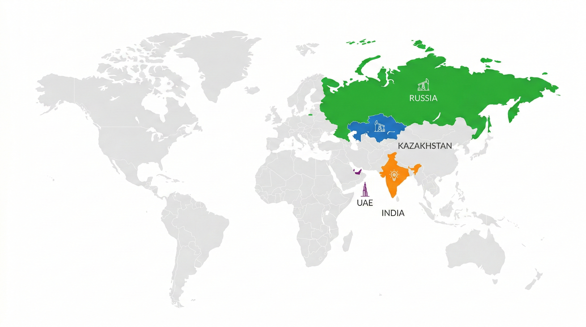
<p style="font-size:0.9em;color:#666;margin-top:0.5em"><em>Target Markets: Russia, Kazakhstan, India, UAE</em></p>
</div>

---

## 6. BUSINESS MODEL

### 6.1. B2C: Subscription Model (SaaS)

The primary monetization model is a recurring subscription with three pricing tiers:

| Tier | Price (monthly) | Price (annual) | Includes |
|------|----------------|----------------|----------|
| **Basic** | $2.99 | $29.99 | 5 analyses/mo, 1 topic, Arina persona, daily AI insights |
| **Standard** | $5.99 | $59.99 | 15 analyses/mo, all 6 topics, both personas |
| **Premium** | $9.99 | $99.99 | Unlimited analyses, all topics, priority support, extended insights |

**6 Analysis Topics:** Love, Career, Money, Health, Family, Spiritual Growth.

**Freemium:** 1 free analysis upon registration + 7-day trial.

**ARPPU** (Average Revenue Per Paying User): **$3.5/mo** (~$42/year).

> *Note: During the initial commercial operation phase, a flexible pay-per-use model (payment for individual analyses) is used for feedback collection, hypothesis testing, and funnel optimization. As the full MVP functionality is implemented (Q3-Q4 2026), a planned transition to recurring subscriptions will follow. This hybrid approach minimizes risks and allows empirical validation of the optimal monetization model.*

### 6.2. B2B: Licensing and API

| Segment | Fixed Fee | Variable Component |
|---------|-----------|-------------------|
| Small business (1--5 locations) | $100/mo | + $0.10 per analysis over the limit |
| Medium business (5--20 locations) | $300/mo | + $0.07 per analysis |
| Large chains and API access | from $1,000/mo | + royalties from B2C revenue through partner |

**Use Case Scenario:** A QR code is placed on a receipt or coffee cup with a call to action: "Find out what your cup says about you." The customer opens the Telegram bot, uploads a photo of coffee grounds, and receives an insight from the Arina persona. Additionally, a discount on the next visit is offered. For chains with an app (Drinkit) -- integration via API.

<div style="text-align:center;margin:2em 0">
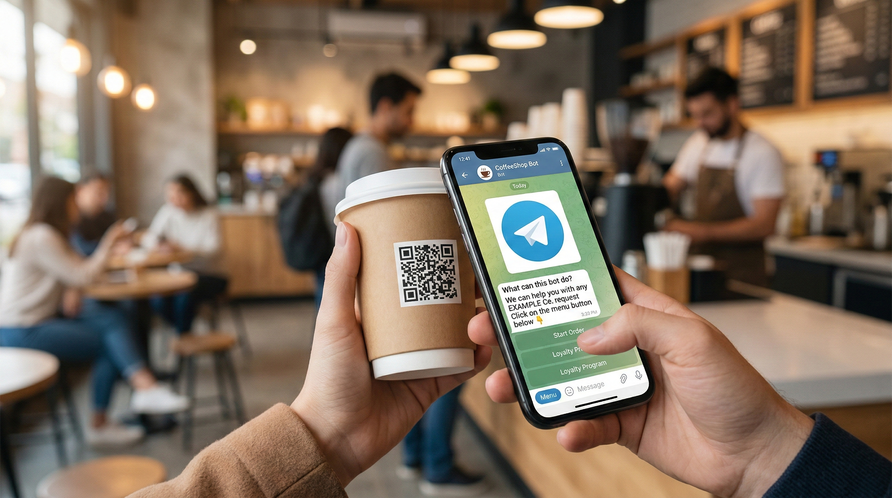
<p style="font-size:0.9em;color:#666;margin-top:0.5em"><em>B2B Integration: QR Code on Coffee Cup → Telegram Bot → AI Insight</em></p>
</div>

**Value for B2B Partners:**
- Increased guest loyalty and engagement (unique interactive experience).
- Viral marketing -- users share result cards on social media (stories), providing free reach and attracting new audiences.
- Access to aggregated anonymous statistics: which topics guests request, at what time, sentiment dynamics.
- For new chains (The Coffee) -- a tool for rapidly building loyalty at launch.

### 6.3. Licensing Fees

LLC "SIMANTIA" (ООО «СИМАНТИЯ», Russia) pays royalties of 15--20% of revenue for a non-exclusive license to use the platform in Russia and CIS territories.

Projected revenue of LLC "SIMANTIA" (ООО «СИМАНТИЯ»): 2026 -- up to $50,000, 2027 -- up to $300,000.

### 6.4. Payment Providers

| Region | Provider | Commission |
|--------|----------|------------|
| Russia | YooKassa (cards, SBP, Apple Pay, Google Pay, 54-FZ compliance) | 2.4--2.8% |
| Global / Kazakhstan | Paddle or 2Checkout | 5--8% (incl. tax compliance) |
| India | Razorpay | 2--3% |
| UAE | Telr or Stripe | 2.9--3.5% |

### 6.5. Development Model

Bootstrap (self-funding). Confirmed source of wealth -- income from entrepreneurial activity. External investment is not planned at the initial stage; it may be considered at the scaling stage (2028, Series A).

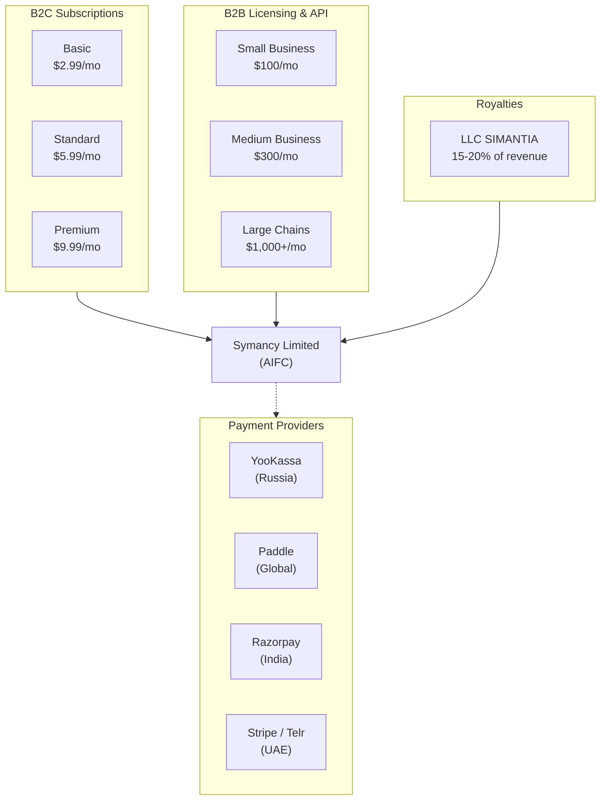
```mermaid
flowchart TB
    subgraph B2C["B2C Subscriptions"]
        Basic["Basic<br/>$2.99/mo"]
        Standard["Standard<br/>$5.99/mo"]
        Premium["Premium<br/>$9.99/mo"]
    end
    subgraph B2B["B2B Licensing & API"]
        Small["Small Business<br/>$100/mo"]
        Medium["Medium Business<br/>$300/mo"]
        Large["Large Chains<br/>$1,000+/mo"]
    end
    subgraph Roy["Royalties"]
        R["LLC SIMANTIA<br/>15-20% of revenue"]
    end

    B2C --> SYM["Symancy Limited<br/>(AIFC)"]
    B2B --> SYM
    Roy --> SYM

    subgraph Pay["Payment Providers"]
        YK["YooKassa<br/>(Russia)"]
        PD["Paddle<br/>(Global)"]
        RP["Razorpay<br/>(India)"]
        ST["Stripe / Telr<br/>(UAE)"]
    end
    SYM -.-> Pay
```

---

## 7. GO-TO-MARKET STRATEGY

### 7.1. Phased Launch Plan

**Phase 1. Soft Launch (Months 1--2)**
- Goal: 500--700 active users, 50--70 paying.
- Channels: Friends & Family, themed Telegram channels, micro-influencers.
- Budget: $800.
- CAC: ~$10 (test mode).

**Phase 2. Growth Hacking (Months 3--4)**
- Goal: 2,000--3,000 active, 200--300 paying.
- Channels: referral program, viral mechanics (sharing analysis cards), coffee shop partnerships, content marketing.
- Budget: $2,200.
- CAC: $4--5.

**Phase 3. Scaling (Months 5--12)**
- Goal: reach 5,000 paying users by end of year.
- Channels and budget allocation:

| Channel | Budget Share | CAC | Details |
|---------|-------------|-----|---------|
| Telegram Ads | 40% | 75 RUB (~$0.83) | Direct access to target audience |
| VK | 25% | 55 RUB (~$0.61) | Broad reach, look-alike audiences |
| Yandex.Direct | 20% | 100 RUB (~$1.11) | High-quality traffic |
| TikTok | 15% | 40 RUB (~$0.44) | Viral potential |

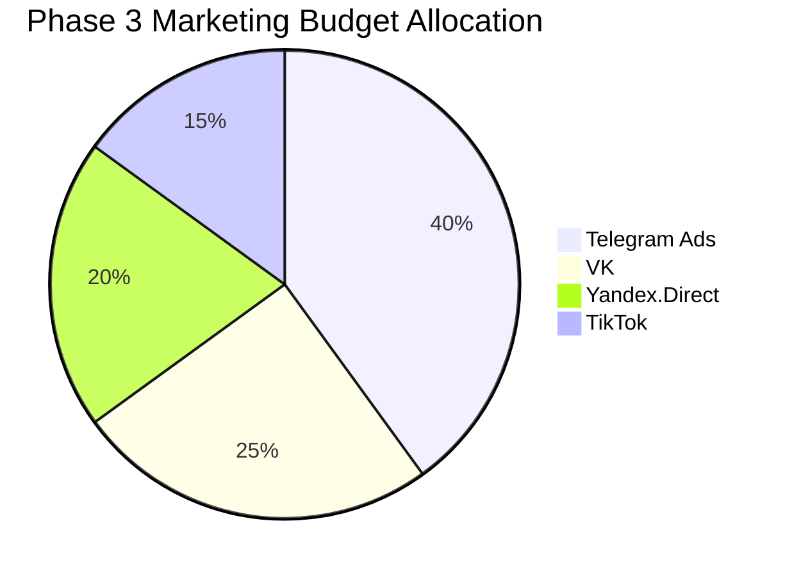
```mermaid
pie title Phase 3 Marketing Budget Allocation
    "Telegram Ads" : 40
    "VK" : 25
    "Yandex.Direct" : 20
    "TikTok" : 15
```

- Budget: $12,000.
- **Average CAC for the year: $3 per paying user** (due to warm targeting of already interested audiences).

> **Note:** The stated CAC represents the cost of acquiring one paying user, factoring in a 2.5--3% conversion rate from registrations and targeting optimization for warm audiences.

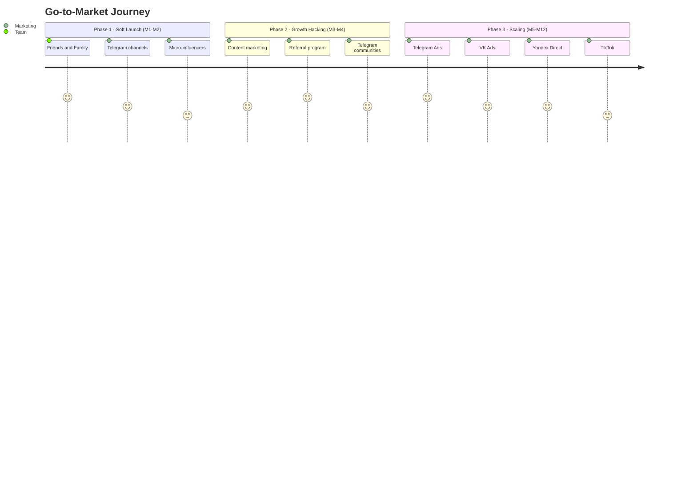
```mermaid
journey
    title Go-to-Market Journey
    section Phase 1 - Soft Launch (M1-M2)
        Friends and Family: 5: Team
        Telegram channels: 4: Marketing
        Micro-influencers: 3: Marketing
    section Phase 2 - Growth Hacking (M3-M4)
        Content marketing: 4: Marketing
        Referral program: 5: Marketing
        Telegram communities: 4: Marketing
    section Phase 3 - Scaling (M5-M12)
        Telegram Ads: 5: Marketing
        VK Ads: 4: Marketing
        Yandex Direct: 4: Marketing
        TikTok: 3: Marketing
```

**Total marketing budget (Year 1): $15,000.**

### 7.2. B2B Partners (Negotiations in Progress)

| Partner | Market | Stage | Potential |
|---------|--------|-------|-----------|
| **Surf Coffee** | Russia, CIS (international chain) | Contact at management level | Pilot integration |
| **Coffemania** | Russia (international chain) | Preliminary negotiations | Demo required |
| **The Coffee** | Kazakhstan (Brazilian roots, since January 2026) | Initial stage | Interested in local partnerships |
| **Drinkit** | Kazakhstan (Dodo Brands, plan for 1,000 locations by 2030) | Analysis | API integration into app |
| **Zebra Coffee** | Kazakhstan (large chain in business centers) | Analysis | Systematic B2B collaboration |
| **Coffee Inn** | Kazakhstan (Astana, premium segment) | Analysis | Quality-focused partnership |
| **Spectre Coffee, For You by QG** | Kazakhstan (Almaty, specialty segment) | Analysis | Targeted collaborations |

The most advanced negotiations are with Surf Coffee and The Coffee. LOI signing is planned for Q2--Q3 2026 following the registration of Symancy Limited.

### 7.3. Customer Journey

1. The user discovers the bot / website (advertising, QR code in a coffee shop, friend's recommendation).
2. Registration -- receives 1 free analysis.
3. Sends a photo of coffee grounds.
4. Selects a topic (1 of 6 or all) and a persona (Arina / Cassandra).
5. Receives a personalized AI analysis.
6. Shares the result card on social media (viral mechanics).
7. Receives daily morning/evening AI insights (retention).
8. Subscribes to continue analyses.

<div style="text-align:center;margin:2em 0">
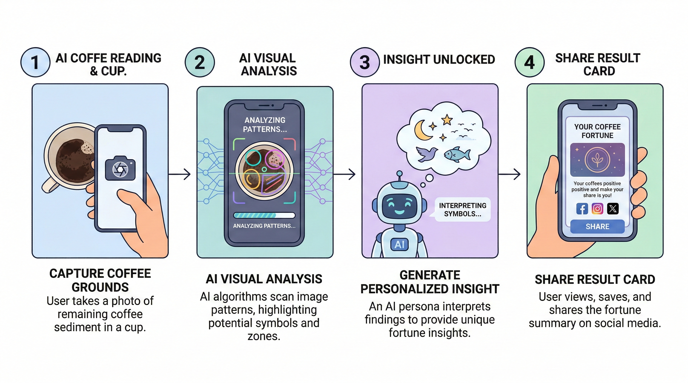
<p style="font-size:0.9em;color:#666;margin-top:0.5em"><em>How Symancy AI Works: From Coffee Photo to Personalized Insight</em></p>
</div>

### 7.4. Product Delivery Channels

| Channel | Status | Priority |
|---------|--------|----------|
| Telegram Bot + Mini App | Primary channel | Launch Q2 2026 |
| Web Application (React SPA / PWA) | Secondary channel | Launch Q2 2026 |
| App Store / Google Play (Capacitor hybrid) | Expanded reach | Q4 2026 |
| WhatsApp / WeChat | International markets | 2027 |
| B2B API (tRPC / REST) | For partners | Q3 2026 |

<div style="text-align:center;margin:2em 0">
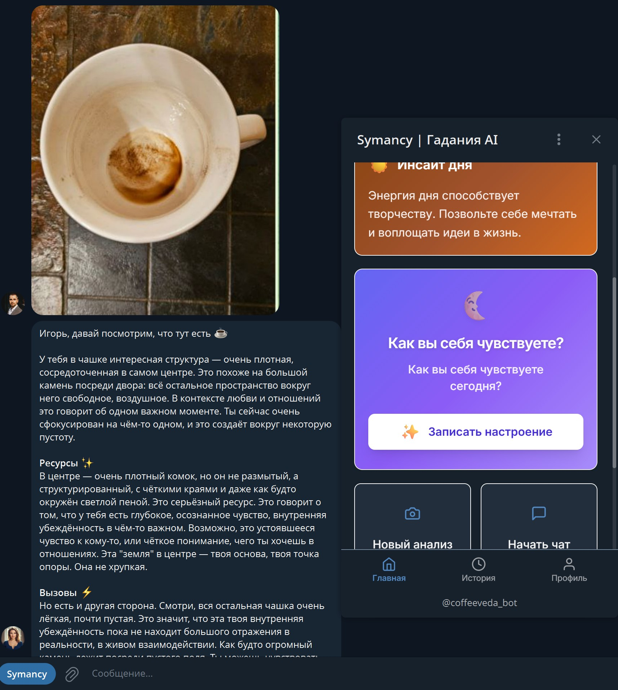
<p style="font-size:0.9em;color:#666;margin-top:0.5em"><em>Symancy Telegram Bot: AI Analysis Chat + Mini App Interface</em></p>
</div>

### 7.5. Retention Mechanics

- Daily personalized AI insights (morning and evening messages).
- Push notifications and reminders.
- Referral program (bonus analyses for invited friends).
- Gamification (streaks, achievements, analysis history).
- Seasonal promotions and themed collections.

---

## 8. FINANCIAL PLAN

### 8.1. Already Invested (Sunk Costs): $38,000

| Expense Item | Amount ($) | Confirmation |
|--------------|-----------|--------------|
| Software development (contracts: pre-MVP + Technical Specification + MVP) | 25,300 | Contracts and acceptance certificates |
| Legal services (SHA, MAA, Option Agreement) | 5,000 | Contracts with lawyers |
| Symancy Ltd registration (AIFC) | 2,600 | Benefits & Partners |
| LLC "SIMANTIA" (ООО «СИМАНТИЯ») registration (Russia) | 1,100 | State duty, legal address |
| Infrastructure, domains, APIs (2024--2025) | 500 | Hosting, test APIs |
| Other operating expenses | 3,500 | Travel, administration |
| **TOTAL** | **38,000** | All expenses are documented |

Additionally: Since August 2025, the CEO has been contributing significant personal time to the project (sweat equity) on a pro bono basis.

### 8.2. Operating Reserve: $35,000

| Item | Amount ($) |
|------|-----------|
| AIFC corporate expenses (Astana Hub, accounting, legal support, office lease) | 5,000 |
| Development and maintenance (APIs, servers, domains) | 12,000 |
| Marketing | 15,000 |
| Reserve | 3,000 |
| **TOTAL** | **35,000** |

### 8.3. Key Financial Model Metrics

| Metric | Value | Source |
|--------|-------|--------|
| ARPPU | $3.5/mo ($42/year) | Pre-MVP testing |
| Conversion to paying | 2.5--3% (pre-MVP: 7.5%) | Testing (200 reg., 15 purchases) + industry benchmark |
| Churn rate (initial) | 10--12%/mo | Industry benchmark |
| Churn rate (target) | 7--8%/mo | With retention mechanics |
| CAC (average) | $3 / paying user | Go-to-market calculation (warm targeting) |
| LTV (at 8% churn) | $3.5 / 0.08 = **$43.75** | ARPPU / churn |
| LTV/CAC | **14.6x** | Healthy ratio (>3x) |
| Organic traffic share | 30--40% | Viral mechanics + content marketing |
| Gross margin per analysis | 90--98% | API cost: $0.01--0.05 |

### 8.4. Unit Economics (Cost per Analysis)

| Item | Cost |
|------|------|
| Vision API call (image analysis) | $0.01--0.03 |
| LLM text interpretation generation | $0.005--0.02 |
| Infrastructure (per request) | <$0.001 |
| **Cost per analysis** | **$0.015--0.05** |
| Average revenue per analysis (at ARPPU $3.5, ~5 analyses/mo) | $0.70 |
| **Gross margin** | **93--98%** |

Additional costs for free features (daily AI insights): ~$0.005/insight. At 2 insights/day per user = ~$0.30/mo per user. Optimized through lighter models (GPT-4o-mini, Gemini Flash) for insights.

### 8.5. User Forecast Rationale

The forecast is based on:
- Pre-MVP testing results: conversion from registration to first purchase of **7.5%** (200 registrations, 15 purchases).
- Competitor analysis: apps in the Digital Wellness niche in Russia show 2--5% conversion to paying users, with downloads for leaders in the hundreds of thousands.
- Planned reach of 150,000--200,000 unique users per year. At a conservative 2.5--3% conversion, this yields 3,750--6,000 paying users. The target of **5,000** (optimistic scenario) falls within this range.

### 8.6. Three Financial Scenarios

#### Revenue Forecast for 3 Years

| Metric | Pessimistic | Base | Optimistic |
|--------|-------------|------|------------|
| **Year 1 (2026)** | | | |
| Paying users by year-end | 1,000 | 3,000 | 5,000 |
| B2C revenue | $20,000 | $50,000 | $85,000 |
| B2B revenue | $1,000 | $5,000 | $10,000 |
| **Year 1 Total** | **$21,000** | **$55,000** | **$95,000** |
| **Year 2 (2027)** | | | |
| Paying users by year-end | 5,000 | 15,000 | 35,000--40,000 |
| B2C revenue | $105,000 | $380,000 | $940,000 |
| B2B revenue | $20,000 | $60,000 | $100,000 |
| Royalties (LLC "SIMANTIA" / ООО «СИМАНТИЯ») | $5,000 | $15,000 | $30,000 |
| **Year 2 Total** | **$130,000** | **$455,000** | **$1,070,000** |
| **Year 3 (2028)** | | | |
| Paying users by year-end | 15,000 | 30,000 | 60,000+ |
| B2C revenue | $350,000 | $945,000 | $1,620,000 |
| B2B revenue | $75,000 | $250,000 | $500,000 |
| Royalties | $15,000 | $45,000 | $90,000 |
| **Year 3 Total** | **$440,000** | **$1,240,000** | **$2,210,000** |

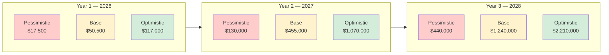
```mermaid
flowchart LR
    subgraph Y1["Year 1 — 2026"]
        Y1P["Pessimistic<br/>$17,500"]
        Y1B["Base<br/>$50,500"]
        Y1O["Optimistic<br/>$117,000"]
    end
    subgraph Y2["Year 2 — 2027"]
        Y2P["Pessimistic<br/>$130,000"]
        Y2B["Base<br/>$455,000"]
        Y2O["Optimistic<br/>$1,070,000"]
    end
    subgraph Y3["Year 3 — 2028"]
        Y3P["Pessimistic<br/>$440,000"]
        Y3B["Base<br/>$1,240,000"]
        Y3O["Optimistic<br/>$2,210,000"]
    end
    Y1 --> Y2 --> Y3

    style Y1P fill:#ffcccc,color:#333
    style Y1B fill:#fff3cd,color:#333
    style Y1O fill:#d4edda,color:#333
    style Y2P fill:#ffcccc,color:#333
    style Y2B fill:#fff3cd,color:#333
    style Y2O fill:#d4edda,color:#333
    style Y3P fill:#ffcccc,color:#333
    style Y3B fill:#fff3cd,color:#333
    style Y3O fill:#d4edda,color:#333
```

#### Monthly Forecast for Year 1 (Optimistic Scenario)

| Month | Paying (B2C) | B2C Revenue | B2B Revenue | Total |
|-------|-------------|-------------|-------------|-------|
| 1 | 0 | $0 | $0 | $0 |
| 2 | 100 | $350 | $0 | $350 |
| 3 | 300 | $1,050 | $0 | $1,050 |
| 4 | 600 | $2,100 | $0 | $2,100 |
| 5 | 1,000 | $3,500 | $0 | $3,500 |
| 6 | 1,500 | $5,250 | $0 | $5,250 |
| 7 | 2,000 | $7,000 | $0 | $7,000 |
| 8 | 2,500 | $8,750 | $0 | $8,750 |
| 9 | 3,000 | $10,500 | $1,000 | $11,500 |
| 10 | 3,800 | $13,300 | $2,000 | $15,300 |
| 11 | 4,500 | $15,750 | $3,000 | $18,750 |
| 12 | 5,000 | $17,500 | $4,000 | $21,500 |
| **TOTAL** | | **$85,050** | **$10,000** | **$95,050** |

#### Monthly Forecast for Year 1 (Base Scenario)

| Month | Paying (B2C) | B2C Revenue | B2B Revenue | Total |
|-------|-------------|-------------|-------------|-------|
| 1 | 0 | $0 | $0 | $0 |
| 2 | 50 | $175 | $0 | $175 |
| 3 | 150 | $525 | $0 | $525 |
| 4 | 350 | $1,225 | $0 | $1,225 |
| 5 | 600 | $2,100 | $0 | $2,100 |
| 6 | 900 | $3,150 | $0 | $3,150 |
| 7 | 1,200 | $4,200 | $0 | $4,200 |
| 8 | 1,500 | $5,250 | $0 | $5,250 |
| 9 | 1,800 | $6,300 | $500 | $6,800 |
| 10 | 2,200 | $7,700 | $1,000 | $8,700 |
| 11 | 2,600 | $9,100 | $1,500 | $10,600 |
| 12 | 3,000 | $10,500 | $2,000 | $12,500 |
| **TOTAL** | | **$50,225** | **$5,000** | **$55,225** |

### 8.7. Growth Assumptions for 2027--2028

**Geographic Expansion (2027):**

| Region | Budget (H2 2027) | CAC | Expected Paying Users by End of 2027 |
|--------|-----------------|-----|---------------------------------------|
| India | $5,000 | $1.5--2 (affordable mobile traffic) | 500--700 |
| UAE | $3,000 | $5--6 (advertising to expats) | 200--300 |

**B2B Direction (Detailed Projections):**

| Year | Number of Partners | Average Revenue/Partner/Mo | Annual B2B Revenue |
|------|--------------------|----------------------------|--------------------|
| 2026 | 2--3 (pilots) | $200--500 | $5,000 |
| 2027 | 10--15 | $700--1,000 | $100,000 |
| 2028 | 30--50 | $1,200--1,500 | $500,000 |

### 8.8. Expense Structure for 2027--2028

| Item | 2027 | 2028 |
|------|------|------|
| Marketing (from reinvested profit) | $100,000--120,000 | $200,000--300,000 |
| APIs and infrastructure | $40,000--60,000 | $80,000--120,000 |
| Payroll (per Employment Plan) | $120,000--180,000 | $200,000--300,000 |
| Corporate and legal | $15,000 | $20,000 |
| **Total expenses** | **$275,000--375,000** | **$500,000--740,000** |

**Funding source for 2027--2028:** Reinvestment of operating profit. Under the base scenario, 2027 revenue will be ~$455,000, which covers expenses. Under the pessimistic scenario, attracting investment (friends & family, angel investors) or reducing growth pace will be necessary.

### 8.9. Break-Even Point

- With expenses of ~$35,000/year and ARPPU of $3.5/mo, the break-even point is: ~830 paying users.
- Expected achievement: months 5--7 after launch (base scenario).

---

## 9. RISK MANAGEMENT

| Risk Category | Description | Probability | Mitigation Measures |
|--------------|-------------|-------------|---------------------|
| **Regulatory** | AFSA questions about positioning | Medium | Clear Digital Wellness positioning, working through Benefits & Partners, Explainable AI |
| **AI "Black Box"** | Lack of generation transparency | Low | Three-tier hallucination protection, Visual Proof Module (v2.0), Audit Log |
| **External API Dependency** | Changes in LLM provider pricing/terms | Medium | Multi-provider architecture (Gemini, Claude, OpenAI), switching capability |
| **Financial** | Insufficient revenue for scaling | Medium | Bootstrap model, 3 scenarios, reserve fund, readiness to pivot |
| **Competitive** | Major player entering the niche | Low | Niche-first strategy, patentable Visual Proof technology, accumulated dataset |
| **AI Ethics / Bias** | Generating inappropriate content | Low | Strict prompting, minimal temperature, monitoring, responsible AI policy |
| **Sanctions** | Cross-border payment difficulties Russia--AIFC | Medium | Multiple legal channels (KZ banks, friendly jurisdictions), legal consultations |
| **Legal Address** | Loss of office in AIFC | Low | 60-day notice period, coworking option available |
| **Hiring** | Difficulty hiring in Kazakhstan | Medium | Flexible format (remote + visits), competitive salaries, stock option program |

### Plan B: Conditions for Pivot

A decision on strategic analysis and potential pivot will be made if threshold values are not achieved within 6 months of public launch:
- Fewer than 500 paying users per month.
- Retention (D1) below 20% or monthly Churn above 15%.
- No B2B pilot in place.
- CAC exceeding 50% of LTV.

Potential pivot directions: pure B2B (white-label for coffee shops), target audience change, expansion to other types of visual analysis (tarot, palmistry).

---

## 10. AFSA (AIFC) COMPLIANCE

| AFSA Requirement | Implementation |
|-----------------|----------------|
| **Operational Resilience** | Detailed data flow description, backups, managed cloud providers (Supabase), CI/CD |
| **Determinism and Explainability** | Structured Prompt Engineering, seed parameters; Visual Proof Module (v2.0) will provide full traceability |
| **Third-Party API Control** | Multi-provider architecture, strict prompting, minimal temperature, output data verification |
| **AI Ethics** | Bias prevention policy, absence of discriminatory patterns, regular audits |
| **Fit & Proper** | Team experience and reputation confirmed, source of wealth documented |
| **AML / KYC** | Payment providers ensure AML compliance; company follows AIFC policy |

**Astana Hub Qualification (DeepTech):**
- Proprietary algorithms: Prompt Engineering Library, Persona Engine
- R&D component: domain-specific analysis methodology
- Technological entry barrier: integration of Vision-Language models with domain expertise
- Patent potential: Visual Proof Module, tasseography analysis methodology

---

## 11. DEVELOPMENT PLAN (ROADMAP)

| Period | Key Objectives |
|--------|---------------|
| **Q1 2026** | Complete Symancy Limited registration in AIFC. Sign office lease agreement. SHA with CTO. |
| **Q2 2026** | Submit application to Astana Hub. IP Assignment Agreement. Product soft launch (Telegram Bot + Web). |
| **Q3 2026** | Complete MVP. Closed beta testing (200--500 users). Begin B2B pilot negotiations. |
| **Q4 2026** | Public launch (PWA + Capacitor for App Store / Google Play). First B2B pilots. Scale marketing. |
| **2027** | Enter India and UAE markets. Team expansion (staff in Kazakhstan). Develop Visual Proof Module (v2.0). 10--15 B2B partners. |
| **2028** | Operational break-even. Scale B2B portfolio (30--50 partners). Prepare for investment (Series A). Add Hindi. |

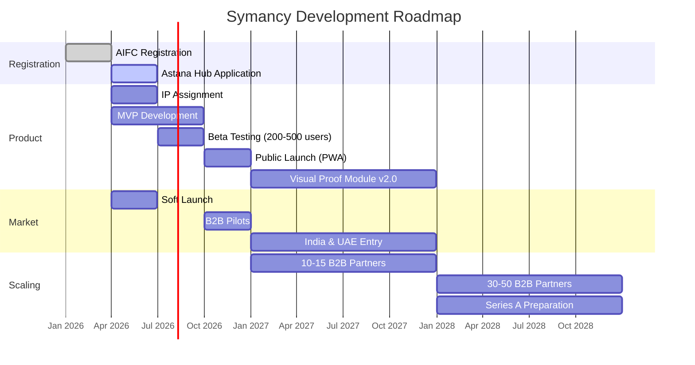
```mermaid
gantt
    title Symancy Development Roadmap
    dateFormat YYYY-MM-DD
    axisFormat %b %Y

    section Registration
        AIFC Registration           :done, reg1, 2026-01-01, 2026-03-31
        Astana Hub Application      :active, reg2, 2026-04-01, 2026-06-30

    section Product
        IP Assignment               :ip1, 2026-04-01, 2026-06-30
        MVP Development             :mvp, 2026-04-01, 2026-09-30
        Beta Testing (200-500 users):beta, 2026-07-01, 2026-09-30
        Public Launch (PWA)         :launch, 2026-10-01, 2026-12-31
        Visual Proof Module v2.0    :v2, 2027-01-01, 2027-12-31

    section Market
        Soft Launch                 :soft, 2026-04-01, 2026-06-30
        B2B Pilots                  :b2b, 2026-10-01, 2026-12-31
        India & UAE Entry           :intl, 2027-01-01, 2027-12-31

    section Scaling
        10-15 B2B Partners          :partners, 2027-01-01, 2027-12-31
        30-50 B2B Partners          :scale, 2028-01-01, 2028-12-31
        Series A Preparation        :series, 2028-01-01, 2028-12-31
```

---

## 12. EMPLOYMENT PLAN FOR 2026--2028

| Position | 2026 | 2027 | 2028 | Salary (gross, Kazakhstan) |
|----------|------|------|------|----------------------------|
| CEO (Anna Voznesenskaya) | 1 | 1 | 1 | No salary until profitability; sweat equity |
| CTO (Igor Maslennikov) | 1 | 1 | 1 | No salary until profitability; 20% option |
| Developer (Middle/Senior) | Outsource | 2 | 3 | $1,200--2,500/mo |
| Marketing Manager (Director of Marketing) | 0 | 1 | 1 | $2,000--3,500/mo |
| Customer Support | 0 | 2 | 3 | $500--800/mo |
| Accountant (outsource) | + | + | + | ~$200--400/mo |
| Lawyer (outsource) | + | + | + | As needed |
| **TOTAL staff** | **2** | **7** | **9** | |

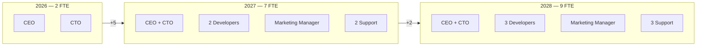
```mermaid
flowchart LR
    subgraph Y2026["2026 — 2 FTE"]
        A1["CEO"]
        A2["CTO"]
    end
    subgraph Y2027["2027 — 7 FTE"]
        B1["CEO + CTO"]
        B2["2 Developers"]
        B3["Marketing Manager"]
        B4["2 Support"]
    end
    subgraph Y2028["2028 — 9 FTE"]
        C1["CEO + CTO"]
        C2["3 Developers"]
        C3["Marketing Manager"]
        C4["3 Support"]
    end
    Y2026 -->|"+5"| Y2027 -->|"+2"| Y2028
```

> **Note:** The founders (CEO and CTO) work without salary until profitability or investment round. The CTO is incentivized by a 20% option, the CEO -- by sweat equity. This accurately reflects the bootstrap model of the project.

**Salaries** (for hired employees) are consistent with market averages in Kazakhstan (Astana/Almaty) based on hh.kz and Glassdoor data for 2026.

**AIFC Substance** is ensured by:
- The CEO's physical presence at the office on AIFC premises.
- Gradual onboarding of part of the team to the Kazakhstan payroll starting 2027.
- Office lease (coworking space or virtual office with physical presence rights).

**Hiring Strategy:** Priority is retaining the current team. As the company grows, key specialists are offered employment through the Kazakhstan entity. Flexible formats: remote work + periodic visits to the Astana office.

---

## 13. CONCLUSION

Symancy AI is a technologically unique, ethical, and scalable product in the rapidly growing Digital Wellness category ($8.64 billion in 2026, CAGR 19.23%). The platform occupies an untapped niche -- AI-powered visual pattern analysis with Explainable AI -- where none of the existing competitors (Faladdin, Co-Star, Nebula) offer verifiable analytics.

Registering the parent company in AIFC ensures intellectual property protection under English law, access to international markets, and a transparent structure for the regulator. The team has the requisite experience (14+ years of project management for the CEO, LLM/RAG expertise for the CTO), the financial model is conservative (3 scenarios, bootstrap), and the technology architecture is designed with AFSA requirements for AI transparency, explainability, and ethics in mind.

The project fully meets AFSA requirements for company registration in AIFC and is ready for submission of the complete documentation package.

---

**Appendices:**
- Appendix A: Technology Description (see below)
- Appendix B: CVs of Key Personnel (CEO, CTO)
- Appendix C: Pre-MVP Acceptance Certificate dated 24.10.2025
- Appendix D: Draft SHA (Shareholders' Agreement)
- Appendix E: Draft IP Assignment Agreement

---

## APPENDIX A: TECHNOLOGY DESCRIPTION

### HALLUCINATION PROTECTION: How We Control AI

> **For AFSA: Response to the question about AI system predictability**

#### The Problem: LLM Hallucinations

Language models (LLMs) can generate plausible but ungrounded text -- "hallucinations." This is unacceptable for regulated services.

#### Our Solution: Three-Tier Protection

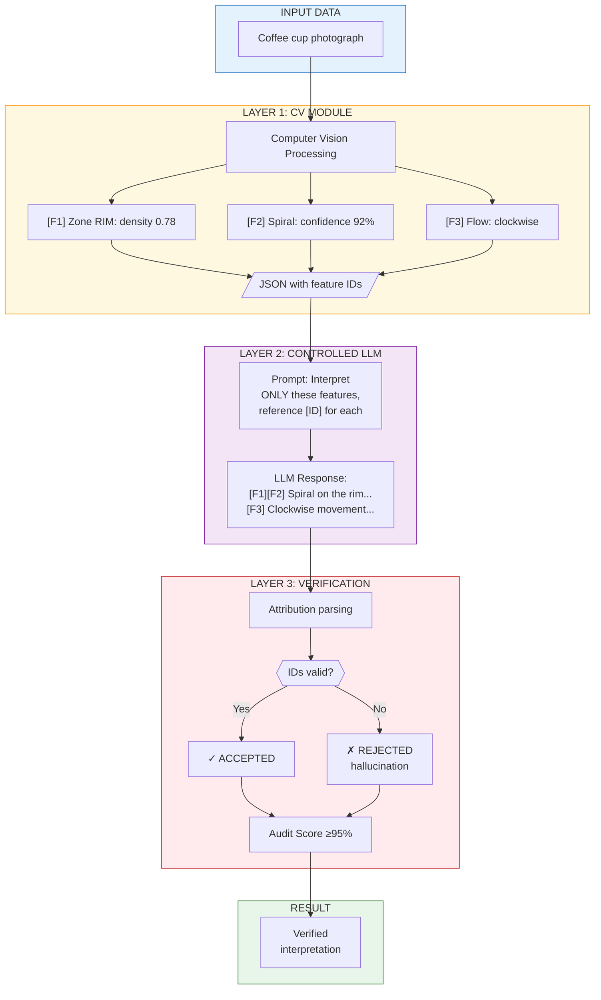
```mermaid
flowchart TB
    subgraph INPUT["INPUT DATA"]
        PHOTO["Coffee cup photograph"]
    end

    subgraph CV["LAYER 1: CV MODULE"]
        CV_PROC["Computer Vision Processing"]
        F1["[F1] Zone RIM: density 0.78"]
        F2["[F2] Spiral: confidence 92%"]
        F3["[F3] Flow: clockwise"]
        JSON[/"JSON with feature IDs"/]
    end

    subgraph LLM_LAYER["LAYER 2: CONTROLLED LLM"]
        PROMPT["Prompt: Interpret<br/>ONLY these features,<br/>reference [ID] for each"]
        LLM_OUT["LLM Response:<br/>[F1][F2] Spiral on the rim...<br/>[F3] Clockwise movement..."]
    end

    subgraph VERIFY["LAYER 3: VERIFICATION"]
        PARSE["Attribution parsing"]
        CHECK{{"IDs valid?"}}
        ACCEPT["✓ ACCEPTED"]
        REJECT["✗ REJECTED<br/>hallucination"]
        SCORE["Audit Score ≥95%"]
    end

    subgraph OUTPUT["RESULT"]
        RESULT["Verified<br/>interpretation"]
    end

    PHOTO --> CV_PROC
    CV_PROC --> F1
    CV_PROC --> F2
    CV_PROC --> F3
    F1 --> JSON
    F2 --> JSON
    F3 --> JSON
    JSON --> PROMPT
    PROMPT --> LLM_OUT
    LLM_OUT --> PARSE
    PARSE --> CHECK
    CHECK -->|Yes| ACCEPT
    CHECK -->|No| REJECT
    ACCEPT --> SCORE
    REJECT --> SCORE
    SCORE --> RESULT

    style INPUT fill:#e3f2fd,stroke:#1565c0
    style CV fill:#fff8e1,stroke:#ff8f00
    style LLM_LAYER fill:#f3e5f5,stroke:#7b1fa2
    style VERIFY fill:#ffebee,stroke:#c62828
    style OUTPUT fill:#e8f5e9,stroke:#2e7d32
```

#### Key Assurances for the Regulator

| Requirement | How We Ensure It |
|-------------|------------------|
| **Predictability** | One photo -> identical CV features (deterministic algorithm) |
| **Transparency** | Every statement references a specific CV feature |
| **Control** | Statements without feature attribution are automatically rejected |
| **Audit** | Complete log: image_hash -> CV features -> prompt -> response |
| **Reproducibility** | Repeated analysis of the same photo yields identical features |

#### Why This Is Not a "Black Box"

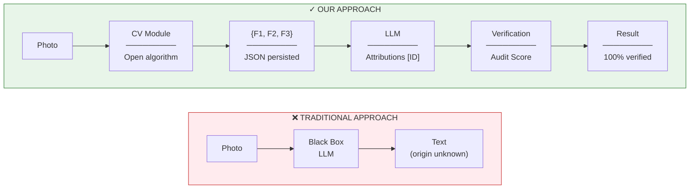
```mermaid
flowchart LR
    subgraph BAD["❌ TRADITIONAL APPROACH"]
        direction LR
        B_PHOTO["Photo"] --> B_BOX["Black Box<br/>LLM"]
        B_BOX --> B_TEXT["Text<br/>(origin unknown)"]
    end

    subgraph GOOD["✓ OUR APPROACH"]
        direction LR
        G_PHOTO["Photo"] --> G_CV["CV Module<br/>─────────<br/>Open algorithm"]
        G_CV --> G_JSON["{F1, F2, F3}<br/>─────────<br/>JSON persisted"]
        G_JSON --> G_LLM["LLM<br/>─────────<br/>Attributions [ID]"]
        G_LLM --> G_VERIFY["Verification<br/>─────────<br/>Audit Score"]
        G_VERIFY --> G_RESULT["Result<br/>─────────<br/>100% verified"]
    end

    style BAD fill:#ffebee,stroke:#c62828
    style GOOD fill:#e8f5e9,stroke:#2e7d32
```

---

### CURRENT ARCHITECTURE: Intelligent Multimodal Platform

> For a platform overview, see [Section 4.1 — Current Architecture](#41-current-architecture-v10).

#### Platform Architectural Components

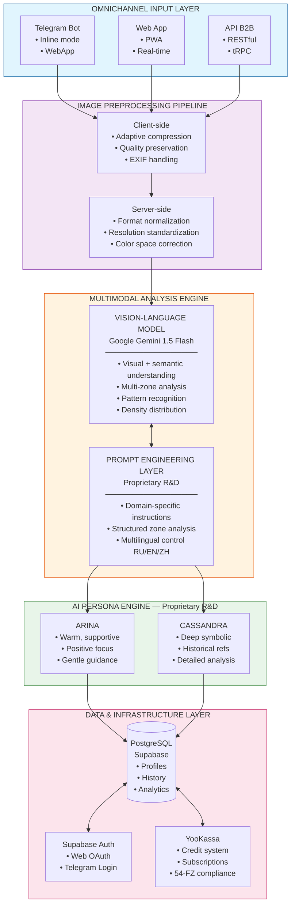
```mermaid
flowchart TB
    subgraph INPUT["OMNICHANNEL INPUT LAYER"]
        TG["Telegram Bot<br/>• Inline mode<br/>• WebApp"]
        WEB["Web App<br/>• PWA<br/>• Real-time"]
        API["API B2B<br/>• RESTful<br/>• tRPC"]
    end

    subgraph PREPROCESS["IMAGE PREPROCESSING PIPELINE"]
        CLIENT["Client-side<br/>• Adaptive compression<br/>• Quality preservation<br/>• EXIF handling"]
        SERVER["Server-side<br/>• Format normalization<br/>• Resolution standardization<br/>• Color space correction"]
    end

    subgraph ANALYSIS["MULTIMODAL ANALYSIS ENGINE"]
        VLM["VISION-LANGUAGE MODEL<br/>Google Gemini 1.5 Flash<br/>─────────────────<br/>• Visual + semantic understanding<br/>• Multi-zone analysis<br/>• Pattern recognition<br/>• Density distribution"]
        PROMPT["PROMPT ENGINEERING LAYER<br/>Proprietary R&D<br/>─────────────────<br/>• Domain-specific instructions<br/>• Structured zone analysis<br/>• Multilingual control RU/EN/ZH"]
    end

    subgraph PERSONA["AI PERSONA ENGINE — Proprietary R&D"]
        ARINA["ARINA<br/>• Warm, supportive<br/>• Positive focus<br/>• Gentle guidance"]
        CASSANDRA["CASSANDRA<br/>• Deep symbolic<br/>• Historical refs<br/>• Detailed analysis"]
    end

    subgraph INFRA["DATA & INFRASTRUCTURE LAYER"]
        DB[("PostgreSQL<br/>Supabase<br/>• Profiles<br/>• History<br/>• Analytics")]
        AUTH["Supabase Auth<br/>• Web OAuth<br/>• Telegram Login"]
        PAY["YooKassa<br/>• Credit system<br/>• Subscriptions<br/>• 54-FZ compliance"]
    end

    TG --> CLIENT
    WEB --> CLIENT
    API --> CLIENT
    CLIENT --> SERVER
    SERVER --> VLM
    VLM <--> PROMPT
    PROMPT --> ARINA
    PROMPT --> CASSANDRA
    ARINA --> DB
    CASSANDRA --> DB
    DB <--> AUTH
    DB <--> PAY

    style INPUT fill:#e1f5fe,stroke:#01579b
    style PREPROCESS fill:#f3e5f5,stroke:#7b1fa2
    style ANALYSIS fill:#fff3e0,stroke:#e65100
    style PERSONA fill:#e8f5e9,stroke:#2e7d32
    style INFRA fill:#fce4ec,stroke:#c2185b
```

---

#### Key Technology Components

**A. Image Preprocessing Pipeline**

A proprietary multi-layer image optimization pipeline:

| Stage | Technology | R&D Component |
|-------|-----------|---------------|
| Client-side adaptive compression | browser-image-compression | Algorithm for preserving critical details while reducing size |
| Server-side normalization | Sharp (Node.js) | Standardization of input data for consistent analysis |
| Content validation | Custom filters | Automatic determination of image suitability |
| Metadata and hashing | SHA-256 | Ensuring traceability and auditability |

**B. Multimodal Analysis Engine**

Integration with a state-of-the-art Vision-Language model with a proprietary control layer:

- **Vision API**: Google Gemini 1.5 Flash -- multimodal model with deep visual context understanding
- **Prompt Engineering Layer**: Proprietary library of specialized prompts (R&D):
  - **Zoning**: Instructions for structured analysis by semantic zones (RIM / CENTER / BOTTOM)
  - **Pattern Detection**: Specialized directives for recognizing traditional symbols
  - **Contextual Linking**: Techniques for connecting visual elements with interpretation
  - **Multilingual**: Generation control in 3 languages (RU / EN / ZH)

**C. AI Persona System (Persona Engine) -- Proprietary Development**

A proprietary system of personalized AI assistants (see [Section 4.1](#41-current-architecture-v10) for persona overview). Each persona is the result of research in the field of LLM stylistic tuning through prompt engineering.

**D. Omnichannel Platform (Omnichannel Delivery)**

| Channel | Technology | Capabilities |
|---------|-----------|--------------|
| **Telegram Bot** | grammY + pg-boss | Inline mode, contextual follow-ups, WebApp integration, proactive messaging |
| **Web Application** | React 19 + Vite | PWA, responsive design, real-time via Supabase Realtime |
| **API** | RESTful + tRPC | Type-safe interface for B2B partners |

---

#### Intelligent Algorithms (R&D Component)

**Prompt Engineering as a Research Domain:**

Symancy has developed a domain-specific prompt engineering methodology for visual analysis tasks. Key innovations:

1. **Structured Image Zoning**
   - Prompts instruct the model to divide analysis by semantic cup zones
   - Each zone has its own interpretive framework

2. **Pattern Classification**
   - Taxonomy of tasseography visual patterns (spirals, lines, clusters, breaks)
   - Linking patterns to an interpretive vocabulary

3. **Consistency Control**
   - Techniques for improving result reproducibility
   - Temperature settings and seed parameters

**Simplified Structured Prompt Example:**
```
Analyze the coffee grounds image. Divide the analysis into zones:

1. CUP RIM (RIM) — near future, external events
   • Describe visible patterns
   • Indicate distribution density
   • Interpret symbolism

2. CENTER (CENTER) — current situation
   [similar structure]

3. BOTTOM (BOTTOM) — deep processes
   [similar structure]

Response format: structured JSON with fields zone, patterns, density, interpretation.
```

---

#### Technology Advantages

| Aspect | Implementation | Business Value |
|--------|---------------|----------------|
| **Multimodality** | Vision + Language in a unified pipeline | Deep visual context understanding |
| **Personalization** | AI personas with unique styles | Differentiation from competitors |
| **Scalability** | Serverless + managed services | Automatic scaling |
| **Multilingual** | 3 languages (RU/EN/ZH) | Global market entry |
| **Omnichannel** | Telegram + Web + API | Maximum user reach |
| **Compliance** | 54-FZ fiscalization | Readiness for Russia/CIS operations |

---

#### DeepTech Criteria Compliance (Current State)

| Criterion | Current Implementation | Status |
|-----------|----------------------|--------|
| Proprietary algorithms | Prompt Engineering Library, Persona Engine | ✅ Present |
| Domain expertise | Tasseography analysis methodology | ✅ Present |
| Technological barrier | Component integration requires expertise | ✅ Present |
| Scalability | Cloud-native architecture | ✅ Present |
| **Explainable AI** | Implicit (within Vision API) | ⚠️ Requires reinforcement |
| **Visual verification** | Absent | ⚠️ Requires development |

---

#### Areas of Development (Transition to Version 2.0)

The current architecture is functional and scalable. To fully meet AFSA requirements for Explainable AI, the following development is planned:

| Area | Current | Target (v2.0) |
|------|---------|----------------|
| Feature Extraction | Implicit (in Vision API) | Explicit CV Pipeline with JSON output |
| Traceability | At log level | Attribution mechanism pattern->text |
| Visualization | Text + photo separately | Interactive overlay with zone highlighting |
| Reproducibility | Probabilistic | Deterministic CV + constrained LLM |

**Important:** These improvements represent a natural evolution of the platform, not a rebuild. The current architecture provides a solid foundation for implementing the Visual Proof Module.

---

### Target Architecture: Visual Proof Module (v2.0)

**Key Innovation:**
Development of a proprietary Computer Vision module (Visual Proof Module) that analyzes the image **BEFORE** passing it to the LLM and generates a structured set of verifiable features. Each textual insight becomes **mathematically linked** to specific visual data.

---

#### System Architecture

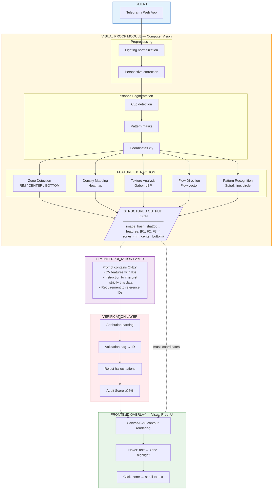
```mermaid
flowchart TB
    subgraph CLIENT["CLIENT"]
        TG_WEB["Telegram / Web App"]
    end

    subgraph CV["VISUAL PROOF MODULE — Computer Vision"]
        subgraph PREP["Preprocessing"]
            NORM["Lighting normalization"]
            PERSPECTIVE["Perspective correction"]
        end

        subgraph SEG["Instance Segmentation"]
            CUP["Cup detection"]
            MASKS["Pattern masks"]
            COORDS["Coordinates x,y"]
        end

        subgraph FEATURES["FEATURE EXTRACTION"]
            ZONES["Zone Detection<br/>RIM / CENTER / BOTTOM"]
            DENSITY["Density Mapping<br/>Heatmap"]
            TEXTURE["Texture Analysis<br/>Gabor, LBP"]
            FLOW["Flow Direction<br/>Flow vector"]
            PATTERNS["Pattern Recognition<br/>Spiral, line, circle"]
        end

        JSON[/"STRUCTURED OUTPUT JSON<br/>─────────────────<br/>image_hash: sha256...<br/>features: [F1, F2, F3...]<br/>zones: {rim, center, bottom}"/]
    end

    subgraph LLM["LLM INTERPRETATION LAYER"]
        PROMPT_LLM["Prompt contains ONLY:<br/>• CV features with IDs<br/>• Instruction to interpret<br/>  strictly this data<br/>• Requirement to reference IDs"]
    end

    subgraph VERIFY["VERIFICATION LAYER"]
        PARSE["Attribution parsing"]
        VALIDATE["Validation: tag → ID"]
        REJECT["Reject hallucinations"]
        SCORE["Audit Score ≥95%"]
    end

    subgraph FRONTEND["FRONTEND OVERLAY — Visual Proof UI"]
        CANVAS["Canvas/SVG contour rendering"]
        HOVER["Hover: text → zone highlight"]
        CLICK["Click: zone → scroll to text"]
    end

    TG_WEB --> NORM
    NORM --> PERSPECTIVE
    PERSPECTIVE --> CUP
    CUP --> MASKS
    MASKS --> COORDS
    COORDS --> ZONES
    COORDS --> DENSITY
    COORDS --> TEXTURE
    COORDS --> FLOW
    COORDS --> PATTERNS
    ZONES --> JSON
    DENSITY --> JSON
    TEXTURE --> JSON
    FLOW --> JSON
    PATTERNS --> JSON
    JSON --> PROMPT_LLM
    PROMPT_LLM --> PARSE
    PARSE --> VALIDATE
    VALIDATE --> REJECT
    REJECT --> SCORE
    SCORE --> CANVAS
    JSON -.->|mask coordinates| CANVAS
    CANVAS --> HOVER
    HOVER --> CLICK

    style CLIENT fill:#e3f2fd,stroke:#1565c0
    style CV fill:#fff8e1,stroke:#ff8f00
    style LLM fill:#f3e5f5,stroke:#7b1fa2
    style VERIFY fill:#ffebee,stroke:#c62828
    style FRONTEND fill:#e8f5e9,stroke:#2e7d32
```

---

#### Module Details

**A. Preprocessing Module**
- **Lighting Normalization**: Adaptive histogram equalization (CLAHE)
- **Perspective Correction**: Automatic alignment along the cup contour
- **Size Standardization**: Reduction to a uniform resolution for consistency
- **Technologies**: OpenCV (Python) / Sharp (Node.js)

**B. Instance Segmentation Module**
- **Cup Detection**: Extraction of the region of interest (ROI) with background removal
- **Pattern Segmentation**: Extraction of individual visual elements (spots, lines, clusters)
- **Output**: Segmentation masks in polygon format (array of coordinates [x,y])
- **Technologies**: OpenCV contour detection, optionally Segment Anything Model (SAM) for precision

**C. Zone Detection Module**

- **Algorithmic division of the cup into semantic zones**:
  - **RIM (edge)**: Outer ring -- symbolizes the near future
  - **CENTER (center)**: Central area -- current situation
  - **BOTTOM (bottom)**: Lower zone -- deep processes, the past
- **Output**: Zone boundary coordinates for image overlay
- **Technologies**: Geometric algorithms based on detected cup contour

**D. Density Mapping Module**
- **Heatmap Construction**: Visualization of coffee sediment distribution density
- **Metrics**: Normalized density value (0.0--1.0) for each zone
- **Output**: Density matrix + visualization for debugging
- **Technologies**: OpenCV kernel density estimation, Gaussian blur analysis

**E. Texture Analysis Module**
- **Gabor Filters**: Analysis of directional textures and repeating patterns
- **LBP (Local Binary Patterns)**: Extraction of texture descriptors
- **Metrics**: Contrast, granularity, homogeneity
- **Output**: Feature vector with numerical texture characteristics
- **Technologies**: scikit-image, OpenCV

**F. Flow Direction Module**
- **Coffee Grounds Flow Direction Analysis**: Determination of the dominant vector
- **Methods**: Optical flow analysis on a static image, gradient orientation
- **Output**: Direction angle (0°--360°), strength/confidence (0.0--1.0)
- **Technologies**: OpenCV calcOpticalFlowFarneback, proprietary algorithms

**G. Pattern Recognition Module**
- **Geometric Shape Classification**: spiral, line, circle, cluster, break
- **Confidence Score**: Detection confidence for each pattern
- **Output**: List of detected patterns with coordinates and confidence
- **Technologies**: Contour analysis, shape matching, optionally a classifier trained on a proprietary dataset

---

#### Explainable AI Mechanism (Visual Proof)

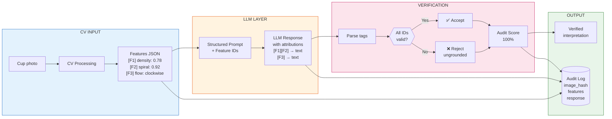
```mermaid
flowchart LR
    subgraph INPUT["CV INPUT"]
        IMG["Cup photo"]
        CV_PROC["CV Processing"]
        FEATURES["Features JSON<br/>[F1] density: 0.78<br/>[F2] spiral: 0.92<br/>[F3] flow: clockwise"]
    end

    subgraph LLM_LAYER["LLM LAYER"]
        PROMPT["Structured Prompt<br/>+ Feature IDs"]
        LLM_OUT["LLM Response<br/>with attributions<br/>[F1][F2] → text<br/>[F3] → text"]
    end

    subgraph VERIFY_LAYER["VERIFICATION"]
        PARSE["Parse tags"]
        CHECK{{"All IDs<br/>valid?"}}
        ACCEPT["✅ Accept"]
        REJECT["❌ Reject<br/>ungrounded"]
        AUDIT["Audit Score<br/>100%"]
    end

    subgraph OUTPUT["OUTPUT"]
        RESULT["Verified<br/>interpretation"]
        LOG[("Audit Log<br/>image_hash<br/>features<br/>response")]
    end

    IMG --> CV_PROC --> FEATURES
    FEATURES --> PROMPT
    PROMPT --> LLM_OUT
    LLM_OUT --> PARSE
    PARSE --> CHECK
    CHECK -->|Yes| ACCEPT
    CHECK -->|No| REJECT
    ACCEPT --> AUDIT
    REJECT --> AUDIT
    AUDIT --> RESULT
    FEATURES --> LOG
    LLM_OUT --> LOG
    AUDIT --> LOG

    style INPUT fill:#e3f2fd,stroke:#1565c0
    style LLM_LAYER fill:#fff3e0,stroke:#e65100
    style VERIFY_LAYER fill:#fce4ec,stroke:#c2185b
    style OUTPUT fill:#e8f5e9,stroke:#2e7d32
```

**Operating Principle:**

1. **Structured Input for LLM**: The LLM receives NOT an image, but a JSON with extracted features, where each feature has a unique identifier (F1, F2, F3...).

2. **Forced Attribution**: The prompt instructs the LLM to reference feature IDs with every statement.

3. **Output Verification**: The system parses the LLM response and checks:
   - Whether all referenced IDs exist in the source JSON
   - Whether any statements lack feature attribution (potential hallucinations)

4. **Audit Score**: Percentage of verified statements (target: >95%)

**Interaction Example:**

```
CV OUTPUT (JSON):
{
  "features": [
    { "id": "F1", "type": "density", "zone": "rim", "value": 0.78, "bbox": [120,45,280,95] },
    { "id": "F2", "type": "pattern", "name": "spiral", "confidence": 0.92, "center": [200,300] },
    { "id": "F3", "type": "flow", "direction": "clockwise", "angle": 87, "strength": 0.6 }
  ]
}

LLM PROMPT:
"Interpret the following CV-detected features. For each statement,
indicate the feature ID in square brackets.

Features:
[F1] High density in the RIM zone (0.78)
[F2] Spiral pattern in the center (confidence: 0.92)
[F3] Clockwise flow direction (strength: 0.6)

Interpret ONLY this data."

LLM RESPONSE:
"[F1][F2] The concentration of energy at the cup's edge, forming a spiral, indicates
approaching opportunities that require attention. [F3] Clockwise movement
symbolizes positive momentum in the current direction."

VERIFICATION:
✓ [F1][F2] — valid IDs, correspond to features
✓ [F3] — valid ID
Audit Score: 100% (all statements verified)
```

---

#### Frontend Overlay (Visual Proof UI)

**Visualization of the CV <-> Text Connection:**

The client application receives from the server:
1. The original image
2. An array of coordinates (masks, bbox) for each detected feature
3. The textual interpretation with attributions

**Interactive Elements:**
- **Contour Overlay**: Canvas/SVG renders vector contours over the photo
- **Hover Effect**: Hovering over a text fragment highlights the corresponding zone in the photo
- **Click Navigation**: Clicking on a photo zone scrolls to the corresponding text
- **Color Coding**: Different colors for different types of features

**Important:**
Contours are **not generated** by a neural network (Image-to-Image), but are **rendered** based on precise coordinates obtained from the CV module. This guarantees determinism and reproducibility.

---

#### Target Architecture Technology Stack

| Component | Technology | Rationale |
|-----------|-----------|-----------|
| CV Pipeline | Python + OpenCV + FastAPI | Full CV capabilities, GPU acceleration |
| Segmentation | OpenCV / SAM (optional) | Balance of accuracy and speed |
| Feature Extraction | scikit-image + numpy | Industry standard for texture analysis |
| LLM Integration | Google Gemini API / OpenAI | External API with our input control |
| Verification Layer | Python + regex/parser | Attribution validation |
| Frontend Overlay | Canvas API / SVG + React | Cross-platform rendering |
| Audit Logging | PostgreSQL (Supabase) | Full trace storage for auditing |

---

#### Regulatory Compliance

**For AFSA (AIFC) -- Explainable AI:**

| Requirement | Implementation |
|-------------|----------------|
| Algorithm Transparency | Each step of the CV pipeline is documented and verifiable |
| No "Black Box" | LLM receives only structured data, not the image |
| Traceability | Audit log: image_hash -> CV features -> prompt -> LLM response |
| Reproducibility | Deterministic CV pipeline yields identical features for the same photo |
| Model Bias Minimization | LLM is restricted to interpreting only the provided features |
| Model Misuse Prevention | CV module filters data and sets a strict context |

**For Astana Hub -- DeepTech / R&D:**

| Criterion | Confirmation |
|-----------|--------------|
| Proprietary algorithms | Custom CV pipeline for a specific task (tasseography) |
| R&D component | Research and development of domain-specific feature extraction |
| Uniqueness | No off-the-shelf solutions for coffee grounds analysis -- proprietary development |
| Demonstrability | Visual proof of each module's operation |
| Intellectual property | Algorithms, trained models, dataset -- basis for patenting |

---

#### Visual Proof Module Implementation Roadmap

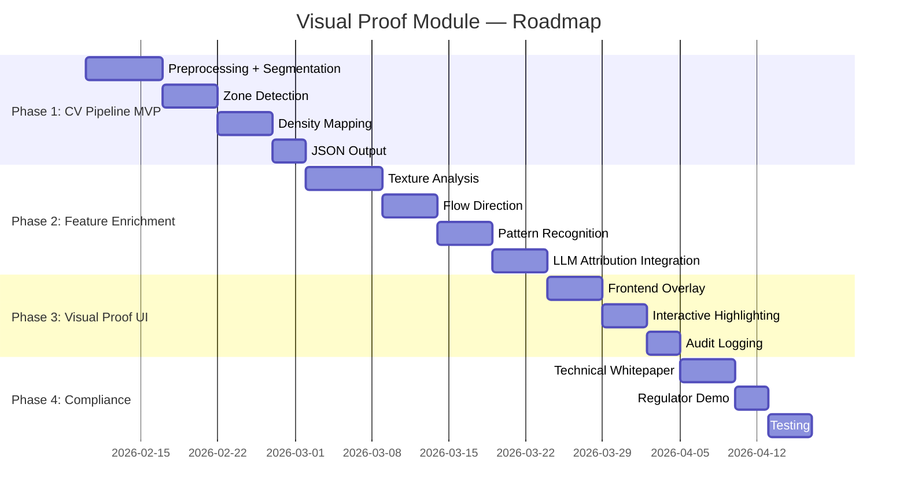
```mermaid
gantt
    title Visual Proof Module — Roadmap
    dateFormat  YYYY-MM-DD
    section Phase 1: CV Pipeline MVP
    Preprocessing + Segmentation    :p1a, 2026-02-10, 7d
    Zone Detection                  :p1b, after p1a, 5d
    Density Mapping                 :p1c, after p1b, 5d
    JSON Output                     :p1d, after p1c, 3d
    section Phase 2: Feature Enrichment
    Texture Analysis                :p2a, after p1d, 7d
    Flow Direction                  :p2b, after p2a, 5d
    Pattern Recognition             :p2c, after p2b, 5d
    LLM Attribution Integration     :p2d, after p2c, 5d
    section Phase 3: Visual Proof UI
    Frontend Overlay                :p3a, after p2d, 5d
    Interactive Highlighting        :p3b, after p3a, 4d
    Audit Logging                   :p3c, after p3b, 3d
    section Phase 4: Compliance
    Technical Whitepaper            :p4a, after p3c, 5d
    Regulator Demo                  :p4b, after p4a, 3d
    Testing                         :p4c, after p4b, 4d
```

**Phase 1: CV Pipeline MVP (2--3 weeks)**
- Preprocessing + Cup Segmentation
- Zone Detection
- Basic Density Mapping
- Structured JSON output

**Phase 2: Feature Enrichment (2--3 weeks)**
- Texture Analysis
- Flow Direction
- Pattern Recognition
- LLM integration with attribution

**Phase 3: Visual Proof UI (1--2 weeks)**
- Frontend Overlay implementation
- Interactive highlighting
- Audit logging

**Phase 4: Compliance & Documentation (1--2 weeks)**
- Technical whitepaper
- Demo for regulators
- Reproducibility testing

---

### SUMMARY FOR REGULATORS

##### For Astana Hub (DeepTech Qualification)

**Symancy is a DeepTech platform because:**

✅ **Proprietary Algorithms and R&D:**
- Proprietary Prompt Engineering system for domain-specific analysis
- Unique Persona Engine with AI characters
- Methodology for structured image zoning
- Visual Proof Module (CV Pipeline) under development

✅ **Technological Entry Barrier:**
- Integration of Vision-Language models with domain expertise
- Multilingual generation (RU/EN/ZH) with style control
- Omnichannel architecture (Telegram + Web + API)

✅ **Intellectual Property:**
- Library of specialized prompts
- Tasseography analysis methodology
- Planned patents for Visual Proof technology

✅ **Alignment with Priority Directions:**
- Artificial Intelligence / Machine Learning
- Computer Vision
- Natural Language Processing

---

##### For AFSA (Explainable AI Compliance)

**Current State:**
The platform employs a structured approach to analysis with image zoning and linking of visual patterns to interpretation through the prompt system.

**Planned Enhancement (Visual Proof Module):**

| AFSA Requirement | Implementation |
|-----------------|----------------|
| **Transparency** | Explicit CV feature extraction with JSON output |
| **Traceability** | Audit log: image_hash -> features -> prompt -> response |
| **Explainability** | Every statement is linked to a specific CV feature |
| **Reproducibility** | Deterministic CV yields identical features |
| **Visual Verification** | Frontend overlay with interactive zone highlighting |
| **Model Bias Mitigation** | LLM is restricted to interpreting only CV-detected data |
| **Model Misuse Prevention** | CV module filters and contextualizes input |

**Key Advantage:**
Symancy is not a "black box." The system demonstrates an explicit chain: **visual pattern -> CV feature -> interpretation**, ensuring full transparency for the regulator.

---

##### Architecture Comparison Table

| Characteristic | v1.0 (current) | v2.0 (with Visual Proof) |
|----------------|----------------|--------------------------|
| Prompt Engineering | ✅ Present | ✅ Enhanced |
| AI Personas | ✅ Present | ✅ Present |
| Omnichannel | ✅ Present | ✅ Present |
| **CV Pipeline** | ⚠️ Implicit | ✅ Explicit |
| **Attribution** | ⚠️ Implicit | ✅ Explicit |
| **Visual Overlay** | ❌ Absent | ✅ Present |
| **Audit Trail** | ⚠️ Basic | ✅ Complete |
| **AFSA Compliance** | ⚠️ Partial | ✅ Full |
| **DeepTech Level** | ✅ Basic | ✅✅ Enhanced |

---

*Document prepared: February 2026*
