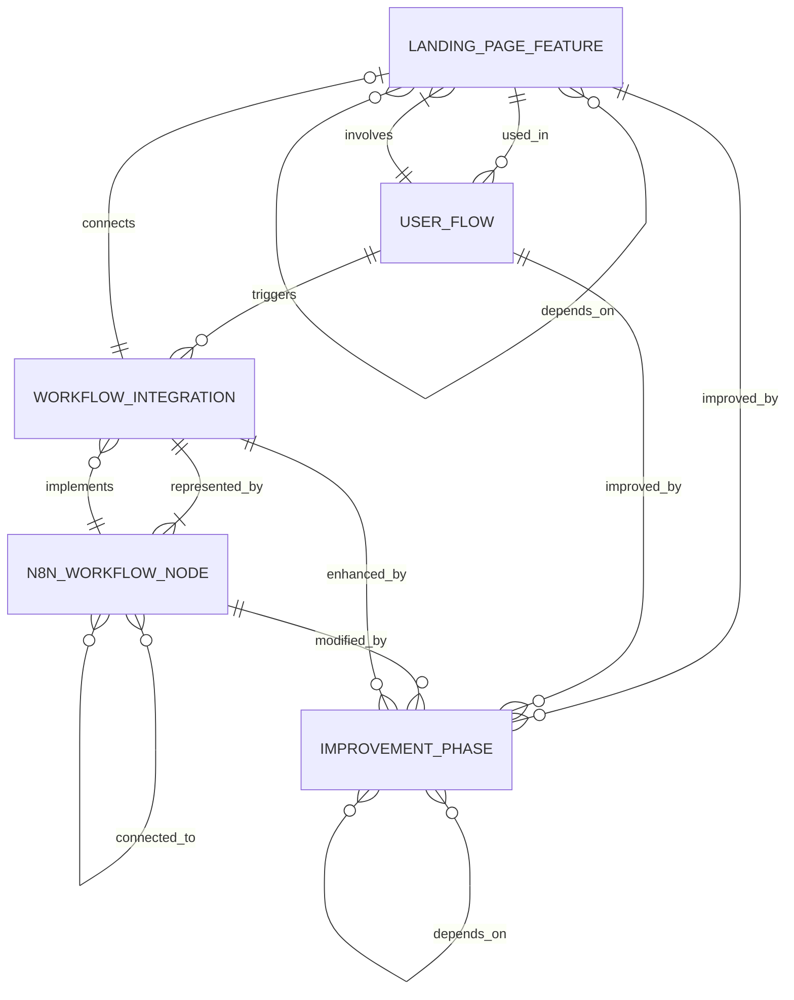

# Data Model: Documentation Artifacts

**Feature**: Landing Page & n8n Workflow Improvement Plan
**Date**: 2025-11-10
**Purpose**: Define the structure and relationships of documentation entities

## Overview

This data model describes the entities that structure the documentation artifacts produced by this feature. Since this is a documentation project (not a code implementation), the "data" consists of information captured in markdown documents rather than database records.

---

## Entity Definitions

### 1. Landing Page Feature

**Description**: A distinct user-facing capability or functional area of the Symancy landing page MVP.

**Attributes**:
- `name` (string): Human-readable feature name (e.g., "Image Upload", "AI Analysis", "History View")
- `currentDescription` (markdown): Detailed description of how the feature currently works
- `currentLimitations` (list): Known issues, pain points, or missing capabilities
- `futureDescription` (markdown): Vision for how the feature should work in the ideal state
- `userValue` (string): Explanation of why this feature matters to users
- `implementationComplexity` (enum): S/M/L/XL t-shirt sizing
- `priority` (enum): P1/P2/P3/P4/P5 based on user value and complexity
- `dependencies` (list): Other features that must be implemented first
- `relatedUserFlows` (list): User flows that utilize this feature

**Relationships**:
- A feature is used by one or more User Flows
- A feature may depend on other features
- A feature is part of one or more Improvement Phases

**Example**:
```markdown
### Feature: Image Upload

**Current Description**: Users can upload coffee cup images via file picker or drag-and-drop. Supports JPEG and PNG formats up to 10MB.

**Current Limitations**:
- No image preview before upload confirmation
- No guidance on ideal photo angle or lighting
- Mobile users report difficulty with camera vs. file selection
- No retry mechanism if upload fails

**Future Description**: Enhanced upload experience with real-time preview, in-app camera capture, image quality validation, auto-rotation, and helpful photography tips overlay.

**User Value**: Reduces user frustration, improves analysis quality through better images, increases mobile conversion rate.

**Implementation Complexity**: M (Medium)
**Priority**: P2
**Dependencies**: None
**Related User Flows**: Initial Upload Flow, Re-analysis Flow
```

---

### 2. User Flow

**Description**: A sequence of user interactions to accomplish a specific goal.

**Attributes**:
- `name` (string): Goal-oriented flow name (e.g., "First-Time Analysis Flow")
- `steps` (ordered list): Sequence of actions user performs
- `currentExperience` (markdown): How the flow works today with pain points noted
- `idealExperience` (markdown): Vision for seamless flow in future state
- `painPoints` (list): Specific user friction points in current flow
- `successMetrics` (list): Measurable criteria for flow improvement (e.g., "completion time <3 minutes")
- `priority` (enum): P1/P2/P3/P4/P5
- `affectedFeatures` (list): Features involved in this flow

**Relationships**:
- A user flow involves multiple Landing Page Features
- A user flow may trigger n8n Workflow Integrations
- A user flow is improved by one or more Improvement Phases

**Example**:
```markdown
### User Flow: First-Time Analysis

**Steps**:
1. User arrives at landing page
2. User uploads coffee cup image
3. User selects focus area (wellbeing/career/relationships)
4. User waits for AI analysis
5. User views results
6. (Optional) User creates account to save analysis

**Current Experience**:
- Step 1: Unclear value proposition, no visual examples
- Step 2: Upload interface is functional but minimal
- Step 3: Focus area selection unclear to first-time users
- Step 4: Loading state provides no progress indication (2-8 seconds)
- Step 5: Results are text-heavy, no visual elements
- Step 6: Account creation feels like an afterthought

**Ideal Experience**:
- Step 1: Engaging hero section with sample analyses and testimonials
- Step 2: Guided upload with photography tips and preview
- Step 3: Clear explanations of each focus area with examples
- Step 4: Engaging loading animation with progress indicators
- Step 5: Visually rich results with charts, icons, and formatting
- Step 6: Seamless account creation integrated into results flow

**Pain Points**:
- 40% of first-time users abandon during upload
- Average 12 seconds to understand focus area options
- No indication that analysis is processing
- Results feel clinical and impersonal

**Success Metrics**:
- First-time completion rate >75% (currently ~60%)
- Upload abandonment rate <10% (currently 40%)
- Average time-to-result <5 minutes (currently 7.5 minutes)

**Priority**: P1
**Affected Features**: Hero Section, Image Upload, Focus Selection, AI Analysis, Results Display, Account Creation
```

---

### 3. n8n Workflow Node

**Description**: A single processing unit in the n8n automation workflow.

**Attributes**:
- `nodeId` (string): Unique identifier from n8n JSON (e.g., "Webhook_001")
- `nodeType` (string): n8n node type (e.g., "n8n-nodes-base.webhook", "n8n-nodes-base.httpRequest")
- `nodeName` (string): Human-readable name from workflow
- `configuration` (object): Key configuration parameters
- `inputs` (list): Data inputs expected by this node
- `outputs` (list): Data outputs produced by this node
- `integrations` (list): External services this node connects to
- `errorHandling` (markdown): How node handles errors and failures
- `performanceCharacteristics` (markdown): Execution time, rate limits, concurrency
- `currentLimitations` (list): Known issues or constraints
- `improvementOpportunities` (list): Potential optimizations

**Relationships**:
- A node connects to zero or more upstream nodes (data sources)
- A node connects to zero or more downstream nodes (data consumers)
- A node may represent a Workflow Integration
- A node may be modified by an Improvement Phase

**Example**:
```markdown
### Node: Gemini_API_Request

**Node ID**: `HttpRequest_Gemini_001`
**Node Type**: `n8n-nodes-base.httpRequest`
**Node Name**: "Call Gemini API for Coffee Cup Analysis"

**Configuration**:
- Method: POST
- URL: `https://generativelanguage.googleapis.com/v1/models/gemini-1.5-flash:generateContent`
- Authentication: API Key (env variable)
- Timeout: 30 seconds
- Retry: 2 attempts with 5-second delay

**Inputs**:
- Image data (base64 encoded)
- Focus area (wellbeing/career/relationships)
- Language preference (ru/en)

**Outputs**:
- Analysis text (markdown formatted)
- Confidence score
- Error message (if failed)

**Integrations**: Google Gemini API

**Error Handling**:
- Rate limit exceeded: Return cached response or queue request
- Timeout: Retry once, then return error to user
- Invalid API key: Alert admin, return generic error to user

**Performance Characteristics**:
- Average execution: 3-5 seconds
- 95th percentile: 8 seconds
- Rate limit: 60 requests/minute
- No concurrent request limit

**Current Limitations**:
- No caching of similar analyses
- No fallback to alternative AI provider
- Error messages not localized for Russian users

**Improvement Opportunities**:
- Implement response caching for identical images
- Add OpenRouter fallback for Gemini failures
- Localize all error messages
- Implement request queuing for rate limit management
```

---

### 4. Workflow Integration

**Description**: A connection point between the n8n workflow and an external system.

**Attributes**:
- `name` (string): Integration name (e.g., "Landing Page → n8n Webhook")
- `type` (enum): webhook/api/database/messaging/file
- `sourceSystem` (string): System initiating the integration
- `targetSystem` (string): System receiving the integration
- `dataFormat` (string): JSON, XML, form-data, etc.
- `authenticationMethod` (string): How integration authenticates
- `reliabilityRequirements` (markdown): SLA, error tolerance, retry strategy
- `currentImplementation` (markdown): How it works today
- `currentLimitations` (list): Known issues or constraints
- `futureImplementation` (markdown): Proposed improvements

**Relationships**:
- An integration connects the Landing Page to n8n Workflow
- An integration may connect n8n Workflow to external services (Gemini, Supabase, messaging platforms)
- An integration is represented by one or more n8n Workflow Nodes
- An integration may be improved by an Improvement Phase

**Example**:
```markdown
### Integration: Landing Page → n8n Analysis Webhook

**Type**: webhook
**Source System**: Symancy Landing Page (React app)
**Target System**: n8n Workflow
**Data Format**: JSON

**Authentication Method**: Webhook URL security through obscurity (no authentication token)

**Reliability Requirements**:
- Availability: 99.5% uptime
- Error tolerance: Must not lose user requests
- Retry strategy: Client-side retry with exponential backoff

**Current Implementation**:
When user clicks "Analyze", landing page sends POST request to n8n webhook:
```json
{
  "imageData": "base64EncodedString",
  "mimeType": "image/jpeg",
  "focusArea": "wellbeing",
  "language": "ru",
  "userId": "optional-if-authenticated"
}
```

Webhook triggers n8n workflow which:
1. Validates image data
2. Calls Gemini API
3. Stores analysis in Supabase (if user authenticated)
4. Returns analysis to client

**Current Limitations**:
- No webhook authentication (security risk)
- No request idempotency (duplicate analysis if user clicks twice)
- No status polling (user must wait for synchronous response)
- Single webhook URL (can't route to different workflows)

**Future Implementation**:
- Add HMAC signature verification
- Implement idempotency keys to prevent duplicate processing
- Support async processing with status polling endpoint
- Enable workflow routing based on request parameters
- Add webhook monitoring and alerting
```

---

### 5. Improvement Phase

**Description**: A logical grouping of related enhancements that can be implemented together.

**Attributes**:
- `phaseName` (string): Descriptive phase name (e.g., "Phase 1: Upload Experience Enhancement")
- `phaseNumber` (integer): Sequential phase number
- `includedImprovements` (list): Features or flows improved in this phase
- `priority` (enum): P1/P2/P3/P4/P5
- `effortEstimate` (string): T-shirt size (S/M/L/XL) with optional hour range
- `dependencies` (list): Other phases that must complete first
- `successCriteria` (list): Measurable outcomes for phase completion
- `deliverables` (list): Specific outputs of this phase
- `parallelizable` (boolean): Can this phase run concurrently with others?

**Relationships**:
- A phase improves one or more Landing Page Features
- A phase improves one or more User Flows
- A phase may modify n8n Workflow Nodes
- A phase may enhance Workflow Integrations
- A phase depends on zero or more other phases

**Example**:
```markdown
### Phase 2: AI Analysis Enhancement

**Phase Number**: 2
**Priority**: P2

**Included Improvements**:
- Implement response caching for identical images
- Add OpenRouter fallback for Gemini failures
- Improve loading state with progress indicators
- Add analysis confidence scoring
- Localize error messages

**Effort Estimate**: L (Large) - Approximately 80-120 developer hours

**Dependencies**:
- Phase 1 (Upload Experience Enhancement) must be complete
- Requires Supabase schema update for caching layer

**Success Criteria**:
- Average analysis time reduced to <4 seconds (from 5 seconds)
- 99.9% analysis success rate (from 98.5%)
- Zero failed analyses due to Gemini rate limits
- All error messages available in Russian and English

**Deliverables**:
- Redis cache integration for analysis results
- OpenRouter integration with fallback logic
- Enhanced loading component with progress bar
- Confidence score UI component
- Localized error message catalog

**Parallelizable**: Yes - can be developed concurrently with Phase 3 (Mobile Optimization)
```

---

## Entity Relationships Diagram



---

## Documentation Artifact Mapping

Each entity type maps to specific sections in the documentation deliverables:

### Current State Report (Landing Page)
- **Landing Page Features**: Feature inventory section
- **User Flows**: User experience section
- **Workflow Integrations**: Integration points section

### Future State Specification (Landing Page)
- **Landing Page Features**: Enhanced feature specifications
- **User Flows**: Ideal user experience journeys
- **Workflow Integrations**: Future integration requirements

### Improvement Roadmap (Landing Page)
- **Improvement Phases**: Primary roadmap structure
- **Landing Page Features**: Improvements grouped by phase
- **Dependencies**: Phase sequencing logic

### Current State Analysis (n8n Workflow)
- **n8n Workflow Nodes**: Node inventory and specifications
- **Workflow Integrations**: Integration architecture

### Improvement Specification (n8n Workflow)
- **n8n Workflow Nodes**: Node improvement proposals
- **Workflow Integrations**: Integration enhancements
- **Improvement Phases**: Workflow improvement roadmap

---

## Validation Rules

### Landing Page Feature
- `name` must be unique within landing page context
- `priority` must be assigned based on value/complexity matrix
- `dependencies` must reference existing features (no circular dependencies)

### User Flow
- `steps` must be non-empty ordered list
- Each `successMetric` must be measurable and time-bound
- `affectedFeatures` must reference existing features

### n8n Workflow Node
- `nodeId` must match actual node ID from n8n JSON
- `nodeType` must be valid n8n node type
- `inputs` and `outputs` must document data schemas

### Workflow Integration
- `type` must be one of defined enum values
- `authenticationMethod` must be documented
- `reliabilityRequirements` must include SLA

### Improvement Phase
- `phaseNumber` must be unique and sequential
- `dependencies` must reference existing phases (no circular dependencies)
- `successCriteria` must be measurable
- If `parallelizable` is true, phase must have no conflicting dependencies

---

## Usage in Documentation

When creating documentation artifacts, use this data model to structure information:

1. **Inventory Phase**: Identify all instances of each entity in current state
2. **Analysis Phase**: Populate entity attributes from code review and stakeholder interviews
3. **Design Phase**: Define future state for each entity
4. **Synthesis Phase**: Organize entities into coherent documentation sections

This structured approach ensures comprehensive coverage and enables traceability from requirements through implementation.
