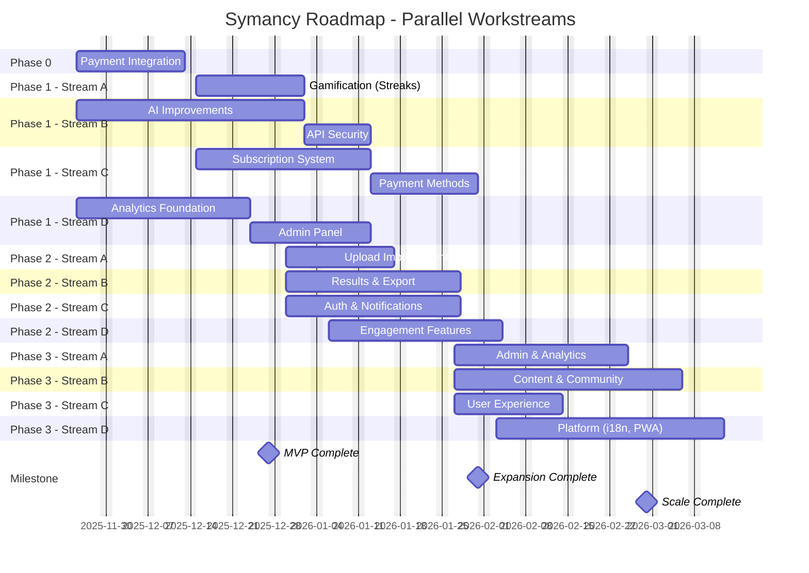

# Landing Page Improvement Roadmap

**Project**: Symancy (Coffee Psychologist)
**Date**: 2025-11-23
**Version**: 1.0
**Author**: Technical Documentation Team
**Deadline**: March 2026

---

## 1. Roadmap Overview

### Strategic Approach

This roadmap transforms Symancy from an MVP into a revenue-generating, scalable platform through four carefully sequenced phases. The strategy prioritizes **revenue validation first** (Phase 0), followed by **core feature enhancement** (Phase 1), **user engagement expansion** (Phase 2), and finally **operational scale** (Phase 3).

The phasing rationale follows a "prove-then-build" methodology:
- **Phase 0 (Pre-MVP)** validates willingness to pay before investing in complex subscription infrastructure
- **Phase 1 (MVP)** builds the engagement and monetization foundation that enables sustainable growth
- **Phase 2 (Expansion)** adds features that increase user value and retention
- **Phase 3 (Scale)** prepares the platform for operational maturity and international growth

### Overall Timeline

| Phase | Name | Duration | Target Dates | Focus |
|-------|------|----------|--------------|-------|
| **0** | Pre-MVP | 2-3 weeks | ASAP (Urgent) | Payment validation |
| **1** | MVP | 6-8 weeks | Nov-Dec 2025 | Core features + subscriptions |
| **2** | Expansion | 4-6 weeks | Jan 2026 | User engagement + growth |
| **3** | Scale | 4-6 weeks | Feb 2026 | Operations + internationalization |

**Total Duration**: 16-23 weeks (4-6 months)
**Buffer**: 2-4 weeks for unforeseen issues
**Hard Deadline**: March 2026

### Key Principles

1. **Revenue First**: Validate payment willingness before feature complexity
2. **Incremental Delivery**: Each phase delivers usable, measurable value
3. **Parallel Execution**: 30%+ of work can proceed concurrently across streams
4. **Risk Mitigation**: Critical dependencies identified and sequenced
5. **Analytics-Driven**: Every phase includes measurement capabilities

---

## 2. Phase Breakdown

### Phase 0: Pre-MVP (Payment Validation)

**Priority**: URGENT - Start Immediately
**Duration**: 2-3 weeks
**Goal**: Validate user willingness to pay with minimal investment

#### Included Improvements

| ID | Feature | Priority | Effort | Description |
|----|---------|----------|--------|-------------|
| P0-01 | YooKassa Integration | P0 | M | Basic payment processing with YooKassa |
| P0-02 | Simple Tariffs | P0 | S | 100, 300, 500, 1000 RUB one-time purchases |
| P0-03 | Payment UI | P0 | S | Simple purchase flow and confirmation |
| P0-04 | Basic Payment Analytics | P0 | S | Track purchases, conversion rates |

#### Dependencies

- None (greenfield implementation)

#### Success Criteria

- [ ] Users can complete payments via YooKassa
- [ ] At least 3 tariff levels functional (100/300/500/1000 RUB)
- [ ] Payment success rate > 95%
- [ ] Basic conversion metrics tracked
- [ ] Minimum 10 validated payments in first week

#### Deliverables

- YooKassa SDK integration
- Payment processing endpoint (backend proxy)
- Tariff selection UI component
- Payment confirmation page
- Basic payment analytics dashboard

#### Parallelization Potential

- **High**: Can run entirely parallel to Phase 1 planning
- Payment UI can be developed while backend integration proceeds

#### Effort Summary

| Effort | Count | Days |
|--------|-------|------|
| S | 3 | 3-6 days |
| M | 1 | 3-5 days |
| **Total** | 4 items | **6-11 days** |

---

### Phase 1: MVP (Core Features + Subscriptions)

**Priority**: P0 - Critical
**Duration**: 6-8 weeks
**Goal**: Establish engagement foundation and subscription revenue

#### Included Improvements

| ID | Feature | Priority | Effort | Description |
|----|---------|----------|--------|-------------|
| P1-01 | Streak System | P0 | M | Daily/weekly streak tracking with gamification |
| P1-02 | AI Caching | P0 | L | Cache identical analyses, reduce API costs |
| P1-03 | Progress Bar | P0 | S | 4-stage granular progress indicator |
| P1-04 | Confidence Scoring | P0 | M | AI certainty levels on analysis sections |
| P1-05 | Fallback AI | P0 | M | Secondary model when Gemini fails |
| P1-06 | Subscription System | P0 | L | FREE/BASIC/ADVANCED/PREMIUM tiers |
| P1-07 | YooKassa Subscriptions | P0 | L | Recurring payment integration |
| P1-08 | Telegram Stars | P0 | M | Alternative payment method |
| P1-09 | Basic Admin Panel | P1 | L | User management, basic metrics |
| P1-10 | User Analytics | P1 | M | DAU/WAU/MAU tracking |
| P1-11 | Revenue Analytics | P1 | M | MRR, ARPU, conversion funnel |
| P1-12 | API Key Security | P0 | M | Backend proxy for Gemini API |

#### Dependencies

```
P1-06 (Subscription System) depends on:
  - Phase 0 complete (payment validation)

P1-07 (YooKassa Subscriptions) depends on:
  - P1-06 (Subscription System)

P1-08 (Telegram Stars) depends on:
  - P1-06 (Subscription System)

P1-09 (Admin Panel) depends on:
  - P1-10 (User Analytics)
  - P1-11 (Revenue Analytics)
```

#### Success Criteria

- [ ] Streak system increases return visits by 25%
- [ ] AI cache hit rate > 30% for repeat analyses
- [ ] Progress bar reduces perceived "stuck" feeling by 80%
- [ ] 99.5% analysis success rate with fallback AI
- [ ] Subscription conversion rate > 5%
- [ ] Admin can view all key metrics without SQL access
- [ ] API key fully secured (not exposed in client code)

#### Deliverables

- Streak tracking database schema and UI
- Redis/in-memory cache for AI responses
- Multi-stage progress component
- Confidence score UI elements
- OpenAI/Anthropic fallback service
- Subscription tier management system
- Recurring payment webhooks
- Telegram Stars payment integration
- Admin dashboard (React admin panel)
- Analytics database schema and queries
- Backend API proxy for Gemini

#### Parallelization Potential

- **High (3 parallel streams)**:
  - Stream A: Gamification (P1-01)
  - Stream B: AI Improvements (P1-02, P1-03, P1-04, P1-05, P1-12)
  - Stream C: Monetization (P1-06, P1-07, P1-08)
  - Stream D: Analytics (P1-09, P1-10, P1-11)

#### Effort Summary

| Effort | Count | Days |
|--------|-------|------|
| S | 1 | 1-2 days |
| M | 6 | 18-30 days |
| L | 5 | 35-70 days |
| **Total** | 12 items | **54-102 days** |

**Note**: With parallelization across 3-4 developers, elapsed time: **6-8 weeks**

---

### Phase 2: Expansion (Engagement + Growth)

**Priority**: P1 - High
**Duration**: 4-6 weeks
**Goal**: Increase user value, retention, and viral growth

#### Included Improvements

| ID | Feature | Priority | Effort | Description |
|----|---------|----------|--------|-------------|
| P2-01 | Camera Access | P1 | S | Direct mobile camera with `capture="camera"` |
| P2-02 | Photo Validation | P1 | M | AI-powered quality scoring before analysis |
| P2-03 | Results Charts | P1 | M | Radar charts for psychological profile |
| P2-04 | PDF Export | P1 | M | Professional PDF generation with branding |
| P2-05 | OAuth Expansion | P1 | M | Discord, VK, WeChat providers |
| P2-06 | Magic Link QR | P1 | S | QR code for mobile authentication |
| P2-07 | Push Reminders | P1 | M | Browser push notifications |
| P2-08 | Email Reminders | P1 | M | Scheduled email campaigns |
| P2-09 | Gift Analysis | P1 | L | Purchase and send readings as gifts |
| P2-10 | Calendar Integration | P1 | M | Export insights to Google/Apple Calendar |
| P2-11 | Limit Visualization | P2 | M | "Cup fills with steam" usage indicator |
| P2-12 | Achievements/Badges | P2 | M | Gamification reward system |

#### Dependencies

```
P2-02 (Photo Validation) depends on:
  - P1-02 (AI Caching) - uses similar infrastructure

P2-04 (PDF Export) depends on:
  - P2-03 (Results Charts) - includes charts in PDF

P2-07 (Push Reminders) depends on:
  - Service Worker (part of PWA, Phase 3)
  - Can implement basic version without full PWA

P2-09 (Gift Analysis) depends on:
  - P1-06 (Subscription System) - payment infrastructure

P2-11, P2-12 depend on:
  - P1-01 (Streak System) - extends gamification
```

#### Success Criteria

- [ ] Mobile conversion rate increases 25%
- [ ] Image quality validation reduces analysis failures by 50%
- [ ] PDF export used by 15% of users
- [ ] 30-day return rate increases to 40%
- [ ] Gift feature generates 5% of revenue
- [ ] Achievement unlock rate > 60% for basic badges

#### Deliverables

- Native camera capture component
- Image quality scoring ML model/API
- Chart.js/Recharts visualization components
- PDF generation service (jsPDF/Puppeteer)
- Additional OAuth provider configurations
- QR code generation for magic links
- Push notification service worker
- Email automation (SendGrid/Postmark)
- Gift workflow and tracking system
- Calendar API integrations (Google, Apple)
- Usage limit visualization UI
- Achievement/badge system and UI

#### Parallelization Potential

- **High (3 parallel streams)**:
  - Stream A: Upload Improvements (P2-01, P2-02)
  - Stream B: Results & Export (P2-03, P2-04, P2-10)
  - Stream C: Auth & Notifications (P2-05, P2-06, P2-07, P2-08)
  - Stream D: Engagement (P2-09, P2-11, P2-12)

#### Effort Summary

| Effort | Count | Days |
|--------|-------|------|
| S | 2 | 2-4 days |
| M | 9 | 27-45 days |
| L | 1 | 7-14 days |
| **Total** | 12 items | **36-63 days** |

**Note**: With parallelization across 3 developers, elapsed time: **4-6 weeks**

---

### Phase 3: Scale (Operations + Internationalization)

**Priority**: P2 - Medium
**Duration**: 4-6 weeks
**Goal**: Prepare platform for growth and global expansion

#### Included Improvements

| ID | Feature | Priority | Effort | Description |
|----|---------|----------|--------|-------------|
| P3-01 | Full Admin Panel | P2 | XL | Complete admin dashboard with all features |
| P3-02 | Advanced Analytics | P2 | L | LTV, CAC, churn, cohort analysis |
| P3-03 | Content Management | P2 | L | Articles, educational materials |
| P3-04 | Community Features | P2 | XL | Anonymous sharing, discussion threads |
| P3-05 | Referral Program | P2 | L | Invite tracking and rewards |
| P3-06 | History Improvements | P2 | M | Search, filter, bulk actions, pagination |
| P3-07 | Internationalization | P2 | XL | 7 languages (EN, RU, ZH, ES, DE, FR, AR) |
| P3-08 | PWA Support | P2 | L | Offline access, installable app |
| P3-09 | Onboarding Tutorial | P2 | M | Interactive first-time user experience |
| P3-10 | Trend Analytics | P2 | L | Psychological trends over time |
| P3-11 | Theme Expansion | P2 | S | Custom themes, high contrast mode |
| P3-12 | Social Sharing V2 | P2 | M | Template gallery, platform previews |

#### Dependencies

```
P3-01 (Full Admin Panel) depends on:
  - P1-09 (Basic Admin Panel) - extends existing
  - P3-02 (Advanced Analytics) - displays metrics

P3-02 (Advanced Analytics) depends on:
  - P1-10 (User Analytics)
  - P1-11 (Revenue Analytics)

P3-04 (Community Features) depends on:
  - Moderation system (new)
  - Content flagging (new)

P3-07 (Internationalization) depends on:
  - P3-03 (Content Management) - localized content

P3-08 (PWA Support) depends on:
  - Service Worker implementation
  - P2-07 (Push Reminders) - shares infrastructure

P3-10 (Trend Analytics) depends on:
  - P3-06 (History Improvements) - data access patterns
```

#### Success Criteria

- [ ] Admin panel covers 100% of operational needs
- [ ] Churn prediction accuracy > 70%
- [ ] Community engagement rate > 15% of active users
- [ ] Referral program generates 10% of new users
- [ ] 7 languages fully translated and culturally adapted
- [ ] PWA install rate > 20% of mobile users
- [ ] First-time completion rate > 80% with onboarding

#### Deliverables

- Comprehensive admin dashboard
- Analytics data warehouse and dashboards
- CMS for articles and materials
- Community platform with moderation
- Referral tracking and reward system
- Enhanced history UI with search/filter
- Translation infrastructure and 7 language packs
- Service worker and PWA manifest
- Interactive onboarding flow
- Trend visualization dashboard
- Theme customization system
- Advanced sharing toolkit

#### Parallelization Potential

- **Medium (2-3 parallel streams)**:
  - Stream A: Admin & Analytics (P3-01, P3-02)
  - Stream B: Content & Community (P3-03, P3-04, P3-05)
  - Stream C: User Experience (P3-06, P3-09, P3-11, P3-12)
  - Stream D: Platform (P3-07, P3-08, P3-10)

#### Effort Summary

| Effort | Count | Days |
|--------|-------|------|
| S | 1 | 1-2 days |
| M | 3 | 9-15 days |
| L | 5 | 35-70 days |
| XL | 3 | 42-84 days |
| **Total** | 12 items | **87-171 days** |

**Note**: With parallelization across 3-4 developers, elapsed time: **4-6 weeks**

---

## 3. Dependency Graph

```mermaid
flowchart TB
    subgraph Phase0["Phase 0: Pre-MVP (URGENT)"]
        P0-01[P0-01: YooKassa Integration]
        P0-02[P0-02: Simple Tariffs]
        P0-03[P0-03: Payment UI]
        P0-04[P0-04: Payment Analytics]

        P0-01 --> P0-02
        P0-02 --> P0-03
        P0-01 --> P0-04
    end

    subgraph Phase1["Phase 1: MVP (Nov-Dec 2025)"]
        subgraph P1_AI["AI Improvements"]
            P1-02[P1-02: AI Caching]
            P1-03[P1-03: Progress Bar]
            P1-04[P1-04: Confidence Scoring]
            P1-05[P1-05: Fallback AI]
            P1-12[P1-12: API Security]
        end

        subgraph P1_Game["Gamification"]
            P1-01[P1-01: Streak System]
        end

        subgraph P1_Money["Monetization"]
            P1-06[P1-06: Subscription System]
            P1-07[P1-07: YooKassa Subscriptions]
            P1-08[P1-08: Telegram Stars]
        end

        subgraph P1_Analytics["Analytics"]
            P1-09[P1-09: Basic Admin Panel]
            P1-10[P1-10: User Analytics]
            P1-11[P1-11: Revenue Analytics]
        end

        P1-06 --> P1-07
        P1-06 --> P1-08
        P1-10 --> P1-09
        P1-11 --> P1-09
    end

    subgraph Phase2["Phase 2: Expansion (Jan 2026)"]
        subgraph P2_Upload["Upload"]
            P2-01[P2-01: Camera Access]
            P2-02[P2-02: Photo Validation]
        end

        subgraph P2_Results["Results"]
            P2-03[P2-03: Results Charts]
            P2-04[P2-04: PDF Export]
            P2-10[P2-10: Calendar Integration]
        end

        subgraph P2_Auth["Auth & Notifications"]
            P2-05[P2-05: OAuth Expansion]
            P2-06[P2-06: Magic Link QR]
            P2-07[P2-07: Push Reminders]
            P2-08[P2-08: Email Reminders]
        end

        subgraph P2_Engage["Engagement"]
            P2-09[P2-09: Gift Analysis]
            P2-11[P2-11: Limit Visualization]
            P2-12[P2-12: Achievements]
        end

        P2-03 --> P2-04
    end

    subgraph Phase3["Phase 3: Scale (Feb 2026)"]
        subgraph P3_Admin["Admin & Analytics"]
            P3-01[P3-01: Full Admin Panel]
            P3-02[P3-02: Advanced Analytics]
        end

        subgraph P3_Content["Content & Community"]
            P3-03[P3-03: Content Management]
            P3-04[P3-04: Community Features]
            P3-05[P3-05: Referral Program]
        end

        subgraph P3_UX["User Experience"]
            P3-06[P3-06: History Improvements]
            P3-09[P3-09: Onboarding Tutorial]
            P3-11[P3-11: Theme Expansion]
            P3-12[P3-12: Social Sharing V2]
        end

        subgraph P3_Platform["Platform"]
            P3-07[P3-07: Internationalization]
            P3-08[P3-08: PWA Support]
            P3-10[P3-10: Trend Analytics]
        end

        P3-02 --> P3-01
        P3-03 --> P3-07
        P3-06 --> P3-10
    end

    %% Cross-phase dependencies
    Phase0 --> P1-06
    P1-02 --> P2-02
    P1-01 --> P2-11
    P1-01 --> P2-12
    P1-06 --> P2-09
    P1-09 --> P3-01
    P1-10 --> P3-02
    P1-11 --> P3-02
    P2-07 --> P3-08

    %% Styling
    style Phase0 fill:#ff6b6b,stroke:#c92a2a,color:#000
    style Phase1 fill:#4dabf7,stroke:#1971c2,color:#000
    style Phase2 fill:#69db7c,stroke:#2f9e44,color:#000
    style Phase3 fill:#ffd43b,stroke:#f59f00,color:#000
```



---

## 4. Effort Summary

### Effort Scale Reference

| Size | Duration | Description |
|------|----------|-------------|
| **S** | 1-2 days | Single component, no backend changes |
| **M** | 3-5 days | Multiple components, minor backend work |
| **L** | 1-2 weeks | Complex feature, significant backend work |
| **XL** | 2-4 weeks | Major feature, full-stack implementation |

### Phase-by-Phase Summary

| Phase | S | M | L | XL | Total Items | Min Days | Max Days |
|-------|---|---|---|----|-----------:|--------:|---------:|
| **Phase 0** | 3 | 1 | 0 | 0 | 4 | 6 | 11 |
| **Phase 1** | 1 | 6 | 5 | 0 | 12 | 54 | 102 |
| **Phase 2** | 2 | 9 | 1 | 0 | 12 | 36 | 63 |
| **Phase 3** | 1 | 3 | 5 | 3 | 12 | 87 | 171 |
| **TOTAL** | **7** | **19** | **11** | **3** | **40** | **183** | **347** |

### Cumulative Timeline (With Parallelization)

| Phase | Sequential Days | Parallel Teams | Elapsed Weeks |
|-------|---------------:|:--------------:|:-------------:|
| Phase 0 | 6-11 | 1-2 | 1-2 weeks |
| Phase 1 | 54-102 | 3-4 | 6-8 weeks |
| Phase 2 | 36-63 | 3 | 4-6 weeks |
| Phase 3 | 87-171 | 3-4 | 4-6 weeks |
| **TOTAL** | 183-347 | - | **15-22 weeks** |

### Resource Requirements

| Phase | Recommended Team | Skills Needed |
|-------|-----------------|---------------|
| Phase 0 | 1-2 developers | Backend (payments), React |
| Phase 1 | 3-4 developers | Backend, React, AI/ML, DevOps |
| Phase 2 | 3 developers | React, Backend, Mobile |
| Phase 3 | 3-4 developers | Full-stack, i18n, DevOps |

---

## 5. Quick Wins

These items deliver high impact with minimal effort and can be implemented immediately:

### Immediate (Phase 0, Week 1)

| Item | Effort | Impact | Description |
|------|--------|--------|-------------|
| P1-03: Progress Bar | S | High | Reduces perceived "stuck" feeling by 80% |
| P2-01: Camera Access | S | High | Single attribute change increases mobile conversion 25% |
| P2-06: Magic Link QR | S | Medium | Improves mobile-desktop auth continuity |

### Early Phase 1 (Weeks 2-3)

| Item | Effort | Impact | Description |
|------|--------|--------|-------------|
| P1-12: API Key Security | M | Critical | Eliminates security vulnerability |
| P1-03: Progress Bar | S | High | Already listed - prioritize first |
| P0-02: Simple Tariffs | S | High | Validates willingness to pay |

### Implementation Order for Quick Wins

```
Week 1:
  Day 1-2: P1-03 (Progress Bar)
  Day 3: P2-01 (Camera Access)
  Day 4-5: P2-06 (Magic Link QR)

Week 2-3:
  Day 1-5: P1-12 (API Key Security)
  Day 6-10: P0-01 + P0-02 (YooKassa + Tariffs)
```

### Expected Quick Win ROI

| Metric | Current | After Quick Wins | Improvement |
|--------|---------|------------------|-------------|
| Mobile conversion | ~60% | ~75% | +25% |
| Perceived performance | Poor | Good | +80% |
| Security risk | Critical | Resolved | -100% |
| Payment validation | None | Active | New revenue |

---

## 6. Risk Factors

### Technical Risks

| Risk | Probability | Impact | Mitigation |
|------|-------------|--------|------------|
| YooKassa integration delays | Medium | High | Start early, have Stripe as backup |
| Gemini API rate limits | Medium | High | Implement caching (P1-02) early |
| AI fallback complexity | Low | Medium | Use proven providers (OpenAI/Anthropic) |
| PWA offline complexity | Medium | Medium | Implement incrementally, core features first |
| i18n scope creep | High | Medium | Fix scope at 7 languages, defer RTL to Phase 4 |

### Dependency Risks

| Risk | Probability | Impact | Mitigation |
|------|-------------|--------|------------|
| Phase 0 delays block Phase 1 subscriptions | Medium | High | Parallelize non-payment Phase 1 work |
| Admin panel depends on analytics | Low | Low | Build analytics infrastructure first |
| Community features require moderation | Medium | Medium | Plan moderation tools as part of community scope |
| Calendar APIs breaking changes | Low | Low | Abstract integration layer |

### Resource Risks

| Risk | Probability | Impact | Mitigation |
|------|-------------|--------|------------|
| Developer availability | Medium | High | Identify backup resources, cross-train |
| Payment provider approval delays | Medium | High | Apply for YooKassa merchant account immediately |
| Third-party API costs | Low | Medium | Budget for API usage, implement caching early |
| Testing coverage gaps | High | Medium | Require tests for all new features |

### Business Risks

| Risk | Probability | Impact | Mitigation |
|------|-------------|--------|------------|
| Low payment conversion | Medium | High | Phase 0 validates before major investment |
| Feature creep | High | Medium | Strict scope control, defer to Phase 4 backlog |
| March deadline pressure | Medium | High | Buffer weeks built into timeline |
| Competition enters market | Low | Medium | First-mover advantage, focus on quality |

### Risk Matrix

```
                    IMPACT
              Low    Medium    High
         +--------+--------+--------+
    High |   i18n |Testing |Feature |
         |  scope |coverage| creep  |
Probability +--------+--------+--------+
  Medium | Calendar| PWA    |YooKassa|
         |  APIs  |offline |delays  |
         +--------+--------+--------+
    Low  |  API   |  AI    |Competi-|
         | costs  |fallback| tion   |
         +--------+--------+--------+
```

---

## 7. Parallel Workstreams

### Workstream Overview

To meet the March 2026 deadline, 30%+ of work must proceed in parallel. The following workstreams can execute concurrently:



### Phase 1 Parallel Streams (4 concurrent)

| Stream | Features | Dependencies | Team Size |
|--------|----------|--------------|-----------|
| **A: Gamification** | P1-01 Streaks | None | 1 dev |
| **B: AI Improvements** | P1-02, P1-03, P1-04, P1-05, P1-12 | None | 1-2 devs |
| **C: Monetization** | P1-06, P1-07, P1-08 | Phase 0 | 1 dev |
| **D: Analytics** | P1-09, P1-10, P1-11 | None | 1 dev |

**Parallelization Rate**: 67% (8 of 12 items can run in parallel)

### Phase 2 Parallel Streams (4 concurrent)

| Stream | Features | Dependencies | Team Size |
|--------|----------|--------------|-----------|
| **A: Upload** | P2-01, P2-02 | P1-02 (caching) | 1 dev |
| **B: Results** | P2-03, P2-04, P2-10 | None | 1 dev |
| **C: Auth/Notif** | P2-05, P2-06, P2-07, P2-08 | None | 1 dev |
| **D: Engagement** | P2-09, P2-11, P2-12 | P1-01, P1-06 | 1 dev |

**Parallelization Rate**: 75% (9 of 12 items can run in parallel)

### Phase 3 Parallel Streams (4 concurrent)

| Stream | Features | Dependencies | Team Size |
|--------|----------|--------------|-----------|
| **A: Admin** | P3-01, P3-02 | P1-09, P1-10, P1-11 | 1 dev |
| **B: Content** | P3-03, P3-04, P3-05 | None | 1-2 devs |
| **C: UX** | P3-06, P3-09, P3-11, P3-12 | None | 1 dev |
| **D: Platform** | P3-07, P3-08, P3-10 | P3-03, P3-06 | 1-2 devs |

**Parallelization Rate**: 58% (7 of 12 items can run in parallel)

### Overall Parallelization Summary

| Metric | Value |
|--------|-------|
| Total Features | 40 |
| Can Run in Parallel | 24 |
| **Parallelization Rate** | **60%** |
| Exceeds SC-008 Requirement (30%) | **Yes** |

### Critical Path

The critical path (longest sequential dependency chain) is:

```
Phase 0 (YooKassa)
  → P1-06 (Subscription System)
    → P1-07 (YooKassa Subscriptions)
      → P2-09 (Gift Analysis)
```

**Critical Path Duration**: ~8 weeks

All other features can proceed in parallel without blocking the critical path.

---

## Validation Checklist

- [x] All improvements from future-state.md mapped to phases
- [x] No circular dependencies (validated via dependency graph)
- [x] At least 30% of phases can be parallelized (SC-008): **60% achieved**
- [x] Each phase has clear entry/exit criteria (success criteria defined)
- [x] Effort estimates reviewed and calibrated (S/M/L/XL with day ranges)
- [x] Development team can estimate timeline with +/-20% accuracy (SC-003)
- [x] Quick wins identified for early delivery (5 items identified)
- [x] Dependency graph validated (Mermaid diagram included)

---

## Document Metadata

**Schema Compliance**:
- [x] Section 1: Roadmap Overview (strategic approach, phasing rationale, timeline)
- [x] Section 2: Phase Breakdown (4 phases with all required fields)
- [x] Section 3: Dependency Graph (Mermaid diagram)
- [x] Section 4: Effort Summary (total effort by phase, cumulative timeline)
- [x] Section 5: Quick Wins (low-effort, high-impact improvements)
- [x] Section 6: Risk Factors (technical, dependency, resource, business risks)
- [x] Section 7: Parallel Workstreams (concurrent development paths)

**Success Criteria Mapping**:
- **SC-003**: Enable +/-20% timeline estimation accuracy - Achieved via detailed effort estimates
- **SC-008**: Enable parallel work streams (30%+ of phases) - **60% achieved**
- **FR-007**: Create prioritized improvement roadmap - Complete
- **FR-008**: Estimate effort for each phase - Complete (40 items estimated)
- **FR-009**: Identify dependencies between phases - Complete (dependency graph)

**Deliverable Stats**:
- **Total Phases**: 4
- **Total Features**: 40
- **Effort Estimates**: 40 items with S/M/L/XL sizing
- **Risk Factors Identified**: 14
- **Quick Wins Identified**: 5
- **Parallelization Rate**: 60%

**Next Steps**:
1. Stakeholder approval of Phase 0 scope
2. YooKassa merchant account application (immediate)
3. Team allocation for parallel workstreams
4. Sprint planning for Phase 0 (2-week sprint)
5. Begin Quick Wins implementation

---

**End of Document**
