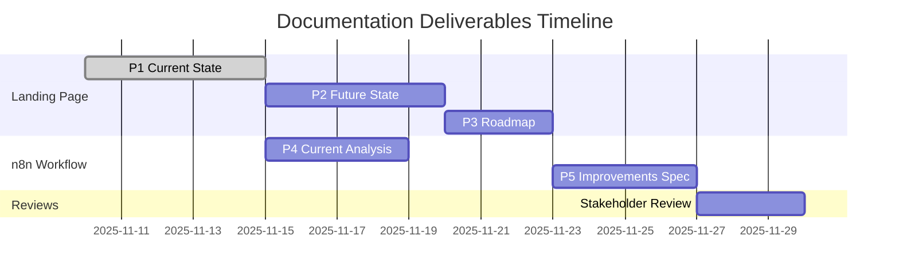

# Quickstart Guide: Landing Page & n8n Workflow Documentation

**Feature**: Landing Page & n8n Workflow Improvement Plan
**Date**: 2025-11-10
**For**: Stakeholders, documentation authors, and reviewers

## Overview

This guide helps you understand how to create, review, and validate the documentation deliverables for the Symancy landing page and n8n workflow improvements.

---

## For Documentation Authors

### Step 1: Setup Your Environment

1. Ensure you're on the correct branch:
   ```bash
   git checkout 001-landing-n8n-improvements
   ```

2. Navigate to the specs directory:
   ```bash
   cd /home/me/code/coffee/specs/001-landing-n8n-improvements
   ```

3. Review planning artifacts:
   - `spec.md` - Feature requirements
   - `plan.md` - Implementation approach
   - `research.md` - Documentation methodology
   - `data-model.md` - Entity definitions
   - `contracts/` - Documentation schemas

### Step 2: Create Documentation Deliverables

Follow this sequence (matches user story priorities P1→P5):

#### P1: Landing Page Current State Documentation

1. Create deliverables directory:
   ```bash
   mkdir -p deliverables/landing-page
   ```

2. Create `deliverables/landing-page/current-state.md` following the schema in `contracts/landing-page-current-state.schema.md`

3. Required activities:
   - Code review: Read all files in `/home/me/code/coffee/` (App.tsx, components/, services/, lib/)
   - Run the application locally to observe user flows
   - Document all features, technical stack, user flows, and limitations
   - Measure performance metrics (bundle size, load time, API latency)

4. Validation:
   - Check all required sections present
   - Verify technical accuracy with development team
   - Test readability: Can stakeholder understand in 30 minutes?

#### P2: Landing Page Future State Specification

1. Create `deliverables/landing-page/future-state.md` following `contracts/landing-page-future-state.schema.md`

2. Required activities:
   - Stakeholder interviews: Product owner, business team, user research
   - Feature ideation workshop: Brainstorm improvements using Jobs-to-be-Done framework
   - Prioritize features using value/complexity matrix
   - Define success metrics aligned with business goals

3. Validation:
   - Identified at least 10 improvement opportunities
   - All features have clear user value
   - Vision aligns with business objectives

#### P3: Landing Page Improvement Roadmap

1. Create `deliverables/landing-page/roadmap.md` following `contracts/landing-page-roadmap.schema.md`

2. Required activities:
   - Map all improvements from future-state.md to implementation phases
   - Estimate effort for each phase (S/M/L/XL sizing)
   - Identify dependencies between phases
   - Create dependency graph (Mermaid diagram)
   - Identify parallel workstreams (30%+ of phases)

3. Validation:
   - No circular dependencies
   - Development team can estimate timeline with ±20% accuracy
   - Quick wins identified for early delivery

#### P4: n8n Workflow Current State Analysis

1. Create deliverables directory:
   ```bash
   mkdir -p deliverables/n8n-workflow
   ```

2. Create `deliverables/n8n-workflow/current-analysis.md` following `contracts/n8n-workflow-current-analysis.schema.md`

3. Required activities:
   - Parse `/home/me/code/coffee/n8n/Pre-MVP workflow n8n.json` (712 lines)
   - Document all nodes: type, configuration, inputs/outputs
   - Map data flows from trigger to completion
   - Create workflow diagram (Mermaid flowchart)
   - Document integration points with landing page
   - Identify performance characteristics and limitations

4. Validation:
   - All nodes documented
   - Workflow diagram accurate and complete
   - Technical team can understand within 20 minutes

#### P5: n8n Workflow Improvement Specification

1. Create `deliverables/n8n-workflow/improvements-spec.md` following `contracts/n8n-workflow-improvements-spec.schema.md`

2. Required activities:
   - Map landing page improvements to required workflow changes
   - Specify performance optimizations (caching, queuing, rate limiting)
   - Define reliability enhancements (error handling, fallbacks)
   - Document new integrations (OpenRouter fallback, monitoring)
   - Create migration strategy for non-disruptive deployment

3. Validation:
   - 100% of landing page enhancements have workflow impact assessments
   - Migration strategy ensures no service disruption
   - Technical team can implement based solely on specification

### Step 3: Review and Iterate

After completing each deliverable:

1. Self-review using validation checklist in schema
2. Share draft with technical team for accuracy review
3. Share with stakeholders for content review
4. Incorporate feedback
5. Mark deliverable as complete

---

## For Stakeholders (Reviewers)

### What to Review

You'll receive 5 documentation deliverables over time (in priority order):

1. **Landing Page Current State** (P1) - Understand what exists today
2. **Landing Page Future State** (P2) - Envision ideal improvements
3. **Landing Page Roadmap** (P3) - See prioritized implementation plan
4. **n8n Workflow Analysis** (P4) - Understand backend automation
5. **n8n Workflow Improvements** (P5) - See workflow enhancement plan

### How to Review

For each deliverable:

1. **Completeness Check**:
   - All required sections present?
   - No placeholder content like "[TODO]"?
   - Appropriate level of detail?

2. **Accuracy Check**:
   - Technical descriptions align with your understanding?
   - Feature descriptions match actual user experience?
   - Success metrics are realistic and measurable?

3. **Clarity Check**:
   - Can you understand without needing explanations?
   - Jargon explained or avoided?
   - Diagrams clear and helpful?

4. **Alignment Check**:
   - Current state matches your understanding?
   - Future state aligns with business goals?
   - Roadmap prioritization makes sense?
   - Workflow improvements support landing page plans?

### Providing Feedback

Use this format for feedback:

**Section**: [Section name from document]
**Issue**: [What's unclear, incorrect, or missing]
**Suggestion**: [How to improve]
**Priority**: [Critical / Important / Minor]

Example:
```
Section: Feature Inventory > Image Upload
Issue: Missing information about mobile camera integration
Suggestion: Document whether mobile users can access device camera directly
Priority: Important
```

### Approval Criteria

Approve the deliverable when:

- [ ] All sections complete and clear
- [ ] Technical accuracy confirmed
- [ ] Aligns with business objectives
- [ ] Actionable (next steps are clear)
- [ ] No critical issues remaining

---

## For Development Team

### Technical Validation Checklist

When reviewing documentation deliverables:

#### Current State Documentation (P1, P4)

- [ ] All code paths documented
- [ ] Architecture diagrams accurate
- [ ] Dependencies and versions correct
- [ ] Performance metrics measured (not estimated)
- [ ] Known issues list complete
- [ ] Integration points clearly described

#### Future State Documentation (P2, P5)

- [ ] Proposed improvements are technically feasible
- [ ] No architectural impossibilities
- [ ] Dependencies on external services realistic
- [ ] Performance targets achievable
- [ ] Security implications addressed

#### Roadmap Documentation (P3)

- [ ] Effort estimates reasonable
- [ ] Dependencies correctly identified
- [ ] No circular dependencies
- [ ] Parallel workstreams technically possible
- [ ] Technical risks identified
- [ ] Timeline estimation is realistic (±20% accuracy)

### Common Technical Issues to Watch For

- **Overly optimistic effort estimates**: Challenge estimates that seem too small
- **Missing dependencies**: Identify unstated prerequisites
- **Performance targets**: Ensure targets are measurable and achievable
- **Security gaps**: Flag missing authentication, authorization, or data protection considerations
- **Integration complexity**: Call out underestimated integration work
- **Technical debt**: Ensure current state honestly documents technical debt

---

## Timeline and Dependencies



**Key Dependencies**:
- P2 (Future State) depends on P1 (Current State)
- P3 (Roadmap) depends on P2 (Future State)
- P4 (n8n Analysis) can start after P1
- P5 (n8n Improvements) depends on both P3 and P4

**Parallel Work**:
- P4 (n8n Analysis) can be developed in parallel with P2 (Future State)

---

## Success Metrics

These deliverables satisfy the following success criteria:

- **SC-001**: Stakeholders understand current state in 30 minutes
- **SC-002**: Identify 10+ improvement opportunities
- **SC-003**: Enable ±20% timeline estimation accuracy
- **SC-004**: Technical team understands workflow in 20 minutes
- **SC-005**: 100% landing page enhancements have workflow impact assessments
- **SC-006**: Approval within one review cycle
- **SC-007**: Reduce future requirements clarification time by 60%
- **SC-008**: Enable 30%+ parallel development workstreams
- **SC-009**: Provide clear business justification for investment
- **SC-010**: Enable incremental value delivery
- **SC-011**: Reduce integration risks

---

## Getting Help

If you encounter issues or have questions:

1. **Technical questions**: Contact development team lead
2. **Business questions**: Contact product owner
3. **Process questions**: Review `research.md` for methodology details
4. **Schema questions**: Review `contracts/` for required document structure
5. **Data model questions**: Review `data-model.md` for entity definitions

---

## Next Steps After Documentation Complete

Once all 5 deliverables are approved:

1. Run `/speckit.tasks` to generate implementation tasks from roadmap
2. Begin implementation phases according to roadmap
3. Reference these documentation artifacts as the single source of truth
4. Update documentation as requirements evolve or discoveries are made

---

## File Locations

All documentation artifacts are stored in:
```
/home/me/code/coffee/specs/001-landing-n8n-improvements/
├── spec.md                    # Feature specification
├── plan.md                    # Implementation plan
├── research.md                # Methodology research
├── data-model.md              # Entity definitions
├── quickstart.md              # This file
├── contracts/                 # Documentation schemas
│   ├── landing-page-current-state.schema.md
│   ├── landing-page-future-state.schema.md
│   ├── landing-page-roadmap.schema.md
│   ├── n8n-workflow-current-analysis.schema.md
│   └── n8n-workflow-improvements-spec.schema.md
└── deliverables/              # Actual documentation outputs
    ├── landing-page/
    │   ├── current-state.md   # P1 deliverable
    │   ├── future-state.md    # P2 deliverable
    │   └── roadmap.md         # P3 deliverable
    └── n8n-workflow/
        ├── current-analysis.md      # P4 deliverable
        └── improvements-spec.md     # P5 deliverable
```
