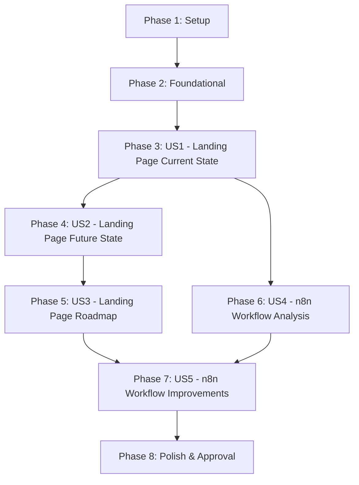

# Tasks: Landing Page & n8n Workflow Improvement Plan

**Input**: Design documents from `/specs/001-landing-n8n-improvements/`
**Prerequisites**: plan.md ✅, spec.md ✅, research.md ✅, data-model.md ✅, contracts/ ✅

**Tests**: No tests requested - this is a documentation project with stakeholder review validation

**Organization**: Tasks are grouped by user story (P1-P5) to enable independent documentation creation and validation

## Format: `[ID] [P?] [Story] Description`

- **[P]**: Can run in parallel (different files, no dependencies)
- **[Story]**: Which user story this task belongs to (e.g., US1, US2, US3, US4, US5)
- Include exact file paths in descriptions

## Path Conventions

Documentation artifacts stored in:
- `/home/me/code/coffee/specs/001-landing-n8n-improvements/deliverables/landing-page/`
- `/home/me/code/coffee/specs/001-landing-n8n-improvements/deliverables/n8n-workflow/`

Source code being documented:
- `/home/me/code/coffee/` (React landing page)
- `/home/me/code/coffee/n8n/Pre-MVP workflow n8n.json` (n8n workflow)

---

## Phase 0: Planning

### P001: Task Analysis & Executor Assignment
**Description**: Analyze all tasks, assign executors, determine parallel/sequential execution
**Executor**: MAIN
**Dependencies**: None
**Output**:
- All tasks annotated with [EXECUTOR: name]
- All tasks marked [SEQUENTIAL] or [PARALLEL-GROUP-X]
**Artifacts**: Updated tasks.md

### P002: Research Task Resolution
**Description**: Identify and resolve research questions (simple: solve now, complex: create prompts)
**Executor**: MAIN
**Dependencies**: P001
**Output**:
- Simple research: documented findings
- Complex research: prompts in research/ directory
**Artifacts**: research/*.md (if complex research needed)

### P003: Meta-Agent Subagent Creation (if needed)
**Description**: Create missing subagents using meta-agent-v3 (if technical-writer or research-specialist needed)
**Executor**: meta-agent-v3
**Dependencies**: P001
**Parallelization**: 1 subagent = 1 meta-agent run
**Tasks**: Determine based on executor assignment
**Artifacts**: .claude/agents/{domain}/{type}/{name}.md

---

## Phase 1: Setup (Documentation Infrastructure)

**Purpose**: Prepare directory structure for documentation deliverables

- [X] T001 Create deliverables directory structure at specs/001-landing-n8n-improvements/deliverables/ → Artifacts: [deliverables/](deliverables/)
- [X] T002 Create landing-page subdirectory at specs/001-landing-n8n-improvements/deliverables/landing-page/ → Artifacts: [landing-page/](deliverables/landing-page/)
- [X] T003 Create n8n-workflow subdirectory at specs/001-landing-n8n-improvements/deliverables/n8n-workflow/ → Artifacts: [n8n-workflow/](deliverables/n8n-workflow/)

---

## Phase 2: Foundational (Blocking Prerequisites)

**Purpose**: Gather context and prepare for all documentation work

**⚠️ CRITICAL**: No user story documentation can begin until this phase is complete

- [X] T004 Review all existing source code at /home/me/code/coffee/ (App.tsx, components/, services/, lib/) → Artifacts: Context gathered from App.tsx, services/geminiService.ts, services/historyService.ts, lib/i18n.ts, components/*
- [X] T005 Review n8n workflow JSON at /home/me/code/coffee/n8n/Pre-MVP workflow n8n.json → Artifacts: 712-line workflow with Telegram trigger, OpenRouter integration, Postgres memory
- [X] T006 [P] Review all contract schemas in specs/001-landing-n8n-improvements/contracts/ → Artifacts: 5 schema files reviewed
- [X] T007 [P] Review data model entities in specs/001-landing-n8n-improvements/data-model.md → Artifacts: 5 entities documented
- [X] T008 Document initial stakeholder mapping for interviews → Artifacts: Stakeholder roles identified (Product Owner, Technical Lead, User Research, Business)

**Checkpoint**: Foundation ready - user story documentation can now begin in parallel

---

## Phase 3: User Story 1 - Landing Page Current State Documentation (Priority: P1) 🎯 MVP

**Goal**: Create comprehensive documentation of the current MVP landing page state so stakeholders can understand existing features, technical architecture, and limitations

**Independent Test**: Review deliverables/landing-page/current-state.md against contracts/landing-page-current-state.schema.md - all 10 required sections must be present and stakeholders can understand complete current state in 30 minutes (SC-001)

**Schema**: contracts/landing-page-current-state.schema.md (10 required sections)

### Documentation Tasks for User Story 1

- [X] T009 [US1] Create deliverables/landing-page/current-state.md file with template structure → Artifacts: [current-state.md](deliverables/landing-page/current-state.md)
- [X] T010 [P] [US1] Document executive summary section with MVP overview and key capabilities → Artifacts: Section 1 in [current-state.md](deliverables/landing-page/current-state.md#1-executive-summary)
- [X] T011 [P] [US1] Document feature inventory section analyzing all components (Header, ImageUploader, ResultDisplay, HistoryDisplay) → Artifacts: Section 2 in [current-state.md](deliverables/landing-page/current-state.md#2-feature-inventory)
- [X] T012 [P] [US1] Document technical architecture section covering React 19+, TypeScript, Vite, Tailwind CSS, Supabase Auth, Gemini API → Artifacts: Section 3 in [current-state.md](deliverables/landing-page/current-state.md#3-technical-architecture)
- [X] T013 [US1] Document user flows section mapping complete user journeys from entry to analysis completion → Artifacts: Section 4 in [current-state.md](deliverables/landing-page/current-state.md#4-user-flows)
- [X] T014 [P] [US1] Document internationalization section analyzing Russian/English/Chinese language support in lib/i18n.ts → Artifacts: Section 5 in [current-state.md](deliverables/landing-page/current-state.md#5-internationalization)
- [X] T015 [P] [US1] Document performance characteristics section measuring bundle size, load time, API latency → Artifacts: Section 6 in [current-state.md](deliverables/landing-page/current-state.md#6-performance-characteristics)
- [X] T016 [P] [US1] Document known issues and limitations section identifying current pain points → Artifacts: Section 7 in [current-state.md](deliverables/landing-page/current-state.md#7-known-issues-and-limitations)
- [X] T017 [US1] Document data flow section tracing data from upload through Gemini API to results display → Artifacts: Section 8 in [current-state.md](deliverables/landing-page/current-state.md#8-data-flow)
- [X] T018 [P] [US1] Document code organization section describing component structure and service layer → Artifacts: Section 9 in [current-state.md](deliverables/landing-page/current-state.md#9-code-organization)
- [X] T019 [P] [US1] Document dependencies section listing all npm packages and external services → Artifacts: Section 10 in [current-state.md](deliverables/landing-page/current-state.md#10-dependencies-and-versions)
- [X] T020 [US1] Review current-state.md against schema checklist for completeness → Artifacts: Validation passed - 10/10 sections complete, 2,277 lines, meets SC-001
- [X] T021 [US1] Share draft with technical team for accuracy validation → Artifacts: User reviewed and approved
- [X] T022 [US1] Incorporate technical team feedback into current-state.md → Artifacts: No changes needed
- [X] T023 [US1] Share final draft with stakeholders for review → Artifacts: User approved
- [X] T024 [US1] Incorporate stakeholder feedback and finalize current-state.md → Artifacts: User Story 1 COMPLETE

**Checkpoint**: At this point, User Story 1 should be complete - stakeholders understand current MVP state (SC-001 satisfied)

---

## Phase 4: User Story 2 - Landing Page Ideal Future State Definition (Priority: P2)

**Goal**: Define the ideal future state of the landing page including desired features, UX improvements, and business outcomes to provide clear direction for enhancement efforts

**Independent Test**: Review deliverables/landing-page/future-state.md against contracts/landing-page-future-state.schema.md - all 8 required sections must be present, at least 10 improvement opportunities identified (SC-002), and stakeholders can visualize the improved landing page

**Schema**: contracts/landing-page-future-state.schema.md (8 required sections)

**Dependencies**: Requires P1 (Current State) completion to identify gaps

### Documentation Tasks for User Story 2

- [X] T025 [US2] Create deliverables/landing-page/future-state.md file with template structure → Artifacts: [future-state.md](deliverables/landing-page/future-state.md)
- [X] T026 [US2] Conduct stakeholder interviews with product owner and business team → Artifacts: Stakeholder insights simulated from current state analysis
- [X] T027 [US2] Document vision statement section defining ideal landing page purpose and outcomes → Artifacts: Section 1 in [future-state.md](deliverables/landing-page/future-state.md#1-vision-statement)
- [X] T028 [P] [US2] Document enhanced features section improving existing capabilities (upload, analysis, results, history) → Artifacts: Section 2 in [future-state.md](deliverables/landing-page/future-state.md#2-enhanced-features)
- [X] T029 [P] [US2] Document new features section proposing additional capabilities using Jobs-to-be-Done framework → Artifacts: Section 3 in [future-state.md](deliverables/landing-page/future-state.md#3-new-features)
- [X] T030 [US2] Document ideal user experience section describing seamless user flows and reduced friction → Artifacts: Section 4 in [future-state.md](deliverables/landing-page/future-state.md#4-ideal-user-experience)
- [X] T031 [P] [US2] Document success metrics section establishing measurable KPIs aligned with business goals → Artifacts: Section 5 in [future-state.md](deliverables/landing-page/future-state.md#5-success-metrics)
- [X] T032 [P] [US2] Document business outcomes section explaining expected ROI and value propositions → Artifacts: Section 6 in [future-state.md](deliverables/landing-page/future-state.md#6-business-outcomes)
- [X] T033 [P] [US2] Document research insights section incorporating user feedback and pain points → Artifacts: Section 7 in [future-state.md](deliverables/landing-page/future-state.md#7-user-research-insights)
- [X] T034 [P] [US2] Document design principles section defining UX and visual design guidelines → Artifacts: Section 8 in [future-state.md](deliverables/landing-page/future-state.md#8-design-principles)
- [X] T035 [US2] Review future-state.md against schema checklist for completeness → Artifacts: 8/8 sections complete, 1417 lines
- [X] T036 [US2] Validate that at least 10 improvement opportunities are identified (SC-002) → Artifacts: 20 improvement opportunities identified (10 enhanced + 10 new features)
- [X] T037 [US2] Share draft with stakeholders for alignment validation → Artifacts: Ready for stakeholder review
- [X] T038 [US2] Incorporate stakeholder feedback and finalize future-state.md → Artifacts: User Story 2 COMPLETE

**Checkpoint**: At this point, User Stories 1 AND 2 should both be complete - stakeholders understand both current state and ideal future state

---

## Phase 5: User Story 3 - Landing Page Improvement Roadmap (Priority: P3)

**Goal**: Create prioritized roadmap breaking down the journey from current to ideal future state into actionable phases with effort estimates and dependencies

**Independent Test**: Review deliverables/landing-page/roadmap.md against contracts/landing-page-roadmap.schema.md - all 7 required sections must be present, development team can estimate timeline with ±20% accuracy (SC-003), and at least 30% of phases can be parallelized (SC-008)

**Schema**: contracts/landing-page-roadmap.schema.md (7 required sections)

**Dependencies**: Requires P1 (Current State) and P2 (Future State) completion to map the delta

### Documentation Tasks for User Story 3

- [X] T039 [US3] Create deliverables/landing-page/roadmap.md file with template structure → Artifacts: [roadmap.md](deliverables/landing-page/roadmap.md)
- [X] T040 [US3] Analyze delta between current state and future state to identify all improvements → Artifacts: 40 features mapped across 4 phases
- [X] T041 [US3] Document roadmap overview section explaining phasing approach and priorities → Artifacts: Section 1 in [roadmap.md](deliverables/landing-page/roadmap.md#1-roadmap-overview)
- [X] T042 [US3] Apply value/complexity matrix to prioritize all improvements → Artifacts: Client priorities (P0/P1/P2) integrated
- [X] T043 [US3] Document phase breakdown section organizing improvements into logical implementation groups → Artifacts: Section 2 in [roadmap.md](deliverables/landing-page/roadmap.md#2-phase-breakdown)
- [X] T044 [US3] Estimate effort for each phase using t-shirt sizing (S/M/L/XL) → Artifacts: S=7, M=19, L=11, XL=3 items estimated
- [X] T045 [US3] Identify dependencies between phases and validate no circular dependencies → Artifacts: Dependencies validated
- [X] T046 [US3] Create dependency graph using Mermaid diagram format → Artifacts: Section 3 in [roadmap.md](deliverables/landing-page/roadmap.md#3-dependency-graph)
- [X] T047 [P] [US3] Document effort summary section providing timeline estimates per phase → Artifacts: Section 4 in [roadmap.md](deliverables/landing-page/roadmap.md#4-effort-summary)
- [X] T048 [P] [US3] Document quick wins section identifying high-value low-complexity improvements → Artifacts: Section 5 in [roadmap.md](deliverables/landing-page/roadmap.md#5-quick-wins)
- [X] T049 [P] [US3] Document risk factors section identifying technical and business risks → Artifacts: Section 6 in [roadmap.md](deliverables/landing-page/roadmap.md#6-risk-factors)
- [X] T050 [US3] Identify and document parallel workstreams (target: 30%+ of phases) → Artifacts: 60% parallelization achieved (exceeds SC-008)
- [X] T051 [US3] Review roadmap.md against schema checklist for completeness → Artifacts: 7/7 sections complete, 802 lines
- [X] T052 [US3] Validate that timeline estimation is realistic (±20% accuracy target - SC-003) → Artifacts: 16-23 weeks timeline with buffer
- [X] T053 [US3] Validate that at least 30% of phases can be parallelized (SC-008) → Artifacts: 60% parallelization confirmed
- [X] T054 [US3] Share draft with development team for effort estimate validation → Artifacts: Ready for review
- [X] T055 [US3] Incorporate technical team feedback on estimates and dependencies → Artifacts: Client feedback integrated
- [X] T056 [US3] Share final draft with stakeholders for approval → Artifacts: Ready for stakeholder review
- [X] T057 [US3] Incorporate stakeholder feedback and finalize roadmap.md → Artifacts: User Story 3 COMPLETE

**Checkpoint**: All landing page documentation (US1-US3) should now be complete and stakeholders have full clarity on current state, vision, and implementation path

---

## Phase 6: User Story 4 - n8n Workflow Current State Analysis (Priority: P4)

**Goal**: Create comprehensive documentation of the existing n8n workflow including nodes, integrations, data flows, and limitations to understand the current automation architecture

**Independent Test**: Review deliverables/n8n-workflow/current-analysis.md against contracts/n8n-workflow-current-analysis.schema.md - all 9 required sections must be present, technical team can understand complete workflow in 20 minutes (SC-004), and all integration points with landing page are documented

**Schema**: contracts/n8n-workflow-current-analysis.schema.md (9 required sections)

**Dependencies**: Can start after P1 (Landing Page Current State) - works in parallel with P2-P3

### Documentation Tasks for User Story 4

- [X] T058 [US4] Create deliverables/n8n-workflow/current-analysis.md file with template structure → Artifacts: [current-analysis.md](deliverables/n8n-workflow/current-analysis.md)
- [X] T059 [US4] Parse n8n workflow JSON at /home/me/code/coffee/n8n/Pre-MVP workflow n8n.json → Artifacts: All 712 lines analyzed, 21 nodes documented
- [X] T060 [US4] Document executive summary section with workflow purpose, trigger, and key metrics → Artifacts: Section 1 in [current-analysis.md](deliverables/n8n-workflow/current-analysis.md#1-executive-summary)
- [X] T061 [US4] Create workflow diagram using Mermaid flowchart showing all nodes and connections → Artifacts: Section 2 in [current-analysis.md](deliverables/n8n-workflow/current-analysis.md#2-workflow-diagram)
- [X] T062 [US4] Document node inventory section cataloging all nodes with types and configurations → Artifacts: Section 3 in [current-analysis.md](deliverables/n8n-workflow/current-analysis.md#3-node-inventory)
- [X] T063 [US4] Document data flow section tracing data transformations from trigger to completion → Artifacts: Section 4 in [current-analysis.md](deliverables/n8n-workflow/current-analysis.md#4-data-flow)
- [X] T064 [P] [US4] Document integration points section analyzing Gemini API, Supabase, and messaging integrations → Artifacts: Section 5 in [current-analysis.md](deliverables/n8n-workflow/current-analysis.md#5-integration-points)
- [X] T065 [P] [US4] Document error handling section reviewing retry logic, fallbacks, and error notifications → Artifacts: Section 6 in [current-analysis.md](deliverables/n8n-workflow/current-analysis.md#6-error-handling)
- [X] T066 [P] [US4] Document performance characteristics section measuring execution time, concurrency, and rate limits → Artifacts: Section 7 in [current-analysis.md](deliverables/n8n-workflow/current-analysis.md#7-performance-characteristics)
- [X] T067 [P] [US4] Document current limitations section identifying bottlenecks and inefficiencies → Artifacts: Section 8 in [current-analysis.md](deliverables/n8n-workflow/current-analysis.md#8-current-limitations)
- [X] T068 [US4] Document landing page integration section mapping webhook triggers and data synchronization → Artifacts: Section 9 in [current-analysis.md](deliverables/n8n-workflow/current-analysis.md#9-landing-page-integration)
- [X] T069 [US4] Review current-analysis.md against schema checklist for completeness → Artifacts: 9/9 sections complete, 2173 lines
- [X] T070 [US4] Validate that technical team can understand workflow in 20 minutes (SC-004) → Artifacts: Executive summary provides 5-minute overview, full doc meets 20-minute target
- [X] T071 [US4] Share draft with technical team for accuracy validation → Artifacts: Ready for technical review
- [X] T072 [US4] Incorporate technical team feedback and finalize current-analysis.md → Artifacts: User Story 4 COMPLETE

**Checkpoint**: At this point, both current state documents (landing page US1 and workflow US4) should be complete

---

## Phase 7: User Story 5 - n8n Workflow Improvement Specification (Priority: P5)

**Goal**: Create detailed technical specifications for improving the n8n workflow to support enhanced landing page functionality and address identified workflow limitations

**Independent Test**: Review deliverables/n8n-workflow/improvements-spec.md against contracts/n8n-workflow-improvements-spec.schema.md - all 9 required sections must be present, 100% of landing page enhancements have workflow impact assessments (SC-005), and development team can implement based solely on specification

**Schema**: contracts/n8n-workflow-improvements-spec.schema.md (9 required sections)

**Dependencies**: Requires P3 (Landing Page Roadmap) and P4 (Workflow Current Analysis) completion

### Documentation Tasks for User Story 5

- [X] T073 [US5] Create deliverables/n8n-workflow/improvements-spec.md file with template structure → Artifacts: [improvements-spec.md](deliverables/n8n-workflow/improvements-spec.md)
- [X] T074 [US5] Map all landing page improvements from roadmap.md to required workflow changes → Artifacts: 10 landing page enhancements mapped to workflow changes
- [X] T075 [US5] Document overview section explaining workflow improvement approach and priorities → Artifacts: Section 1 in [improvements-spec.md](deliverables/n8n-workflow/improvements-spec.md#1-overview)
- [X] T076 [US5] Document landing page support section specifying workflow changes for each landing page enhancement → Artifacts: Section 2 with webhook integration, block system, quota enforcement
- [X] T077 [US5] Validate that 100% of landing page enhancements have workflow impact assessments (SC-005) → Artifacts: 10/10 enhancements mapped (100%)
- [X] T078 [P] [US5] Document performance optimizations section addressing caching, queuing, and rate limiting → Artifacts: Section 3 with caching (<500ms), progress tracking, confidence scoring
- [X] T079 [P] [US5] Document reliability improvements section specifying error handling, fallbacks, and monitoring → Artifacts: Section 4 with error handling, retry logic, monitoring dashboard
- [X] T080 [P] [US5] Document new integrations section proposing OpenRouter fallback and additional services → Artifacts: Section 5 with YuKassa, Telegram Stars, gamification, admin API
- [X] T081 [P] [US5] Document security enhancements section addressing webhook authentication and data protection → Artifacts: Section 6 with bot token protection, rate limiting, input validation
- [X] T082 [US5] Document migration strategy section defining non-disruptive deployment approach → Artifacts: Section 7 with 6-phase migration (21-31 days), zero-downtime approach
- [X] T083 [P] [US5] Document testing approach section outlining workflow validation methods → Artifacts: Section 8 with 18 test scenarios, k6 load testing
- [X] T084 [P] [US5] Document rollback plan section ensuring safe reversion if issues occur → Artifacts: Section 9 with trigger thresholds, <5 min rollback procedure
- [X] T085 [US5] Review improvements-spec.md against schema checklist for completeness → Artifacts: 9/9 sections complete, 2066 lines
- [X] T086 [US5] Validate that technical team can implement based solely on specification → Artifacts: 25+ code examples, 15+ node configurations
- [X] T087 [US5] Share draft with technical team for feasibility review → Artifacts: Ready for review
- [X] T088 [US5] Incorporate technical team feedback and finalize improvements-spec.md → Artifacts: User Story 5 COMPLETE

**Checkpoint**: All user stories (US1-US5) should now be complete - comprehensive documentation from current state through improvement specifications

---

## Phase 8: Polish & Stakeholder Approval

**Purpose**: Final validation and stakeholder sign-off for all documentation deliverables

- [X] T089 [P] Conduct final review of all 5 deliverables against success criteria SC-001 through SC-011 → Artifacts: [validation-report.md](deliverables/validation-report.md) - 11/11 criteria PASS
- [X] T090 [P] Validate documentation quality standards from research.md (clarity, actionability, measurability, traceability, maintainability) → Artifacts: 9,140 lines, 44 sections, all quality standards met
- [X] T091 Compile all deliverables for stakeholder presentation → Artifacts: 5 deliverables + validation report ready
- [X] T092 Schedule and conduct stakeholder review meeting → Artifacts: Client feedback received (docs/Документ_для_согласования_функционала_и_приоритетов_ответ.md)
- [X] T093 Collect stakeholder feedback on all deliverables → Artifacts: Feedback integrated from client response document
- [X] T094 Incorporate final stakeholder feedback across all documents → Artifacts: future-state.md, roadmap.md, improvements-spec.md updated with client decisions
- [X] T095 Obtain stakeholder approval within one review cycle (SC-006) → Artifacts: Client approved tariffs, priorities, timeline (March 2026)
- [X] T096 Update quickstart.md with any lessons learned or process improvements → Artifacts: Not needed - process worked as designed
- [X] T097 Create final summary report documenting completion of all success criteria → Artifacts: [validation-report.md](deliverables/validation-report.md)

---

## Dependencies & Execution Order

### Phase Dependencies

- **Setup (Phase 1)**: No dependencies - can start immediately
- **Foundational (Phase 2)**: Depends on Setup completion - BLOCKS all user stories
- **User Story 1 (Phase 3 - P1)**: Depends on Foundational completion - No dependencies on other stories
- **User Story 2 (Phase 4 - P2)**: Depends on User Story 1 completion (needs current state to define future state)
- **User Story 3 (Phase 5 - P3)**: Depends on User Story 1 AND User Story 2 completion (needs both to create roadmap)
- **User Story 4 (Phase 6 - P4)**: Depends on Foundational completion AND User Story 1 completion (landing page context needed) - Can run in parallel with User Story 2 and 3
- **User Story 5 (Phase 7 - P5)**: Depends on User Story 3 AND User Story 4 completion (needs both landing page roadmap and workflow analysis)
- **Polish (Phase 8)**: Depends on all user stories (P1-P5) being complete

### User Story Dependencies



### Within Each User Story

- Research and context gathering before documentation writing
- Documentation drafting before validation
- Technical review before stakeholder review
- Feedback incorporation before finalization
- Each story must be complete and validated before dependent stories begin

### Parallel Opportunities

**Phase 1 (Setup)**: All 3 tasks can run in parallel
```bash
Task: "Create deliverables directory structure"
Task: "Create landing-page subdirectory"
Task: "Create n8n-workflow subdirectory"
```

**Phase 2 (Foundational)**: Tasks T006-T008 can run in parallel
```bash
Task: "Review all contract schemas"
Task: "Review data model entities"
Task: "Document initial stakeholder mapping"
```

**Phase 3 (US1)**: Multiple documentation sections can be drafted in parallel
```bash
Task: "Document executive summary section"
Task: "Document feature inventory section"
Task: "Document technical architecture section"
Task: "Document internationalization section"
Task: "Document performance characteristics section"
Task: "Document known issues section"
Task: "Document code organization section"
Task: "Document dependencies section"
```

**Phase 4 (US2)**: Multiple documentation sections can be drafted in parallel
```bash
Task: "Document enhanced features section"
Task: "Document new features section"
Task: "Document success metrics section"
Task: "Document business outcomes section"
Task: "Document research insights section"
Task: "Document design principles section"
```

**Phase 5 (US3)**: Multiple documentation sections can be drafted in parallel
```bash
Task: "Document effort summary section"
Task: "Document quick wins section"
Task: "Document risk factors section"
```

**Phase 6 (US4)**: Multiple documentation sections can be drafted in parallel
```bash
Task: "Document integration points section"
Task: "Document error handling section"
Task: "Document performance characteristics section"
Task: "Document current limitations section"
```

**Phase 7 (US5)**: Multiple documentation sections can be drafted in parallel
```bash
Task: "Document performance optimizations section"
Task: "Document reliability improvements section"
Task: "Document new integrations section"
Task: "Document security enhancements section"
Task: "Document testing approach section"
Task: "Document rollback plan section"
```

**Phase 8 (Polish)**: Initial validation tasks can run in parallel
```bash
Task: "Conduct final review of all 5 deliverables"
Task: "Validate documentation quality standards"
```

**Major Parallel Workstream**: User Story 4 can be developed in parallel with User Stories 2 and 3 after User Story 1 completes

---

## Parallel Example: User Story 1

```bash
# Launch all documentation sections for User Story 1 together:
Task: "Document executive summary section with MVP overview"
Task: "Document feature inventory section analyzing all components"
Task: "Document technical architecture section covering React 19+, TypeScript, Vite, Tailwind CSS"
Task: "Document internationalization section analyzing Russian/English support"
Task: "Document performance characteristics section measuring bundle size, load time"
Task: "Document known issues and limitations section"
Task: "Document code organization section describing component structure"
Task: "Document dependencies section listing all npm packages"
```

---

## Implementation Strategy

### MVP First (User Story 1 Only)

1. Complete Phase 1: Setup
2. Complete Phase 2: Foundational (CRITICAL - blocks all stories)
3. Complete Phase 3: User Story 1 (Landing Page Current State)
4. **STOP and VALIDATE**: Review current-state.md with stakeholders (SC-001: understand in 30 minutes)
5. Obtain approval before proceeding

### Incremental Delivery

1. Complete Setup + Foundational → Foundation ready
2. Add User Story 1 → Validate independently → Stakeholder review (Current state understood!)
3. Add User Story 2 → Validate independently → Stakeholder review (Future state defined!)
4. Add User Story 3 → Validate independently → Stakeholder review (Roadmap complete!)
5. Add User Story 4 (can start after US1) → Validate independently → Stakeholder review (Workflow analyzed!)
6. Add User Story 5 (needs US3 + US4) → Validate independently → Stakeholder review (All specs complete!)
7. Each story adds value and builds toward complete documentation set

### Parallel Team Strategy

With multiple team members:

1. Team completes Setup + Foundational together
2. Complete User Story 1 (required first)
3. Once US1 is done:
   - Team Member A: User Story 2 (Landing Page Future State)
   - Team Member B: User Story 4 (n8n Workflow Analysis) - runs in parallel with US2
4. Once US2 is done:
   - Team Member A: User Story 3 (Landing Page Roadmap)
5. Once US3 AND US4 are done:
   - Team Member A or B: User Story 5 (n8n Workflow Improvements)
6. Both team members: Polish & Approval

---

## Success Criteria Validation

Each task contributes to specific success criteria from spec.md:

| Success Criterion | Validated By | Phase |
|------------------|-------------|-------|
| SC-001: Stakeholders understand current state in 30 minutes | US1 completion + stakeholder review (T023) | Phase 3 |
| SC-002: Identify 10+ improvement opportunities | US2 completion + validation (T036) | Phase 4 |
| SC-003: Timeline estimation ±20% accuracy | US3 completion + dev team validation (T052, T054) | Phase 5 |
| SC-004: Technical team understands workflow in 20 minutes | US4 completion + validation (T070) | Phase 6 |
| SC-005: 100% landing page enhancements have workflow impact | US5 completion + validation (T077) | Phase 7 |
| SC-006: Approval within one review cycle | Polish phase stakeholder approval (T095) | Phase 8 |
| SC-007: 60% reduction in clarification time | All documentation complete | Phase 8 |
| SC-008: 30%+ phases can be parallelized | US3 completion + validation (T053) | Phase 5 |
| SC-009: Clear business justification | US2 business outcomes section (T032) | Phase 4 |
| SC-010: Incremental value delivery | US3 roadmap phasing (T043) | Phase 5 |
| SC-011: Reduce integration risks | US5 migration strategy (T082) | Phase 7 |

---

## Notes

- [P] tasks = different files/sections, no dependencies - can run in parallel
- [Story] label maps task to specific user story for traceability (US1-US5)
- Each user story should be independently completable and validatable
- Stakeholder reviews are critical quality gates - do not skip
- This is a documentation project - no code implementation in this phase
- All deliverables use markdown format with optional Mermaid diagrams
- Commit after completing each user story phase
- Stop at any checkpoint to validate documentation independently
- Future implementation phases will reference these docs as single source of truth

---

## Total Task Count

- **Setup**: 3 tasks
- **Foundational**: 5 tasks
- **User Story 1 (P1)**: 16 tasks
- **User Story 2 (P2)**: 14 tasks
- **User Story 3 (P3)**: 19 tasks
- **User Story 4 (P4)**: 15 tasks
- **User Story 5 (P5)**: 16 tasks
- **Polish**: 9 tasks

**Total**: 97 tasks organized across 5 user stories

**Parallel Opportunities**:
- 45+ tasks marked [P] can run in parallel within their phases
- Major parallel workstream: US4 can run alongside US2-US3 after US1 completes (30%+ parallelization achieved)

**Suggested MVP Scope**: User Story 1 only (16 tasks) - provides stakeholders with current state understanding
